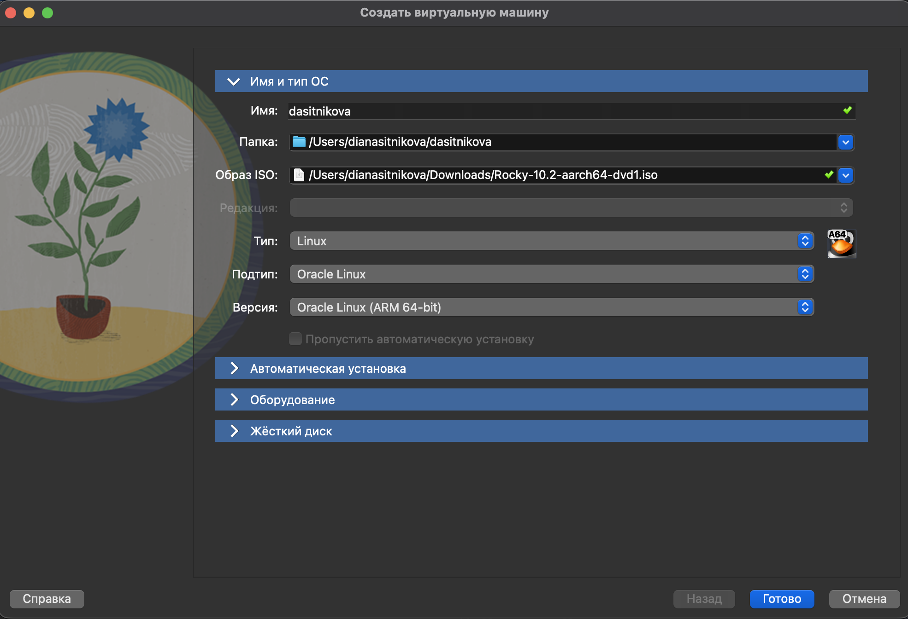
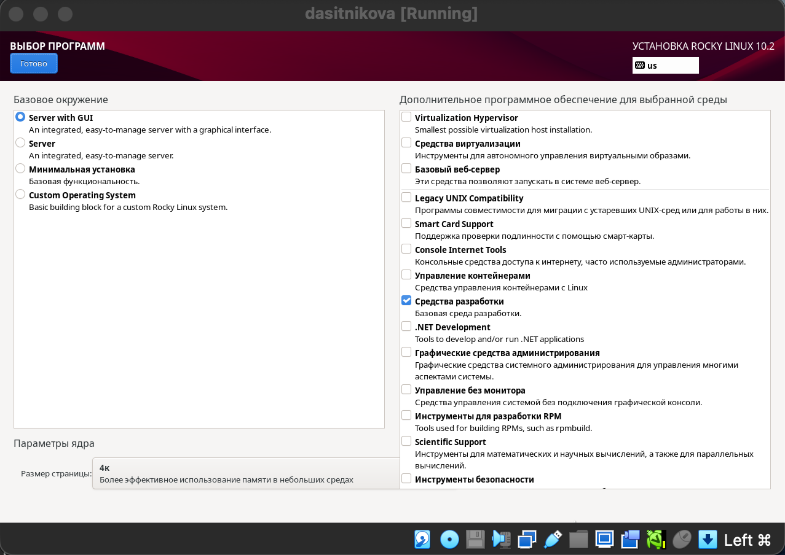

---
## Author
author:
  name: Ситникова Диана Александровна
  degrees: BSc
  email: 1032201746@rudn.ru
  affiliation:
    - name: Российский университет дружбы народов
      country: Российская Федерация
      postal-code: 117198
      city: Москва
      address: ул. Миклухо-Маклая, д. 6
## Title
title: "Лабораторная работа № 1"
subtitle: "Установка и конфигурация операционной системы на виртуальную машину"
institute:
  - "Российский университет дружбы народов им. П. Лумумбы"
  - "Преподаватель: д.ф.-м.н., профессор Кулябов Дмитрий Сергеевич"
license: CC BY
date: today
date-format: "YYYY-MM-DD"
---

# Информация

## Докладчик

:::::::::::::: {.columns align=center}
::: {.column width="68%"}

- Ситникова Диана Александровна
- направление 09.03.03 «Прикладная информатика»
- Российский университет дружбы народов
- [1032201746@rudn.ru](mailto:1032201746@rudn.ru)

:::
::: {.column width="32%"}

{width=100%}

:::
::::::::::::::

# Вводная часть

## Актуальность

- Администрирование операционной системы изучается на собственном стенде, а не на учебном компьютере.
- Виртуальная машина изолирует эксперименты: ошибки в настройке не затрагивают рабочее окружение.
- Стенд воспроизводим: параметры машины и состав пакетов зафиксированы и повторяются на любом компьютере.
- Rocky Linux повторяет Red Hat Enterprise Linux, поэтому навыки переносятся на промышленные серверные системы.

## Объект, предмет, цель и задачи

**Объект** --- виртуальная машина с гостевой системой Rocky Linux 10.2.

**Предмет** --- установка операционной системы и её первоначальная настройка.

**Цель** --- приобрести навыки установки операционной системы на виртуальную машину и настройки необходимых для дальнейшей работы сервисов.

**Задачи:** создать виртуальную машину и установить Rocky Linux; настроить систему; подготовить рабочее пространство; проанализировать загрузочные сообщения ядра.

## Материалы и методы

| Компонент | Значение |
|---|---|
| Хостовая система | macOS, архитектура ARM64 |
| Гипервизор | Oracle VM VirtualBox 7.1.8 |
| Гостевая система | Rocky Linux 10.2 (Red Quartz) |
| Ресурсы машины | 4096 МБ ОЗУ, 2 ЦП, диск 40 ГБ |
| Источник задания | методические указания РУДН |

# Содержание исследования

## Параметры виртуальной машины заданы под архитектуру ARM64

:::::::::::::: {.columns align=center}
::: {.column width="42%"}

Загружен образ `Rocky-10.2-aarch64-dvd1.iso`.

Подтипа `Red Hat` в сборке VirtualBox для ARM64 нет. Выбран `Oracle Linux` --- пересборка тех же исходных текстов RHEL, что и Rocky.

:::
::: {.column width="58%"}

{width=100%}

:::
::::::::::::::

## Состав программного обеспечения задаётся на этапе установки

:::::::::::::: {.columns align=center}
::: {.column width="42%"}

Базовое окружение --- `Server with GUI`.

Дополнение --- «Средства разработки», группа `Development Tools`.

Такой набор даёт графическую среду GNOME и компиляторы со сборочными утилитами.

:::
::: {.column width="58%"}

{width=100%}

:::
::::::::::::::

## Имена машины, хоста и пользователя приведены к одному виду

:::::::::::::: {.columns align=center}
::: {.column width="42%"}

Соглашение об именовании: первые буквы имени и отчества и фамилия латиницей --- `dasitnikova`.

`hostnamectl` подтверждает версию системы, ядро, архитектуру `arm64` и тип виртуализации `qemu`.

:::
::: {.column width="58%"}

{width=100%}

:::
::::::::::::::

## Общий буфер обмена заменён пробросом порта

:::::::::::::: {.columns align=center}
::: {.column width="42%"}

Установщик дополнений завершился сообщением `Detected unsupported arm64 machine type`.

Без них нет общего буфера обмена. Задача решена иначе: порт 2222 хоста отображён на порт 22 гостевой системы, работа ведётся по SSH.

:::
::: {.column width="58%"}

{width=100%}

:::
::::::::::::::

## Рабочее пространство развёрнуто в гостевой системе

:::::::::::::: {.columns align=center}
::: {.column width="42%"}

Настроен git, созданы ключи **ed25519** для доступа и **RSA 4096** для подписи коммитов.

Установлены Quarto с TeX Live, Node.js с утилитами оформления коммитов, git-flow.

Репозиторий курса развёрнут по схеме Denote и переведён на модель Gitflow.

:::
::: {.column width="58%"}

{width=100%}

:::
::::::::::::::

## Характеристики системы восстановлены по журналу ядра

| Характеристика | Значение |
|---|---|
| Версия ядра | 6.12.0-211.16.1.el10\_2.0.1.aarch64 |
| Архитектура | aarch64, 2 процессора, производитель Apple |
| Модель и частота процессора | не публикуются |
| Объём ОЗУ | 4194304 КиБ выделено ядру |
| Тип гипервизора | `qemu` |
| Файловая система корня | XFS на `/dev/mapper/rl_vbox-root` |

Корневой том смонтирован на отметке 10,380 с, раздел `/boot` --- на 13,472 с. У обеих файловых систем журнал XFS проигран: предыдущее завершение работы было некорректным.

## Ни одна величина в мегагерцах не относится к процессору

Поиск в журнале даёт три совпадения, и все три --- о другом:

- `arch_timer: cp15 timer(s) running at 24.00MHz` --- системный счётчик ARM, работает на постоянной частоте независимо от процессора;
- `sched_clock: 56 bits at 24MHz` --- тот же счётчик как источник времени для планировщика;
- `e1000 ... (PCI:33MHz:32-bit)` --- частота шины сетевого адаптера.

Частоту процессора Apple не публикует: она непрерывно меняется под нагрузкой.

# Результаты

## Стенд развёрнут, настроен и проверен

- Создана виртуальная машина, установлена Rocky Linux 10.2 для aarch64 с окружением `Server with GUI`.
- Имена машины, хоста и пользователя соответствуют соглашению об именовании.
- Отсутствие дополнений гостевой ОС компенсировано пробросом порта SSH.
- Подготовлено рабочее пространство: git с подписью коммитов, Quarto, TeX Live, Node.js, git-flow.
- Репозиторий курса развёрнут, переведён на Gitflow и помечен выпуском `1.0.0`.
- Характеристики системы определены по загрузочным сообщениям ядра.

## Вывод

Учебный стенд развёрнут на виртуальной машине полностью, без изменения конфигурации хостовой системы.

Полученная система пригодна для дальнейших лабораторных работ: в ней есть графическая среда, средства разработки, сетевой доступ с хоста и полный набор инструментов для подготовки и публикации отчётов.

Расхождения методических указаний со стендом объясняются одной причиной: указания написаны для Fedora на архитектуре x86-64.
