---
## Author
author:
  name: Ситникова Диана Александровна
  degrees: BSc
  email: 1032201746@rudn.ru
  affiliation:
    - name: Российский университет дружбы народов
      country: Российская Федерация
      postal-code: 117198
      city: Москва
      address: ул. Миклухо-Маклая, д. 6

## Title
title: "Отчёт по лабораторной работе №1"
subtitle: "Установка и конфигурация операционной системы на виртуальную машину"
license: "CC BY"
bibliography: bib/cite.bib
---

# Цель работы

Целью данной работы является приобретение практических навыков установки операционной системы на виртуальную машину и настройки минимально необходимых для дальнейшей работы сервисов.

# Задание

- Создать в Oracle VM VirtualBox виртуальную машину для установки Rocky Linux.
- Установить операционную систему на виртуальный диск.
- Выполнить первоначальную настройку установленной системы: задать имя пользователя и имя хоста в соответствии с соглашением об именовании, установить дополнения гостевой операционной системы.
- Подготовить рабочее пространство: настроить систему контроля версий, ключи доступа и подписи коммитов, установить программное обеспечение для подготовки документации, развернуть репозиторий курса.
- Проанализировать загрузочные сообщения ядра при помощи команды `dmesg` и определить характеристики установленной системы.
- Ответить на контрольные вопросы.

# Теоретическое введение

## Виртуализация и типы гипервизоров

Виртуализация позволяет запускать одну операционную систему внутри другой в изолированной программной среде. Физический компьютер и установленная на нём операционная система называются хостом, а система внутри виртуальной машины --- гостевой операционной системой. Гипервизор предоставляет гостевой системе виртуальные процессоры, оперативную память, накопители, сетевые и другие устройства [@tanenbaum_book_modern-os_ru].

Гипервизоры принято делить на два типа. Гипервизор первого типа работает непосредственно на оборудовании и сам выполняет роль минимальной операционной системы; к этому типу относятся VMware ESXi и Xen. Гипервизор второго типа работает как приложение внутри обычной операционной системы и обращается к её планировщику и драйверам; к этому типу относятся VirtualBox, VMware Workstation и Parallels Desktop.

Разделение на два типа сегодня условно. Современные процессоры содержат аппаратные расширения виртуализации, которые вводят дополнительный уровень привилегий, более высокий, чем у ядра гостевой системы. Благодаря им гостевой код исполняется процессором напрямую, а гипервизор перехватывает лишь привилегированные операции. В архитектуре ARM этот уровень называется EL2 и доступен только коду операционной системы хоста, поэтому в macOS работа с ним вынесена в системный интерфейс Hypervisor.framework. Все гипервизоры на этой платформе обращаются к нему, а собственный код виртуализации не используют.

Этим объясняется результат определения гипервизора в установленной системе: команда `systemd-detect-virt` сообщает `qemu`, хотя виртуальная машина создана средствами VirtualBox. Гостевая система распознаёт гипервизор по данным микропрограммы и по набору виртуальных устройств, а на платформе ARM VirtualBox использует то же описание машины, что и QEMU.

## Паравиртуализация и устройства virtio

Гипервизор может предоставлять гостевой системе точную программную модель существующего физического устройства. Такой способ не требует изменений в гостевой системе, но обходится дорого: каждое обращение к регистру устройства вызывает выход в гипервизор.

Паравиртуализация решает эту задачу иначе: гостевой системе предлагается устройство, изначально спроектированное как виртуальное. Гость и гипервизор обмениваются данными через кольцевые буферы в разделяемой памяти, а число переключений контекста сокращается на порядок. Стандартом таких устройств является virtio.

Оба подхода применяются в одной и той же виртуальной машине. Дисковый контроллер реализован как `virtio-scsi`, то есть паравиртуализованным устройством, а сетевой адаптер --- как программная модель микросхемы Intel 82540EM на шине PCI, о чём сообщает драйвер `e1000` в журнале загрузки ядра. Выбор объясняется совместимостью: драйвер `e1000` присутствует практически в любой операционной системе, поэтому эмуляция сетевой карты гарантирует работу сети без установки дополнительных драйверов.

## Архитектура aarch64 и загрузка через UEFI

Архитектура ARM64, она же aarch64, отличается от x86-64 системой команд, поэтому двоичный код одной архитектуры не исполняется на другой. Гипервизор второго типа не транслирует команды, а исполняет их на физическом процессоре, поэтому архитектура гостевой системы обязана совпадать с архитектурой хоста. По этой причине для установки требуется образ дистрибутива, собранный именно для aarch64.

Различается и способ начальной загрузки. На платформе x86 сохранился устаревший режим BIOS с загрузочной записью в первом секторе диска. Платформа ARM изначально построена вокруг спецификации UEFI: микропрограмма читает таблицу разделов GPT, находит служебный раздел с файловой системой FAT и запускает с него загрузчик в виде обычного исполняемого файла. Поэтому для гостевых систем ARM64 параметр EFI в настройках виртуальной машины включается обязательно.

## Rocky Linux в семействе Red Hat Enterprise Linux

Red Hat Enterprise Linux распространяется по подписке, но его исходные тексты открыты. На их основе собирается несколько дистрибутивов, двоично совместимых с оригиналом: Rocky Linux, AlmaLinux и Oracle Linux. Совместимость означает, что пакет, собранный для одного из них, работает в остальных без пересборки, а номера версий библиотек и ядра совпадают.

Это свойство объясняет выбор подтипа гостевой системы при создании виртуальной машины: подтип `Red Hat` в сборке VirtualBox для ARM64 отсутствует, а `Oracle Linux` описывает дистрибутив того же семейства с тем же составом драйверов и той же схемой разметки.

Для управления программным обеспечением используется пакетный менеджер `dnf`, работающий с пакетами формата RPM. Пакеты объединяются в группы: группа `Development Tools` содержит компиляторы и сборочные утилиты, а базовые окружения вроде `Server with GUI` задают состав системы целиком. Имена групп в RHEL-совместимых дистрибутивах и в Fedora различаются, хотя пакетный менеджер общий.

## Разметка диска и логические тома

Программа установки Rocky Linux по умолчанию размещает корневую файловую систему не на разделе диска, а на логическом томе LVM. Диспетчер логических томов вводит три уровня: физический том --- это раздел или диск целиком, группа томов объединяет физические тома в общее пространство, а логический том выделяется из группы и уже несёт файловую систему.

Такая схема позволяет менять размер тома и добавлять диски без переразметки. Имя группы томов формируется при установке из имени системы, поэтому в данной работе корневой том называется `rl_vbox-root`: на момент установки имя хоста было `vbox`, и последующее переименование хоста имя группы томов не изменило.

## Файловые системы и XFS

Файловая система определяет способ организации и хранения файлов на носителе: структуру каталогов, размещение содержимого по блокам и состав метаданных. В Linux все доступные файловые системы объединяются в единое дерево, начинающееся с корневого каталога `/`. Подключение файловой системы к каталогу называется монтированием. Сведения о смонтированных файловых системах дают команды `findmnt`, `mount` и `df`.

В Rocky Linux файловой системой по умолчанию является XFS. Она журналирует метаданные: перед изменением структуры каталогов запись о предстоящей операции попадает в журнал, и после сбоя система восстанавливает согласованность, проигрывая журнал, вместо полной проверки носителя. Пространство XFS делится на аллокационные группы, которые обслуживаются независимо, что даёт выигрыш при параллельных операциях. Том XFS можно расширить в смонтированном состоянии, но нельзя уменьшить.

## Учётные записи и права администратора

Учётная запись пользователя содержит имя пользователя, числовые идентификаторы UID и GID, принадлежность к группам, путь к домашнему каталогу и командную оболочку. Основные сведения об учётных записях хранятся в файле `/etc/passwd`, а защищённые данные для проверки пароля --- в `/etc/shadow`.

Для выполнения административных операций используется механизм `sudo`, который выполняет отдельную команду от имени другого пользователя согласно правилам в файле `/etc/sudoers`. Команда `sudo -i` открывает интерактивную оболочку суперпользователя. В RHEL-совместимых дистрибутивах право на использование `sudo` предоставляется членством в группе `wheel`.

Отдельно `sudo` подменяет переменную окружения `PATH` на собственный список каталогов `secure_path`. Это защищает от подстановки постороннего исполняемого файла, но означает, что программы, установленные вне системных каталогов, под `sudo` требуется вызывать по полному пути.

## Кольцевой буфер ядра

Во время загрузки и работы ядро Linux выводит диагностические сообщения в кольцевой буфер --- область памяти фиксированного размера, в которой новые записи вытесняют самые старые. Просмотреть его содержимое позволяет команда `dmesg` [@nemeth_book_unix-linux-admin_ru].

По сообщениям буфера восстанавливается ход загрузки: версия и параметры сборки ядра, объём и разметка доступной памяти, обнаруженные процессоры, найденные устройства и порядок монтирования файловых систем. Состав сообщений зависит от архитектуры: часть строк, привычных для платформы x86, на aarch64 ядро не выводит, поскольку соответствующие сведения предоставляет не процессор, а микропрограмма.

В дистрибутивах семейства RHEL параметр ядра `kernel.dmesg_restrict` по умолчанию равен единице, поэтому чтение буфера доступно только суперпользователю.

## Сетевой режим NAT и проброс портов

Сетевой адаптер виртуальной машины в режиме NAT подключается к виртуальному маршрутизатору внутри гипервизора. Гостевая система получает адрес из отдельной подсети, в которой шлюзом выступает адрес `10.0.2.2`, а исходящие соединения гипервизор транслирует от имени хостовой системы. Такой режим не требует настройки и изолирует гостевую систему, но делает её недоступной для входящих соединений: у неё нет адреса в сети хоста.

Чтобы обратиться к службе внутри гостевой системы, применяется проброс портов --- правило, по которому гипервизор принимает соединение на порт хостовой системы и перенаправляет его на порт гостевой.

В [табл. @tbl-std-dir] приведено краткое описание некоторых стандартных каталогов Linux.

| Имя каталога | Назначение |
|---|---|
| `/` | Корневой каталог файловой системы |
| `/etc` | Общесистемные конфигурационные файлы |
| `/home` | Домашние каталоги обычных пользователей |
| `/root` | Домашний каталог суперпользователя `root` |
| `/run/media` | Точки монтирования сменных носителей |
| `/tmp` | Временные файлы |
| `/usr` | Пользовательские программы, библиотеки и документация |
| `/var` | Изменяемые данные: журналы, очереди и кэш |

: Описание некоторых каталогов файловой системы GNU Linux {#tbl-std-dir}

## Соглашение об именовании

В соответствии с методическими указаниями имя виртуальной машины, имя хоста и имя пользователя внутри виртуальной машины должны совпадать. Они образуются из первых букв имени и отчества и фамилии, записанных латинскими буквами. Для автора работы это имя `dasitnikova`.

Каталог рабочего пространства именуется по соглашению Denote, в котором поля имени разделяются символами `==` и `--`. Для второго полугодия 2026 года и предмета с кодом `os2` полный путь имеет вид `~/work/study/2026-2/2026-2==study--os2`. Название проекта на сервере git не допускает таких разделителей, поэтому они заменяются дефисами: `2026-2-study-os2`.

## Система контроля версий и сопутствующие соглашения

Система контроля версий фиксирует изменения файлов проекта и позволяет возвращаться к любому предыдущему состоянию. Git является распределённой системой: полная копия истории хранится у каждого участника, а обмен изменениями происходит через центральный репозиторий.

Подлинность автора коммита в git не проверяется, поэтому для подтверждения авторства применяется подпись коммитов криптографическим ключом. Ключ создаётся средствами GnuPG, его открытая часть публикуется в учётной записи на сервере git, а закрытая остаётся у пользователя.

Работа с репозиторием ведётся по модели ветвления Gitflow. В ней ветка `master` хранит официальную историю выпусков, ветка `develop` служит для накопления изменений, а для подготовки выпуска создаётся ветка `release`, которая по завершении сливается в обе основные ветки и помечается номером версии. Номера версий назначаются по правилам семантического версионирования в виде кортежа «мажорная версия. минорная версия. патч», а сообщения коммитов оформляются по спецификации Conventional Commits в виде `<тип>(<область>): <описание>`.

## Средства подготовки документации

Отчёты и презентации готовятся в системе Quarto: исходный текст записывается в файлах формата `.qmd` на языке разметки Markdown, а Quarto преобразует его в PDF, DOCX и HTML. Для получения PDF Quarto обращается к системе компьютерной вёрстки TeX. Оформление задаётся файлами шаблона, подключаемого к репозиторию курса в качестве подмодуля git.

Работа в командной оболочке и назначение основных утилит Unix подробно рассматриваются в [@robbins_book_bash_en; @newham_book_learning-bash_en].

# Выполнение лабораторной работы

## Получение установочного образа

Установочный образ загружен с официального сайта дистрибутива. Поскольку хостовая система работает на процессоре с архитектурой ARM64, выбрана архитектура ARM (aarch64) и полный установочный образ DVD ISO, содержащий все группы пакетов, необходимые для работы ([рис. @fig-001]). Загружен файл `Rocky-10.2-aarch64-dvd1.iso`.

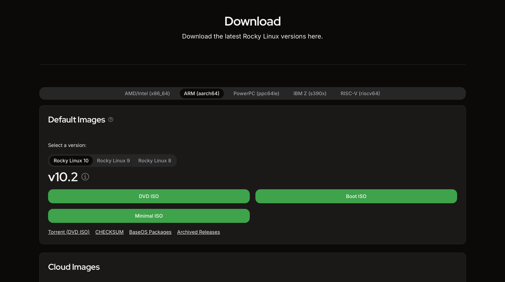{#fig-001 width=85%}

## Создание виртуальной машины

В Oracle VM VirtualBox создана новая виртуальная машина. В разделе «Имя и тип ОС» задано имя `dasitnikova`, указан путь к загруженному образу и выбраны тип `Linux`, подтип `Oracle Linux` и версия `Oracle Linux (ARM 64-bit)` ([рис. @fig-002]). Значок `A64` справа от поля типа подтверждает, что образ распознан как предназначенный для архитектуры ARM64.

Подтип `Red Hat`, указанный в методических указаниях, в сборке VirtualBox для архитектуры ARM64 недоступен. Выбран подтип `Oracle Linux` --- дистрибутив, собираемый из тех же исходных текстов Red Hat Enterprise Linux, что и устанавливаемый Rocky Linux, поэтому предустановленные параметры виртуального оборудования для него совпадают.

{#fig-002 width=85%}

В разделе «Оборудование» задан объём основной памяти 4096 МБ и два виртуальных процессора ([рис. @fig-003]). Для гостевых систем архитектуры ARM64 загрузка выполняется только через EFI, поэтому соответствующий параметр включён.

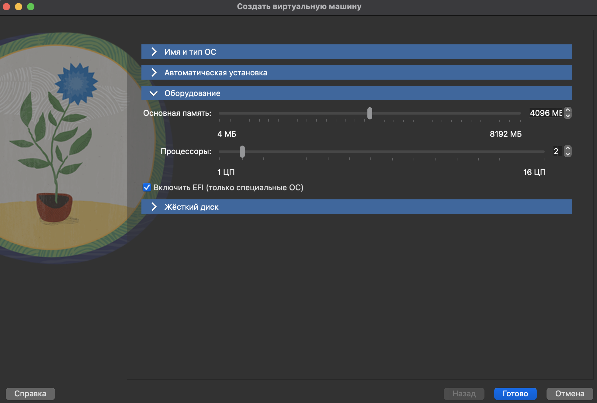{#fig-003 width=85%}

В разделе «Жёсткий диск» создан новый виртуальный диск формата VDI объёмом 40 ГБ ([рис. @fig-004]). Диск создан без выделения места в полном размере, то есть файл диска на хостовой системе растёт по мере заполнения гостевой.

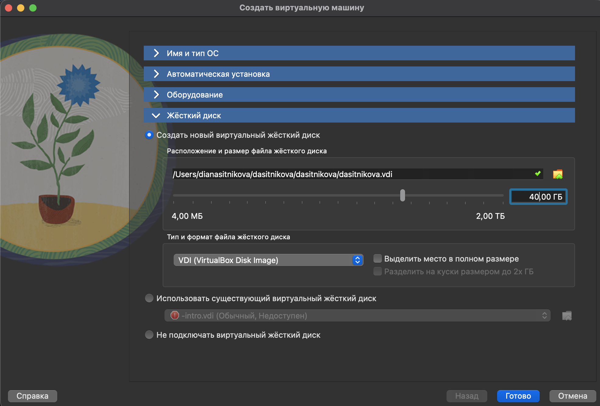{#fig-004 width=85%}

## Установка операционной системы

Виртуальная машина запущена с подключённым установочным образом. Программа установки Anaconda предложила выбрать язык, используемый в процессе установки ([рис. @fig-005]).

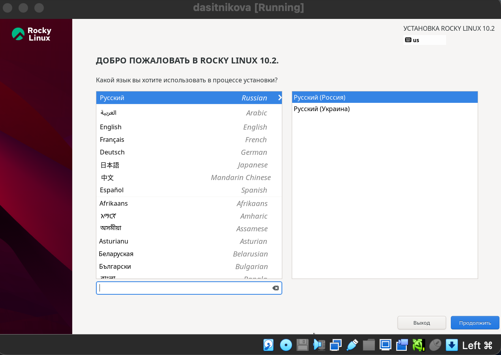{#fig-005 width=85%}

В разделе «Раскладка клавиатуры» к английской раскладке добавлена русская ([рис. @fig-006]). Программа установки предупреждает, что переключение раскладок сочетанием клавиш на этом этапе не поддерживается и для смены раскладки следует использовать значок клавиатуры в верхней панели.

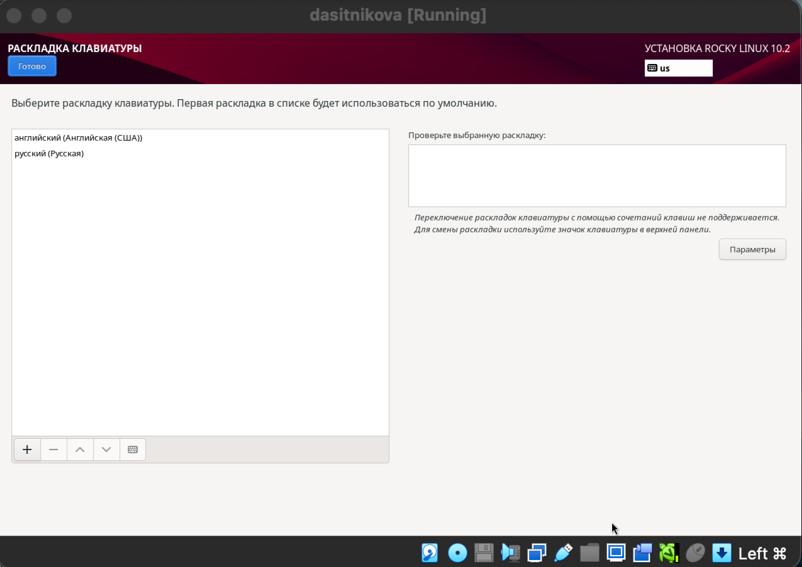{#fig-006 width=85%}

В разделе «Дата и время» выбран часовой пояс Европа/Москва и включена автоматическая синхронизация времени по протоколу NTP ([рис. @fig-007]).

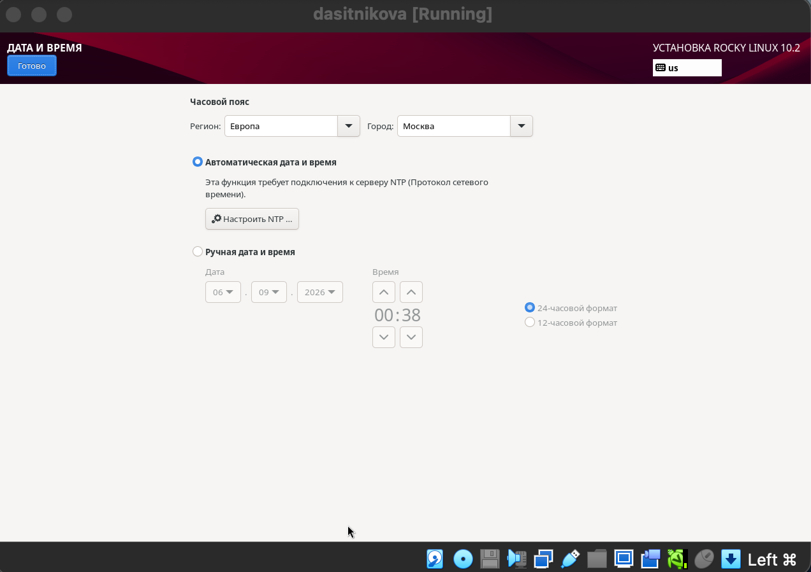{#fig-007 width=85%}

В разделе «Выбор программ» в качестве базового окружения указано `Server with GUI`, а в качестве дополнительного программного обеспечения отмечены «Средства разработки» --- группа `Development Tools` ([рис. @fig-008]). Такой набор даёт графическую среду GNOME и компиляторы со сборочными утилитами, необходимые в дальнейших работах.

{#fig-008 width=85%}

Также заданы имя узла, пароль суперпользователя `root` и учётная запись обычного пользователя с правами администратора, после чего установка запущена. По её завершении виртуальная машина перезагружена, и выполнен вход в графическую среду установленной системы ([рис. @fig-009]).

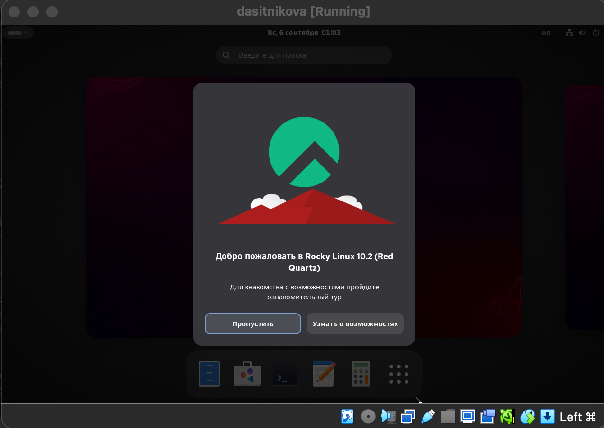{#fig-009 width=85%}

## Первоначальная настройка системы

Имя пользователя и имя хоста приведены в соответствие с соглашением об именовании. Учётная запись `dasitnikova` создана программой установки, поэтому команда `adduser` сообщила о существовании пользователя; пароль задан командой `passwd`, имя хоста установлено командой `hostnamectl` ([рис. @fig-010]).

~~~bash
sudo -i
adduser -G wheel dasitnikova
passwd dasitnikova
hostnamectl set-hostname dasitnikova
hostnamectl
~~~

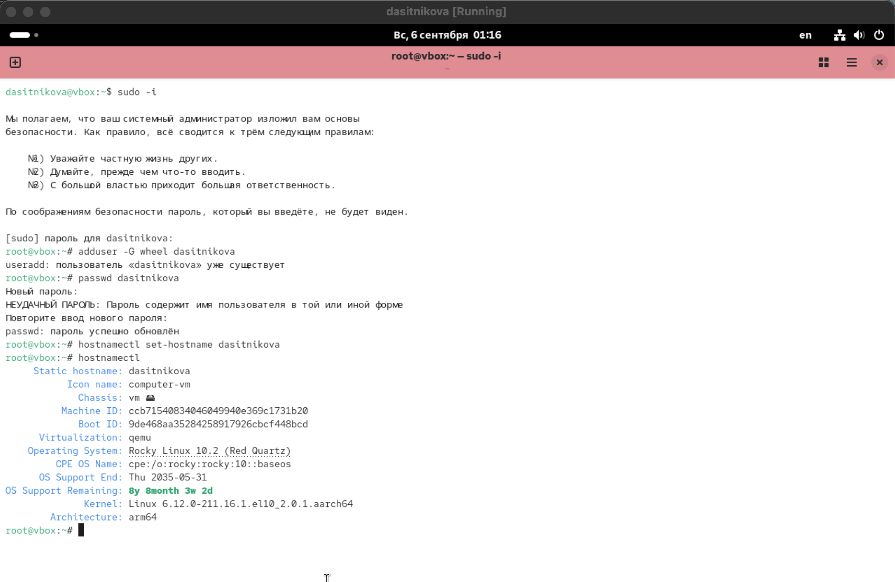{#fig-010 width=85%}

Вывод `hostnamectl` подтверждает параметры установленной системы: имя хоста `dasitnikova`, операционная система Rocky Linux 10.2 (Red Quartz), ядро версии 6.12.0-211.16.1.el10\_2.0.1.aarch64, архитектура arm64, обнаруженный тип виртуализации `qemu`.

## Дополнения гостевой операционной системы

Образ диска дополнений гостевой ОС подключён через меню «Устройства» и смонтирован в каталог `/run/media/dasitnikova/VBox_GAs_7.1.8`. Установщик запущен с правами суперпользователя ([рис. @fig-011]).

~~~bash
sudo -i
cd /run/media/dasitnikova/VBox_GAs_7.1.8/
./VBoxLinuxAdditions.run
~~~

Установщик проверил целостность архива, распаковал его и завершил работу с сообщением `Detected unsupported arm64 machine type`: сборка дополнений гостевой ОС, входящая в состав VirtualBox 7.1.8, не содержит модулей ядра для гостевых систем Linux на архитектуре arm64. Дополнения обеспечивают общий буфер обмена, автоматическую подгонку разрешения экрана и общие папки и не влияют на выполнение остальных заданий работы.

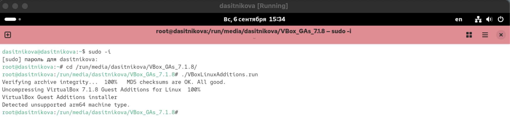{#fig-011 width=85%}

## Настройка доступа к гостевой системе по SSH

Для обмена данными между хостовой и гостевой системами вместо общего буфера обмена настроен проброс порта. Сетевой адаптер виртуальной машины работает в режиме NAT, поэтому средствами `VBoxManage` создано правило, отображающее порт 2222 хостовой системы на порт 22 гостевой:

~~~bash
VBoxManage controlvm dasitnikova natpf1 "ssh,tcp,127.0.0.1,2222,,22"
~~~

Аргументы правила задают его имя, протокол, адрес и порт на хосте, адрес и порт в гостевой системе. После этого выполнено подключение к гостевой системе из терминала хостовой ([рис. @fig-012]):

~~~bash
ssh dasitnikova@127.0.0.1 -p 2222
~~~

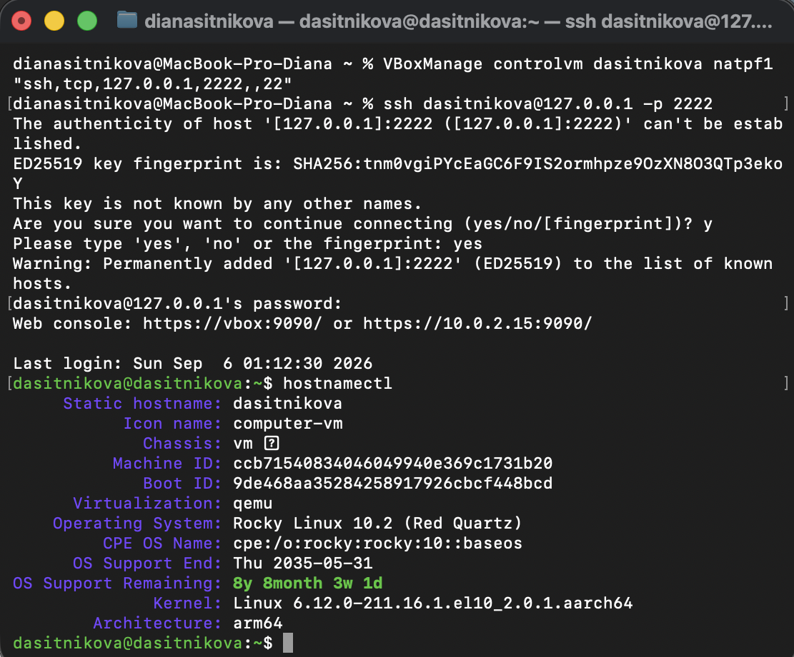{#fig-012 width=85%}

## Установка и настройка системы контроля версий

Система контроля версий установлена из репозиториев дистрибутива, после чего заданы имя и адрес электронной почты владельца репозитория, отключено экранирование символов кириллицы в выводе сообщений, задано имя начальной ветки и определено поведение при обработке символов конца строки ([рис. @fig-013]).

~~~bash
sudo dnf -y install git
git config --global user.name "Diana Sitnikova"
git config --global user.email "sitnickova.diana@gmail.com"
git config --global core.quotepath false
git config --global init.defaultBranch master
git config --global core.autocrlf input
git config --global core.safecrlf warn
~~~

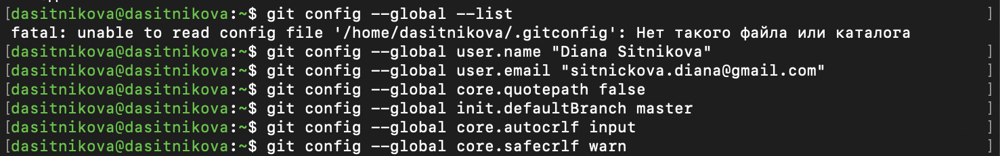{#fig-013 width=85%}

## Ключ SSH

Для доступа к серверу git создана пара ключей по алгоритму ed25519. Закрытый ключ защищён кодовой фразой и добавлен в агент аутентификации, который хранит его в расшифрованном виде в течение сеанса ([рис. @fig-014]).

~~~bash
ssh-keygen -t ed25519 -f ~/.ssh/id_ed25519-git \
  -C "sitnickova.diana@gmail.com"
eval "$(ssh-agent -s)"
ssh-add ~/.ssh/id_ed25519-git
cat ~/.ssh/id_ed25519-git.pub
~~~

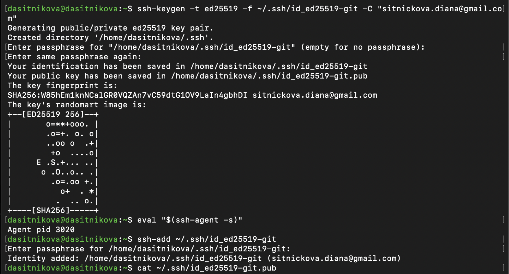{#fig-014 width=85%}

Открытая часть ключа добавлена в учётную запись GitHub в раздел ключей аутентификации ([рис. @fig-015]).

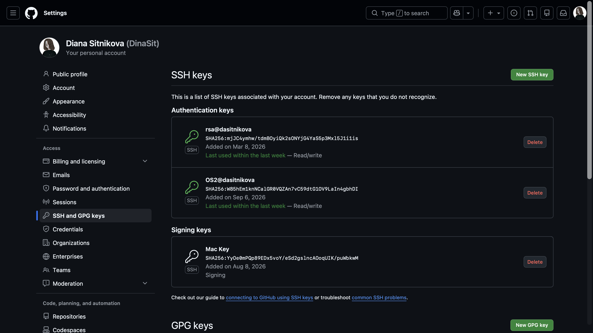{#fig-015 width=85%}

## Ключ PGP и подпись коммитов

Для подписи коммитов создан ключ PGP. При генерации выбран тип `RSA and RSA`, длина 4096 бит и неограниченный срок действия; адрес электронной почты указан тот же, что используется в учётной записи GitHub ([рис. @fig-016]).

~~~bash
gpg --full-generate-key
gpg --list-secret-keys --keyid-format LONG
~~~

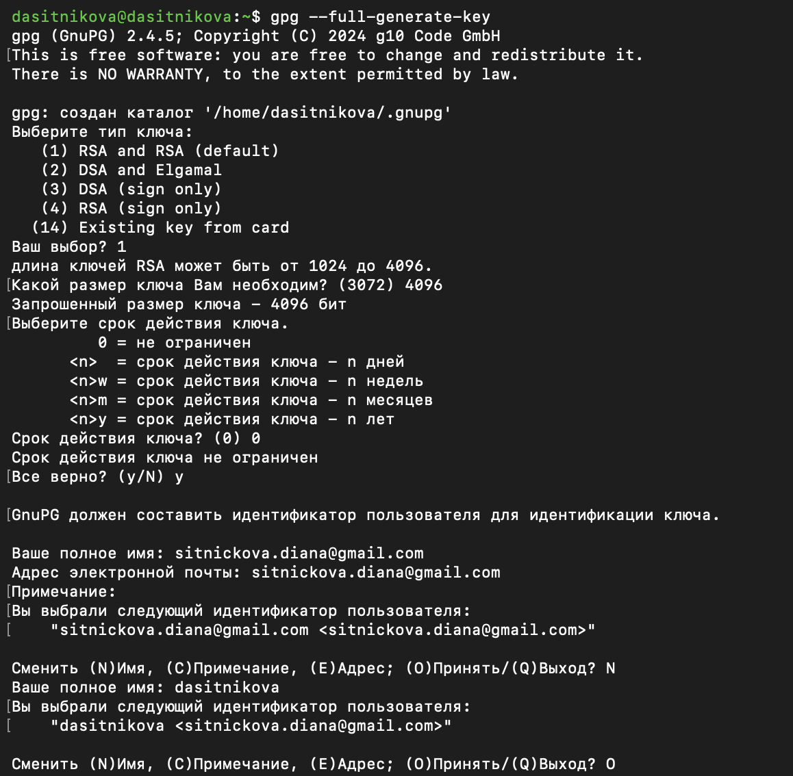{#fig-016 width=85%}

По завершении генерации выведены отпечаток ключа и путь к сертификату отзыва, после чего открытая часть ключа экспортирована в текстовом виде ([рис. @fig-017]).

~~~bash
gpg --armor --export 7C6D168DE97411B5526E54A1FF3915DB064215C6
~~~

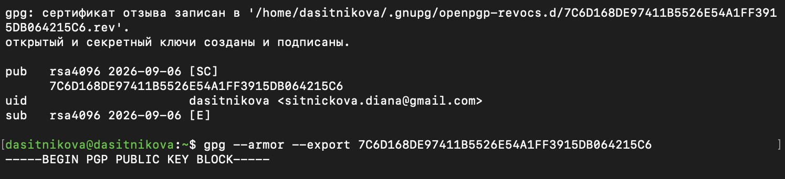{#fig-017 width=85%}

Экспортированный ключ добавлен в учётную запись GitHub в раздел ключей GPG ([рис. @fig-018]).

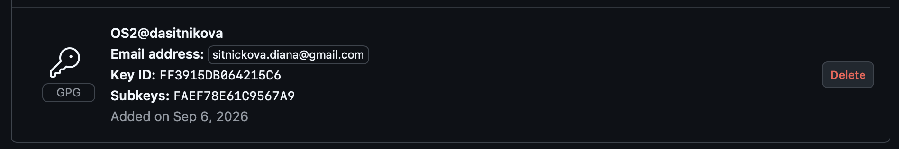{#fig-018 width=85%}

Затем git настроен на автоматическую подпись всех коммитов этим ключом ([рис. @fig-019]).

~~~bash
git config --global user.signingkey \
  7C6D168DE97411B5526E54A1FF3915DB064215C6
git config --global commit.gpgsign true
git config --global gpg.program $(which gpg)
~~~

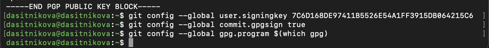{#fig-019 width=85%}

## Средства разработки

Установлена группа пакетов со средствами разработки. В дистрибутивах семейства Red Hat эта группа называется `Development Tools`, поэтому её имя указывается в кавычках ([рис. @fig-020]).

~~~bash
sudo dnf -y group install "Development Tools"
~~~

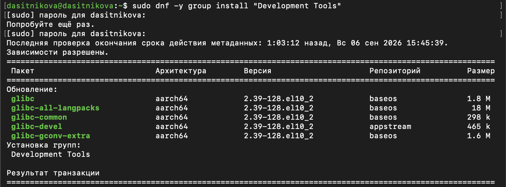{#fig-020 width=85%}

## Система подготовки документации Quarto

Репозиторий Copr `iucar/rstudio`, указанный в методических указаниях, содержит сборки только для дистрибутивов Fedora и не имеет цели `epel-10-aarch64`, соответствующей используемой системе. Поэтому Quarto установлен из официального архива проекта для архитектуры arm64 ([рис. @fig-021]).

~~~bash
curl -s \
  https://api.github.com/repos/quarto-dev/quarto-cli/releases/latest \
  | grep -o 'https://[^"]*linux-arm64\.tar\.gz' | head -1
curl -LO https://github.com/quarto-dev/quarto-cli/releases/\
download/v1.10.18/quarto-1.10.18-linux-arm64.tar.gz
sudo mkdir -p /opt/quarto
sudo tar -xzf quarto-*-linux-arm64.tar.gz -C /opt/quarto \
  --strip-components=1
sudo dnf -y install libxcrypt-compat
~~~

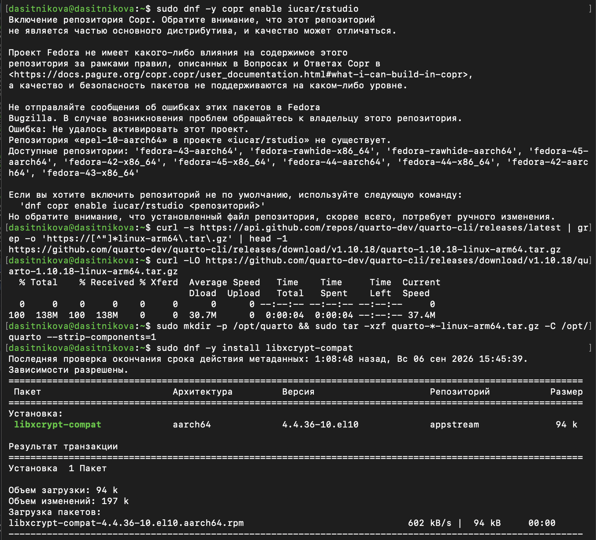{#fig-021 width=85%}

Архив распакован в каталог `/opt/quarto`, поэтому для доступа к программе по имени создана символьная ссылка в каталоге `/usr/local/bin`, входящем в переменную окружения `PATH`. Команда `quarto check` выполняет самодиагностику и подтверждает работоспособность установки ([рис. @fig-022]).

~~~bash
sudo ln -sf /opt/quarto/bin/quarto /usr/local/bin/quarto
quarto check
~~~

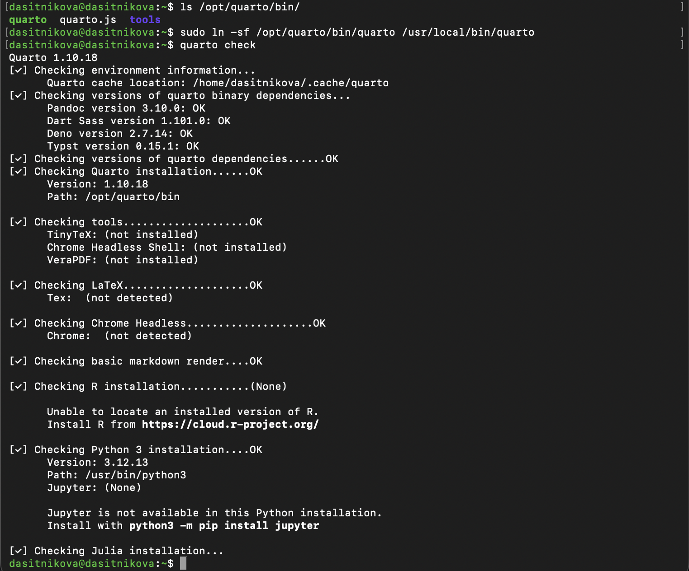{#fig-022 width=85%}

## Node.js и утилиты работы с коммитами

Программное обеспечение для семантического версионирования и оформления коммитов работает на платформе Node.js, поэтому она установлена из репозиториев дистрибутива ([рис. @fig-023]).

~~~bash
sudo dnf -y install nodejs
~~~

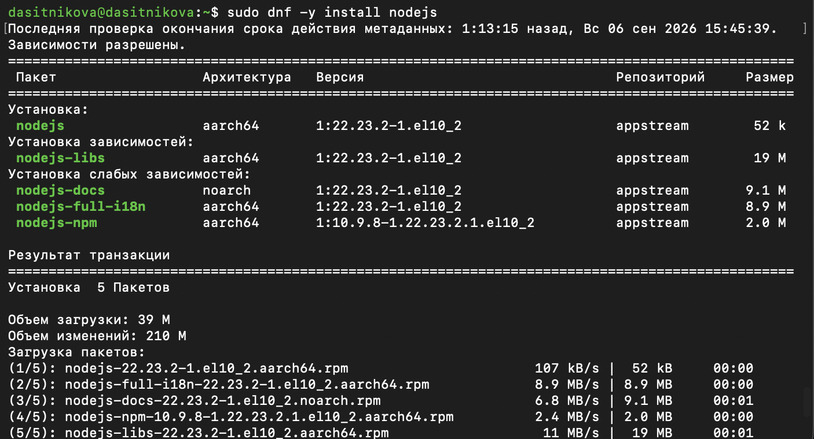{#fig-023 width=85%}

Менеджер пакетов `pnpm` установлен официальным сценарием установки, который размещает файлы в домашнем каталоге пользователя и дописывает переменную `PATH` в файл `~/.bashrc` ([рис. @fig-024]).

~~~bash
curl -fsSL https://get.pnpm.io/install.sh | sh -
source ~/.bashrc
pnpm --version
~~~

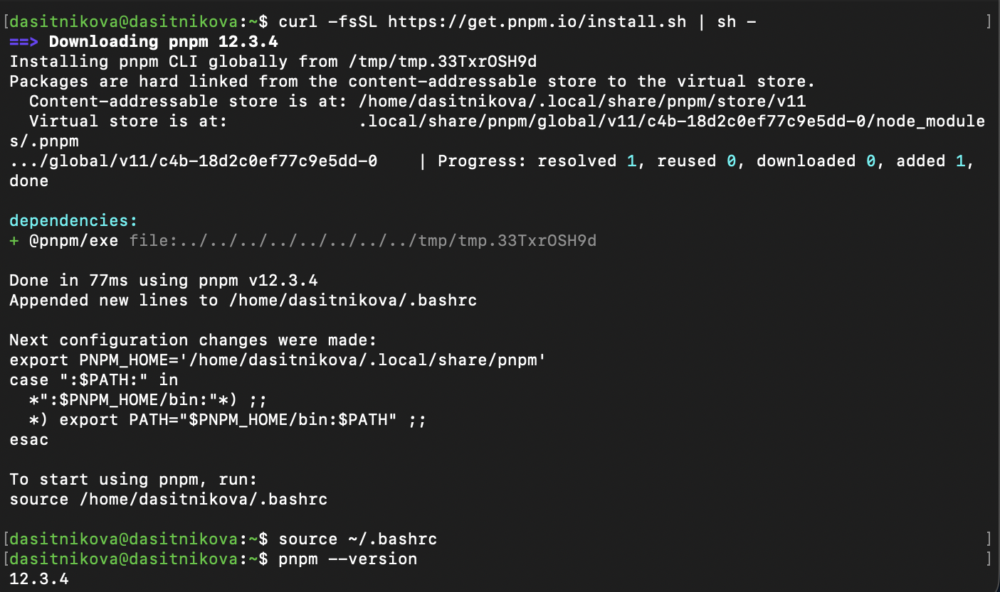{#fig-024 width=85%}

С помощью `pnpm` установлены три утилиты: `commitizen` предоставляет команду `git-cz` для составления сообщений коммитов по спецификации Conventional Commits, `cz-customizable` позволяет настроить их формат, `standard-version` автоматизирует изменение номера версии и ведение журнала изменений ([рис. @fig-025]).

~~~bash
pnpm add -g commitizen cz-customizable standard-version
pnpm list -g
~~~

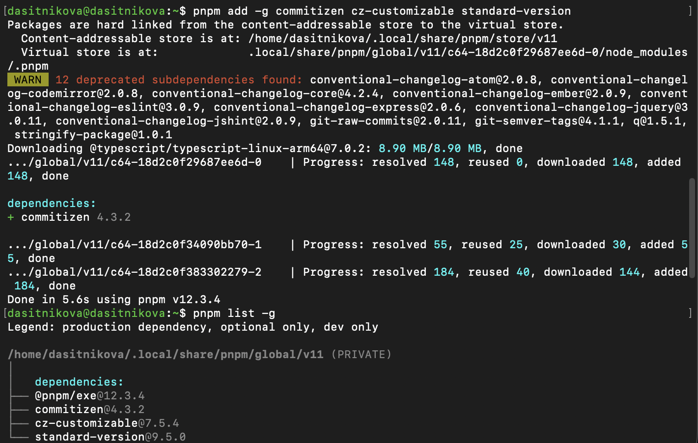{#fig-025 width=85%}

## Пакет git-flow

Репозиторий Copr `elegos/gitflow` также не содержит сборок для используемой системы, поэтому git-flow установлен сценарием установки из репозитория проекта --- этот способ приведён в методических указаниях как альтернативный ([рис. @fig-026]).

~~~bash
cd /tmp
curl -fsSLO https://raw.githubusercontent.com/petervanderdoes/\
gitflow-avh/develop/contrib/gitflow-installer.sh
chmod +x gitflow-installer.sh
sudo ./gitflow-installer.sh install stable
~~~

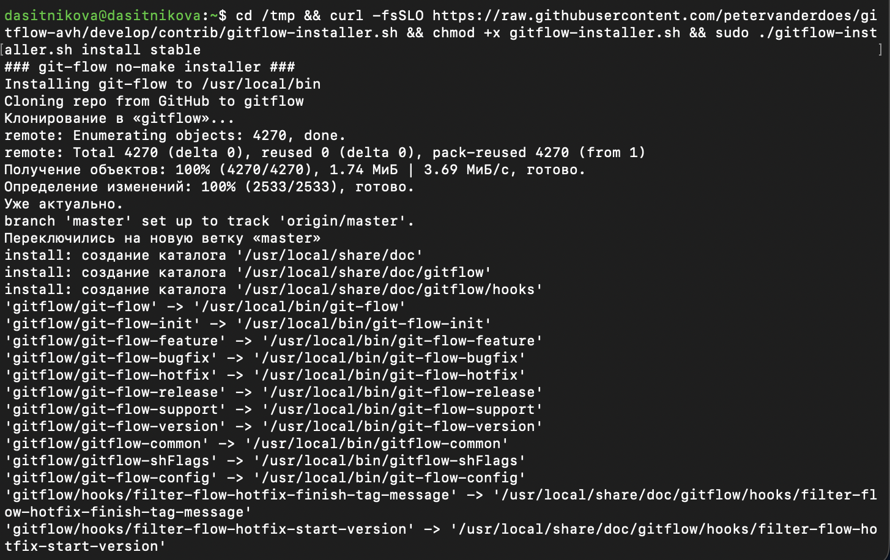{#fig-026 width=85%}

## Система вёрстки TeX

Для получения PDF-версий отчётов и презентаций установлен дистрибутив TeX. Сначала средствами Quarto установлен облегчённый дистрибутив TinyTeX ([рис. @fig-027]).

~~~bash
quarto install tinytex
~~~

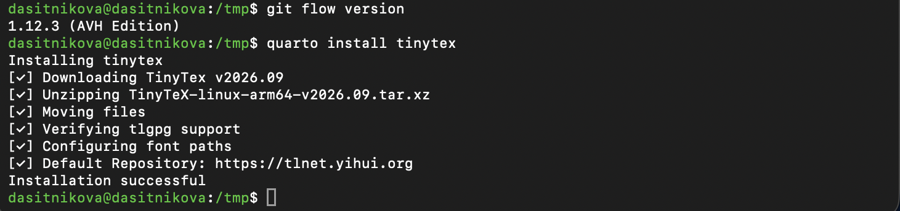{#fig-027 width=85%}

Шаблоны отчёта и презентации используют тему оформления `beamertheme-gotham`, шрифты `plex-otf`, пакет переноса длинных строк `fvextra`, а также `biblatex`, `biber` и `babel-russian` для оформления библиографии по ГОСТ и русской типографики. В репозиториях Rocky Linux 10 доступна только базовая схема TeX Live и перечисленные пакеты отсутствуют, поэтому дополнительно установлен сетевой дистрибутив TeX Live 2026 с CTAN по схеме `medium`, а недостающие пакеты добавлены менеджером `tlmgr`.

~~~bash
cd /tmp
curl -LO \
  https://mirror.ctan.org/systems/texlive/tlnet/install-tl-unx.tar.gz
tar -xzf install-tl-unx.tar.gz
cd /tmp/install-tl-*/
sudo ./install-tl --scheme=medium --no-interaction
sudo /usr/local/texlive/2026/bin/aarch64-linux/tlmgr install \
  beamertheme-gotham plex-otf fvextra biblatex biblatex-gost biber \
  csquotes indentfirst float beamer collection-langcyrillic
~~~

## Репозиторий курса

Репозиторий курса создан на GitHub из шаблона `course-directory-student-template` и назван `2026-2-study-os2` в соответствии с соглашением об именовании. Код курса записан в файл `COURSE`, после чего структура каталогов сгенерирована средствами шаблона: шестнадцать каталогов лабораторных работ, каталог индивидуального выступления и три этапа внешнего курса.

~~~bash
echo os2 > COURSE
make prepare
git add .
git commit -m 'feat(main): make course structure'
git push
~~~

В гостевой системе создан каталог рабочего пространства по соглашению Denote, и репозиторий склонирован в него. Поскольку имя файла ключа отличается от стандартного, ключ указан явно в файле конфигурации SSH. Шаблоны отчёта и презентации подключены к репозиторию подмодулями, поэтому после клонирования они загружены отдельной командой ([рис. @fig-028]).

~~~bash
mkdir -p "$HOME/work/study/2026-2/2026-2==study--os2"
cd "$HOME/work/study/2026-2/2026-2==study--os2"
git clone git@github.com:DinaSit/2026-2-study-os2.git
cd 2026-2-study-os2
git submodule update --init --recursive
~~~

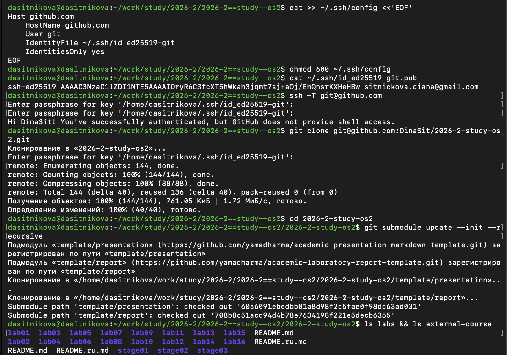{#fig-028 width=85%}

В репозитории инициализирована модель ветвления Gitflow. В качестве префикса меток версий указан символ `v`, остальные параметры оставлены по умолчанию; после инициализации текущей стала ветка `develop` ([рис. @fig-029]).

~~~bash
git flow init
git branch
git push -u --all
~~~

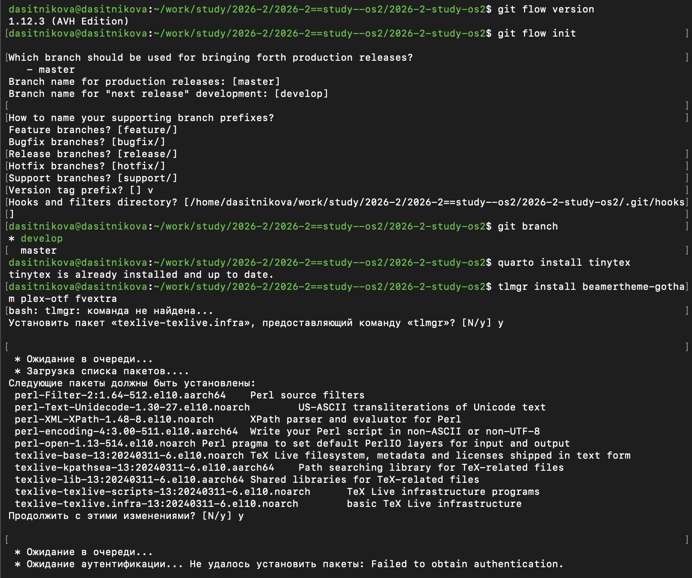{#fig-029 width=85%}

Для работы с выпусками из командной строки установлена утилита `gh`. В репозиториях дистрибутива она отсутствует, поэтому установлен пакет для архитектуры aarch64 из официального репозитория проекта, после чего выполнена авторизация в учётной записи ([рис. @fig-030]).

~~~bash
curl -LO "https://github.com/cli/cli/releases/download/\
v2.100.0/gh_2.100.0_linux_arm64.rpm"
sudo dnf -y install ./gh_*_linux_arm64.rpm
gh auth login
~~~

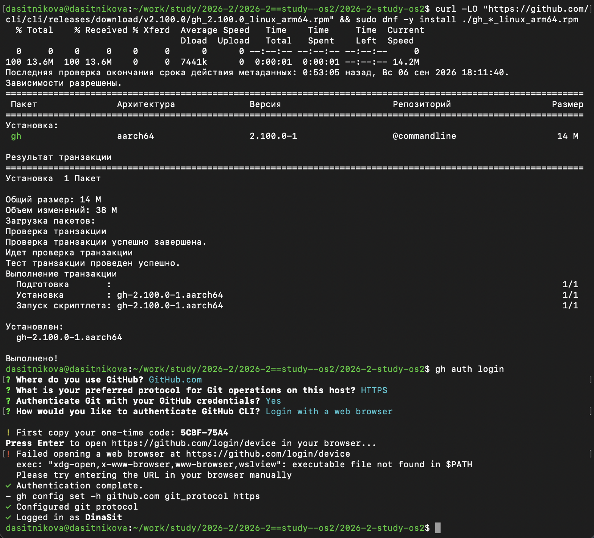{#fig-030 width=85%}

Первый выпуск репозитория оформлен средствами git-flow и помечен версией `1.0.0` в соответствии с правилами семантического версионирования, после чего на его основе создан выпуск в репозитории на GitHub.

~~~bash
git flow release start 1.0.0
git flow release finish 1.0.0
git push --all && git push --tags
mkdir -p ../release && cp CHANGELOG.md ../release
gh release create v1.0.0 -F ../release/CHANGELOG.md
~~~

# Домашнее задание

Требуется определить характеристики установленной системы по загрузочным сообщениям ядра: версию ядра, частоту и модель процессора, объём оперативной памяти, тип обнаруженного гипервизора, тип файловой системы корневого раздела и порядок монтирования файловых систем. Чтение кольцевого буфера в дистрибутивах семейства RHEL доступно только суперпользователю, поэтому команды `dmesg` выполнены через `sudo` ([рис. @fig-031]).

~~~bash
sudo dmesg | grep -i "linux version"
sudo dmesg | grep -icE "mhz|model name"
lscpu | grep -iE "architecture|vendor id|model name|mhz|bogomips"
sudo dmesg | grep -i "memory:"
free -h | head -2
systemd-detect-virt
findmnt /
sudo dmesg | grep -i xfs
~~~

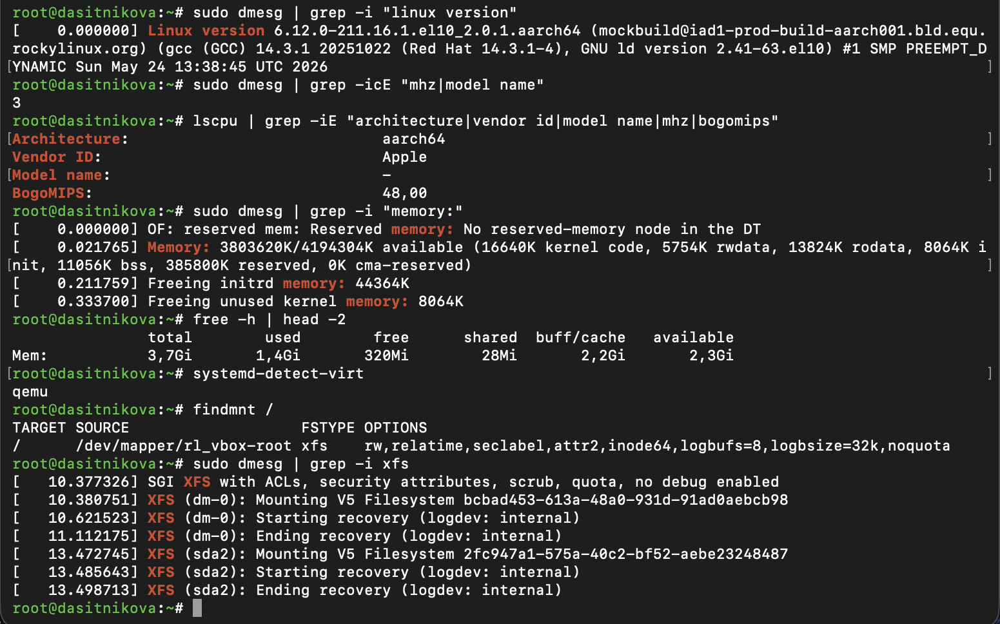{#fig-031 width=95%}

Сводка полученных значений приведена в [табл. @tbl-hw].

| Характеристика | Значение |
|---|---|
| Версия ядра | 6.12.0-211.16.1.el10\_2.0.1.aarch64 |
| Сборка ядра | GCC 14.3.1, GNU ld 2.41, 24 мая 2026 |
| Архитектура | aarch64 |
| Производитель процессора | Apple |
| Модель процессора | не публикуется |
| Частота процессора | не публикуется, BogoMIPS 48,00 |
| Число процессоров | 2 |
| Объём ОЗУ, выделено | 4194304 КиБ, то есть 4096 МиБ |
| Объём ОЗУ, доступно ядру | 3803620 КиБ |
| Тип гипервизора | `qemu` |
| Корневой раздел | `/dev/mapper/rl_vbox-root` |
| Файловая система корня | XFS |

: Характеристики установленной системы {#tbl-hw}

## Версия ядра

Первая строка журнала содержит полное описание ядра: версию `6.12.0-211.16.1.el10_2.0.1.aarch64`, узел сборки в инфраструктуре Rocky Linux, версии компилятора GCC 14.3.1 и компоновщика GNU ld 2.41, а также дату сборки. Суффикс `el10_2` указывает на принадлежность к десятому выпуску Enterprise Linux, суффикс `aarch64` --- на архитектуру. Отметка `SMP PREEMPT_DYNAMIC` означает, что ядро собрано с поддержкой многопроцессорности и с переключаемой во время работы моделью вытеснения.

## Частота и модель процессора

Команда `lscpu` показывает архитектуру `aarch64`, производителя `Apple` и два доступных процессора, однако поле модели пусто, а строка с тактовой частотой отсутствует. Вместо неё выводится значение `BogoMIPS` --- результат калибровочного цикла ядра, который не является измерением частоты.

Причина в устройстве платформы: процессоры Apple не публикуют номинальную частоту даже основной операционной системе, поскольку она непрерывно меняется в зависимости от нагрузки и теплового режима, а модель процессора гипервизор гостевой системе не передаёт. Гостю остаются архитектура, число ядер и набор поддерживаемых расширений системы команд.

Поиск по журналу ядра подстрок `MHz` и `model name` даёт три совпадения, и ни одно из них не относится к частоте процессора.

Первое сообщение --- `arch_timer: cp15 timer(s) running at 24.00MHz` --- описывает системный таймер архитектуры ARM. Это отдельный счётчик, доступный через регистры сопроцессора `cp15`; он работает на фиксированной частоте 24 МГц независимо от того, с какой частотой в этот момент исполняет команды процессор. Пометка `virt` означает, что гостевая система использует виртуальный вариант счётчика, смещённый относительно физического.

Второе сообщение --- `sched_clock: 56 bits at 24MHz, resolution 41ns` --- сообщает, что источником времени для планировщика выбран тот же счётчик. Разрешение 41 нс есть период его тактовой частоты, а разрядности 56 бит хватает почти на 140 лет непрерывной работы до переполнения.

Третье сообщение относится к сетевому адаптеру и содержит характеристику шины `PCI:33MHz:32-bit`, то есть частоту шины PCI, а не процессора.

Таким образом, единственная величина в мегагерцах, доступная гостевой системе, --- это частота системного счётчика. Принимать её за тактовую частоту процессора нельзя: она относится к другому устройству и по определению постоянна.

## Объём оперативной памяти

Строка `Memory: 3803620K/4194304K available` показывает, что ядру предоставлено 4194304 КиБ, то есть ровно 4096 МиБ, заданные в настройках виртуальной машины. Из них 3803620 КиБ остаются доступными для использования, а 385800 КиБ зарезервированы; отдельно перечислены области, занятые кодом ядра, данными и таблицами.

Команда `free -h` показывает те же 3,7 ГиБ как общий объём: она учитывает память уже за вычетом зарезервированных ядром областей. Ниже видно, что 2,2 ГиБ занято под буферы и кэш, но эта память считается доступной для приложений и при необходимости освобождается.

## Тип гипервизора

Команда `systemd-detect-virt` сообщает `qemu`. Виртуальная машина создана средствами VirtualBox, однако на платформе Apple Silicon гипервизоры работают через системный интерфейс Hypervisor.framework и предоставляют гостевой системе одинаковое описание виртуальной машины, по которому она и определяет тип виртуализации.

Настоящий гипервизор при этом всё же можно определить по косвенному признаку. Аппаратный адрес сетевого адаптера, выведенный драйвером `e1000` при загрузке, начинается с последовательности `08:00:27`. Это идентификатор организации, зарегистрированный за VirtualBox, и назначается он всем создаваемым в нём виртуальным сетевым адаптерам.

## Файловая система корневого раздела

Команда `findmnt /` показывает, что корневой каталог смонтирован с устройства `/dev/mapper/rl_vbox-root` и несёт файловую систему XFS. Имя устройства указывает на логический том LVM: `rl_vbox` --- имя группы томов, `root` --- имя логического тома. Среди параметров монтирования присутствуют `relatime` --- обновление времени доступа только при изменении файла, `seclabel` --- поддержка меток SELinux, `inode64` --- размещение индексных дескрипторов по всему тому и `noquota` --- отключённый учёт квот.

## Порядок монтирования файловых систем

Сообщения XFS в журнале ядра позволяют восстановить последовательность монтирования. Строка `Mounted filesystem`, приведённая в методических указаниях, относится к сообщениям файловой системы ext4; XFS выводит собственные сообщения вида `Mounting V5 Filesystem`.

Сначала на отметке 10,377 с ядро сообщает о загрузке модуля XFS с поддержкой списков управления доступом, меток безопасности и квот. Затем на отметке 10,380 с монтируется файловая система на устройстве `dm-0` --- это корневой логический том LVM. Позже, на отметке 13,472 с, монтируется файловая система на разделе `sda2` --- раздел `/boot`. Такой порядок закономерен: раздел `/boot` является точкой монтирования внутри корневого каталога, поэтому смонтировать его можно только после корневой файловой системы.

Между сообщениями о монтировании обеих файловых систем присутствуют строки `Starting recovery` и `Ending recovery`. Они означают, что предыдущее завершение работы системы было некорректным и XFS восстановила согласованность метаданных, проиграв журнал вместо полной проверки носителя. Продолжительность восстановления составила около 0,5 с для корневого тома и 0,03 с для раздела `/boot`.

# Контрольные вопросы

1. **Укажите команды терминала и приведите примеры: для получения справки по команде; для перемещения по файловой системе; для просмотра содержимого каталога; для определения объёма каталога; для создания и удаления каталогов и файлов; для задания определённых прав на файл или каталог; для просмотра истории команд.**

   Справку по команде выводит `man`, краткую сводку --- ключ `--help`, а для встроенных команд оболочки --- `help`. Перемещение по файловой системе выполняется командой `cd`, текущий каталог показывает `pwd`. Содержимое каталога выводит `ls`, при этом ключ `-l` включает подробный формат, `-a` --- отображение скрытых файлов, `-h` --- человекочитаемые размеры. Объём каталога определяет `du`, свободное место на смонтированных файловых системах --- `df`. Каталоги создаёт `mkdir`, пустые файлы --- `touch`, удаление выполняют `rmdir` и `rm`. Права доступа задаёт `chmod`, владельца и группу --- `chown` и `chgrp`. Историю команд выводит `history`.

   ~~~bash
   man ls
   cd /etc && pwd
   ls -lah /var/log
   du -sh /home/dasitnikova
   mkdir -p work/study && touch work/study/notes.txt
   rm -r work
   chmod 755 script.sh
   history | tail -20
   ~~~

2. **Какую информацию содержит учётная запись пользователя? Какие команды позволяют посмотреть информацию о пользователе?**

   Учётная запись описывается строкой в файле `/etc/passwd`, состоящей из семи полей: имя пользователя, признак наличия пароля, числовой идентификатор пользователя UID, идентификатор основной группы GID, поле GECOS с полным именем и дополнительными сведениями, путь к домашнему каталогу и командная оболочка, запускаемая при входе. Хеш пароля и параметры его устаревания хранятся отдельно в файле `/etc/shadow`, доступном только суперпользователю. Дополнительные группы пользователя перечислены в файле `/etc/group`.

   Идентификаторы и группы текущего пользователя выводит команда `id`, имя --- `whoami`, список групп --- `groups`. Запись из базы учётных записей возвращает `getent passwd`, сводную таблицу по всем учётным записям --- `lslogins`. Список работающих в системе пользователей выводят `who` и `w`, историю входов --- `last`.

   ~~~bash
   id dasitnikova
   getent passwd dasitnikova
   groups dasitnikova
   ~~~

3. **Что такое файловая система? Приведите примеры с краткой характеристикой.**

   Файловая система --- это способ организации и хранения данных на носителе. Она определяет структуру каталогов, правила именования, размещение содержимого файлов по блокам, а также состав метаданных: владельца, права доступа и отметки времени.

   XFS --- журналируемая файловая система, используемая по умолчанию в Red Hat Enterprise Linux и Rocky Linux; рассчитана на большие файлы и параллельные операции ввода-вывода, допускает расширение в смонтированном состоянии. Ext4 --- журналируемая файловая система, долгое время применявшаяся в Linux по умолчанию. Btrfs реализует копирование при записи, снимки состояния и контрольные суммы данных. FAT32 не имеет журнала и не хранит прав доступа, но читается всеми распространёнными операционными системами. Кроме дисковых существуют виртуальные файловые системы: `tmpfs` размещается в оперативной памяти, а `procfs` и `sysfs` представляют в виде файлов состояние ядра и устройств.

4. **Как посмотреть, какие файловые системы подмонтированы в операционной системе?**

   Дерево точек монтирования с указанием устройства, типа файловой системы и параметров монтирования выводит команда `findmnt`. Плоский список даёт `mount` без аргументов, а `df` с ключами `-hT` дополнительно показывает занятое и свободное место. Соответствие блочных устройств точкам монтирования выводит `lsblk -f`.

   ~~~bash
   findmnt
   mount
   df -hT
   lsblk -f
   ~~~

   Перечисленные команды показывают состояние на текущий момент, тогда как файл `/etc/fstab` описывает, какие файловые системы должны монтироваться при загрузке.

5. **Как удалить зависший процесс?**

   Сначала определяется идентификатор процесса при помощи `ps`, `pgrep` или интерактивной программы `top`. Затем процессу отправляется сигнал корректного завершения `SIGTERM`, по которому процесс успевает закрыть файлы и освободить ресурсы:

   ~~~bash
   ps aux | grep имя_процесса
   kill -TERM PID
   ~~~

   Если процесс не реагирует на `SIGTERM`, применяется сигнал `SIGKILL`, который процесс не может перехватить или проигнорировать:

   ~~~bash
   kill -KILL PID
   ~~~

   Завершить процессы по имени позволяют `pkill` и `killall`. Поскольку `SIGKILL` не даёт процессу освободить ресурсы, его следует применять только после неудачной попытки штатного завершения.

# Выводы

В ходе лабораторной работы были приобретены практические навыки создания виртуальной машины в Oracle VM VirtualBox, установки Rocky Linux 10.2 для архитектуры aarch64 и первоначальной настройки гостевой операционной системы. Имя виртуальной машины, имя хоста и имя пользователя приведены в соответствие с соглашением об именовании, установлено базовое окружение с графическим интерфейсом и группой средств разработки, настроен доступ к гостевой системе по протоколу SSH через проброс порта.

В гостевой системе подготовлено рабочее пространство для дальнейших работ: настроена система контроля версий, созданы ключи SSH и PGP, включена автоматическая подпись коммитов, установлены Quarto с полным дистрибутивом TeX Live, платформа Node.js с утилитами оформления коммитов и семантического версионирования, а также пакет git-flow. Репозиторий курса создан из шаблона, развёрнут по каноническому пути рабочего пространства, переведён на модель ветвления Gitflow и помечен первым выпуском версии 1.0.0.

С помощью команды `dmesg` и системных утилит проанализированы загрузочные сообщения ядра и определены характеристики установленной системы.

# Список литературы{.unnumbered}

::: {#refs}
:::
