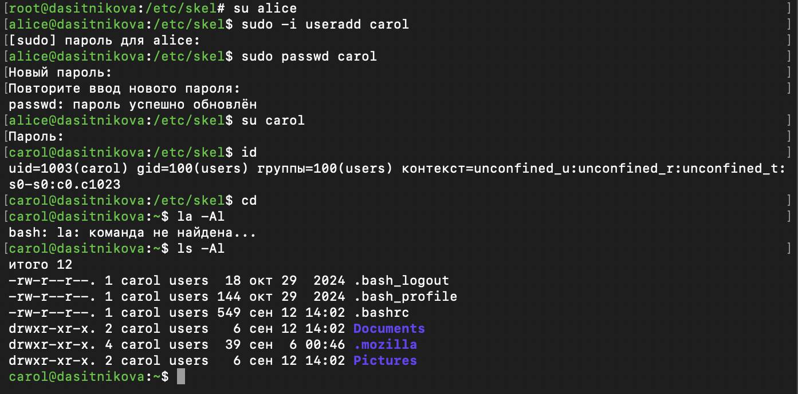
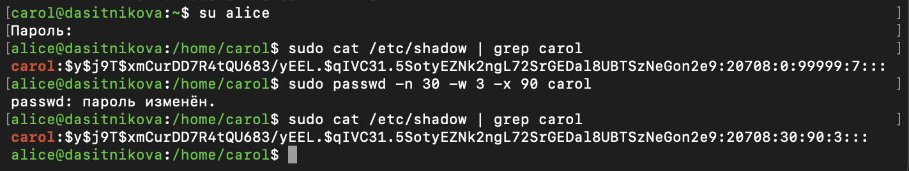

---
## Author
author:
  name: Ситникова Диана Александровна
  degrees: BSc
  email: 1032201746@rudn.ru
  affiliation:
    - name: Российский университет дружбы народов
      country: Российская Федерация
      postal-code: 117198
      city: Москва
      address: ул. Миклухо-Маклая, д. 6
## Title
title: "Лабораторная работа № 2"
subtitle: "Управление пользователями и группами"
institute:
  - "Российский университет дружбы народов им. П. Лумумбы"
  - "Преподаватель: д.ф.-м.н., профессор Кулябов Дмитрий Сергеевич"
license: CC BY
date: today
date-format: "YYYY-MM-DD"
---

# Информация

## Докладчик

:::::::::::::: {.columns align=center}
::: {.column width="68%"}

- Ситникова Диана Александровна
- направление 09.03.03 «Прикладная информатика»
- Российский университет дружбы народов
- [1032201746@rudn.ru](mailto:1032201746@rudn.ru)

:::
::: {.column width="32%"}

{width=100%}

:::
::::::::::::::

# Вводная часть

## Актуальность

- Учётные записи и группы --- основа разграничения доступа в Linux: через них выдаются права на файлы и административные полномочия.
- Ошибка в политике `sudo` или в членстве в группах даёт пользователю лишние права либо лишает администратора доступа.
- Параметры по умолчанию определяют права каждого нового пользователя, поэтому их настраивают до создания учётных записей.

## Объект, предмет, цель и задачи

**Объект** --- учётные записи пользователей и группы в Rocky Linux 10.2.

**Предмет** --- средства создания, переключения и настройки учётных записей и групп.

**Цель** --- получить представление о работе с учётными записями пользователей и группами в операционной системе типа Linux.

**Задачи:** изучить справку по командам; переключаться между учётными записями; создать пользователей и настроить параметры по умолчанию; создать группы и распределить по ним пользователей.

## Материалы и методы

| Компонент | Значение |
|---|---|
| Стенд | Rocky Linux 10.2 из лабораторной работы № 1 |
| Переключение учётных записей | `su`, `sudo`, `visudo` |
| Учётные записи | `useradd`, `passwd`, `usermod` |
| Группы | `groupadd`, `usermod -aG` |
| Системные базы | `/etc/passwd`, `/etc/shadow`, `/etc/group` |

# Содержание исследования

## Административные права выдаются через группу wheel

:::::::::::::: {.columns align=center}
::: {.column width="42%"}

Правило `%wheel ALL=(ALL) ALL` разрешает членам группы выполнять любые команды от имени любого пользователя.

Файл правится только через `visudo`: он проверяет синтаксис перед сохранением.

:::
::: {.column width="58%"}

{width=100%}

:::
::::::::::::::

## su и sudo запрашивают пароли разных пользователей

:::::::::::::: {.columns align=center}
::: {.column width="42%"}

`su alice` запрашивает пароль `alice` и открывает её оболочку.

`sudo useradd bob` запрашивает пароль вызывающего пользователя и выполняет одну команду по политике `sudoers`.

:::
::: {.column width="58%"}

{width=100%}

:::
::::::::::::::

## Параметры новых пользователей задаются заранее

:::::::::::::: {.columns align=center}
::: {.column width="42%"}

В `/etc/login.defs` параметр `USERGROUPS_ENAB` переведён в `no`: собственная группа для нового пользователя не создаётся.

В шаблон `/etc/skel` добавлены каталоги `Pictures`, `Documents` и строка `EDITOR` в `.bashrc`.

:::
::: {.column width="58%"}

{width=100%}

:::
::::::::::::::

## Пользователь carol создан по новым правилам

:::::::::::::: {.columns align=center}
::: {.column width="42%"}

Первичная группа --- `users` с GID 100 из `/etc/default/useradd`.

Домашний каталог получил копию шаблона: `Documents` и `Pictures` на месте.

:::
::: {.column width="58%"}

{width=100%}

:::
::::::::::::::

## Срок действия пароля хранится в /etc/shadow

{width=100%}

| Поле | До | После `passwd -n 30 -w 3 -x 90` |
|---|---|---|
| Минимальный срок, дней | 0 | 30 |
| Максимальный срок, дней | 99999 | 90 |
| Предупреждение, дней | 7 | 3 |

Хеш `$y$` --- алгоритм yescrypt; 20708 --- дата смены пароля, 12 сентября 2026 года.

## Учётная запись распределена по трём файлам

:::::::::::::: {.columns align=center}
::: {.column width="42%"}

`/etc/passwd` --- UID, первичная группа, домашний каталог и оболочка.

`/etc/shadow` --- хеш и сроки пароля, читает только `root`.

`/etc/group` --- участники дополнительных групп; `carol` там нет.

:::
::: {.column width="58%"}

{width=100%}

:::
::::::::::::::

## Ключ -a сохраняет прежние группы

| Пользователь | Первичная группа | Дополнительные группы |
|---|---|---|
| `alice` | `alice` (1001) | `wheel` (10), `main` (1003) |
| `bob` | `bob` (1002) | `main` (1003) |
| `carol` | `users` (100) | `thrid` (1004) |

`usermod -aG main alice` добавил группу к имеющимся: `alice` осталась в `wheel` и не потеряла права администратора.

# Результаты

## Учётные записи и группы настроены и проверены

- Изучена справка по командам управления учётными записями и группами.
- Выполнено переключение между учётными записями `su` и `sudo`, разобрано правило `sudo` для группы `wheel`.
- Созданы пользователи `alice`, `bob` и `carol`.
- Параметры по умолчанию изменены в `/etc/login.defs` и `/etc/skel` и проверены на пользователе `carol`.
- Изменён срок действия пароля пользователя `carol`.
- Созданы две группы, пользователи распределены по ним.

## Вывод

Права пользователя в Linux складываются из трёх источников: записей в `/etc/passwd`, `/etc/shadow` и `/etc/group`, политики `sudo` и параметров, действующих в момент создания учётной записи.

Поэтому параметры по умолчанию настраиваются до создания пользователей, политика `sudo` правится только через `visudo`, а группы добавляются с ключом `-a`.
