---
## Author
author:
  name: Ситникова Диана Александровна
  degrees: BSc
  email: 1032201746@rudn.ru
  affiliation:
    - name: Российский университет дружбы народов
      country: Российская Федерация
      postal-code: 117198
      city: Москва
      address: ул. Миклухо-Маклая, д. 6

## Title
title: "Отчёт по лабораторной работе №2"
subtitle: "Управление пользователями и группами"
license: "CC BY"
bibliography: bib/cite.bib
---

# Цель работы

Целью данной работы является получение представления о работе с учётными записями пользователей и группами пользователей в операционной системе типа Linux.

# Задание

- Прочитать справочное описание `man` по командам `ls`, `whoami`, `id`, `groups`, `su`, `sudo`, `passwd`, `vi`, `visudo`, `useradd`, `usermod`, `userdel`, `groupadd`, `groupdel`.
- Выполнить действия по переключению между учётными записями пользователей и по управлению учётными записями пользователей.
- Выполнить действия по созданию пользователей и управлению их учётными записями.
- Выполнить действия по работе с группами пользователей.
- Ответить на контрольные вопросы.

# Теоретическое введение

## Дискреционное управление доступом

В операционных системах типа Linux чаще всего применяется дискреционное управление доступом: владелец объекта сам определяет, какие субъекты и какие операции могут выполнять над этим объектом [@robachevsky_book_unix_ru; @tanenbaum_book_modern-os_ru]. Субъектами выступают пользователи и группы пользователей, объектами --- файлы, каталоги, устройства и другие ресурсы системы. Особым субъектом является суперпользователь `root`: дискреционные проверки прав на него не распространяются, и он может изменять права владения любыми объектами.

Для каждого объекта определены три вида доступа --- чтение (`r`), запись (`w`) и выполнение (`x`) --- и три категории субъектов: пользователь-владелец, группа-владелец и все остальные. Команда `ls -l` отображает права в виде строки из десяти символов. Первый символ обозначает тип объекта ([табл. @tbl-types]), за ним следуют три тройки `rwx` для владельца, группы и остальных. Точка после строки прав в выводе `ls -l` означает, что у объекта есть метка безопасности SELinux.

| Флаг | Тип объекта |
|---|---|
| `-` | обычный файл |
| `d` | каталог |
| `l` | символическая ссылка |
| `b` | блочное устройство |
| `c` | символьное устройство |
| `p` | именованный канал (FIFO) |
| `s` | сокет Unix |

: Обозначения типов объектов в выводе ls -l {#tbl-types}

Права изменяются командой `chmod` в символьной или восьмеричной записи. В восьмеричной записи каждая тройка прав кодируется одной цифрой, в которой чтению соответствует 4, записи --- 2, выполнению --- 1 ([табл. @tbl-octal]). Например, права `rwxr--r--` задаются командой `chmod 744 file1` или `chmod u=rwx,go+r,go-wx file1`.

| Восьмеричная запись | Двоичная запись | Права |
|---|---|---|
| 0 | 000 | `---` |
| 1 | 001 | `--x` |
| 2 | 010 | `-w-` |
| 3 | 011 | `-wx` |
| 4 | 100 | `r--` |
| 5 | 101 | `r-x` |
| 6 | 110 | `rw-` |
| 7 | 111 | `rwx` |

: Восьмеричное представление прав доступа {#tbl-octal}

## Учётные записи и идентификаторы

Каждый пользователь имеет уникальное имя и числовой идентификатор UID. Ядро проверяет права доступа по идентификаторам, а не по именам: в метаданных файла хранится UID владельца. Идентификатор 0 закреплён за суперпользователем, значения ниже 1000 отведены системным учётным записям служб, а обычные пользователи получают идентификаторы начиная со значения `UID_MIN` из файла `/etc/login.defs` [@nemeth_book_unix-linux-admin_ru].

Каждый пользователь входит в одну первичную группу с идентификатором GID и может входить в несколько дополнительных групп. Первичная группа по умолчанию становится группой-владельцем создаваемых пользователем файлов, дополнительные группы расширяют его права доступа. Список групп процесса формируется при входе в систему, поэтому изменение членства вступает в силу в новом сеансе.

## Системные базы учётных записей

Сведения об учётных записях хранятся в текстовых файлах, поля записей в которых разделены двоеточием.

Файл `/etc/passwd` доступен для чтения всем пользователям и содержит по одной строке на учётную запись: имя пользователя, признак пароля `x`, UID, GID первичной группы, комментарий GECOS, домашний каталог и командную оболочку. Для системных учётных записей оболочкой указывается `/sbin/nologin`, которая запрещает интерактивный вход.

Файл `/etc/shadow` доступен только суперпользователю и хранит хеши паролей и параметры срока их действия ([табл. @tbl-shadow]). Хеш начинается с идентификатора алгоритма, заключённого в символы `$`: `$6$` означает SHA-512, `$y$` --- yescrypt. Алгоритм для новых паролей задаётся параметром `ENCRYPT_METHOD` в файле `/etc/login.defs`.

| № | Поле |
|---|------------------------------------------------|
| 1 | Имя пользователя |
| 2 | Хеш пароля |
| 3 | Дата последней смены пароля в днях от 1 января 1970 года |
| 4 | Минимальное число дней между сменами пароля |
| 5 | Максимальный срок действия пароля в днях; 99999 --- около 273 лет |
| 6 | За сколько дней до истечения срока выводится предупреждение |
| 7 | Через сколько дней после истечения срока учётная запись отключается |
| 8 | Дата отключения учётной записи в днях от 1 января 1970 года |
| 9 | Зарезервированное поле |

: Поля записи файла /etc/shadow {#tbl-shadow}

Файл `/etc/group` содержит имя группы, признак группового пароля, GID и список пользователей, для которых группа является дополнительной. Пользователи, для которых группа первичная, в этом списке не перечисляются: их связь с группой задаётся полем GID в `/etc/passwd`. Групповые пароли хранятся в файле `/etc/gshadow`.

## Переключение учётных записей: su и sudo

Команда `su` запускает новую командную оболочку от имени другого пользователя, по умолчанию `root`, и запрашивает пароль того пользователя, на учётную запись которого выполняется переход. Без ключа `-` оболочка сохраняет текущий каталог и большую часть окружения. Команда `exit` завершает эту оболочку и возвращает к исходной учётной записи.

Команда `sudo` выполняет одну команду с правами другого пользователя и запрашивает пароль вызывающего пользователя, а не целевого. Разрешения задаются политикой в файле `/etc/sudoers` и во включаемых файлах каталога `/etc/sudoers.d`. После успешной проверки `sudo` некоторое время не запрашивает пароль повторно, по умолчанию 5 минут, а каждое выполнение фиксируется в системном журнале. Такой подход позволяет выдавать административные права, не сообщая пароль `root` [@nemeth_book_unix-linux-admin_ru].

Правило политики имеет вид `кто хост=(от_чьего_имени) команды`. Префикс `%` обозначает группу, поэтому правило `%wheel ALL=(ALL) ALL` разрешает членам группы `wheel` выполнять любые команды от имени любого пользователя на любом хосте. В дистрибутивах семейства Red Hat административные права предоставляются именно через членство в группе `wheel`.

Файл `/etc/sudoers` редактируется командой `visudo`. Она блокирует файл от одновременного изменения, открывает для правки временную копию и перед заменой оригинала проверяет синтаксис. Ошибка в `/etc/sudoers`, сохранённая обычным текстовым редактором, может лишить пользователей возможности выполнять `sudo`, а вместе с ней --- и возможности исправить файл без пароля `root`.

## Создание учётных записей и параметры по умолчанию

Учётные записи создаются командой `useradd`: ключ `-m` создаёт домашний каталог, `-g` задаёт первичную группу, `-G` --- список дополнительных групп через запятую, `-s` --- командную оболочку. Изменяются учётные записи командой `usermod`, удаляются --- командой `userdel`; группы создаются и удаляются командами `groupadd` и `groupdel` [@kolisnichenko_book_linux-admin_ru].

Значения, не указанные при вызове `useradd`, берутся из трёх источников:

- `/etc/login.defs` --- диапазоны UID и GID, параметры срока действия паролей по умолчанию (`PASS_MAX_DAYS`, `PASS_MIN_DAYS`, `PASS_WARN_AGE`), создание домашнего каталога (`CREATE_HOME`), алгоритм хеширования паролей (`ENCRYPT_METHOD`) и способ назначения первичной группы (`USERGROUPS_ENAB`);
- `/etc/default/useradd` --- группа по умолчанию, базовый каталог для домашних каталогов, командная оболочка и каталог шаблона;
- `/etc/skel` --- шаблон домашнего каталога, содержимое которого копируется в домашний каталог каждого нового пользователя.

При значении `USERGROUPS_ENAB yes` для нового пользователя создаётся собственная группа с тем же именем, и она становится первичной. При значении `no` первичной становится группа, заданная параметром `GROUP` в файле `/etc/default/useradd`, как правило --- `users` с GID 100.

## Управление паролями и группами

Пароль задаётся командой `passwd`. Суперпользователь может задать пароль любой учётной записи; модуль проверки качества паролей при этом сообщает о слабом пароле, но не препятствует его установке. Параметры срока действия пароля изменяются той же командой с ключами `-n`, `-x` и `-w` или командой `chage`, которая также выводит их в удобочитаемом виде [@neil_book_learning-centos_en].

Пользователь добавляется в дополнительную группу командой `usermod -aG группа пользователь`. Ключ `-a` добавляет группу к уже имеющимся; без него ключ `-G` заменяет весь список дополнительных групп, и пользователь исключается из групп, не перечисленных в команде. Для непосредственного редактирования файла `/etc/group` предназначена команда `vigr`, которая блокирует файл на время правки.

# Выполнение лабораторной работы

Все действия выполнены в виртуальной машине с Rocky Linux 10.2, подготовленной в лабораторной работе № 1. Терминал подключён к гостевой системе по SSH.

## Справочная информация по командам

Изучено справочное описание `man` по командам `ls`, `whoami`, `id`, `groups`, `su`, `sudo`, `passwd`, `vi`, `visudo`, `useradd`, `usermod`, `userdel`, `groupadd`, `groupdel`. Справочник разделён на разделы: пользовательские команды описаны в разделе 1, команды администрирования системы --- в разделе 8. Команда `whoami` относится к разделу 1 и выводит имя пользователя, соответствующее текущему эффективному UID; это равносильно вызову `id -un` ([рис. @fig-001]).

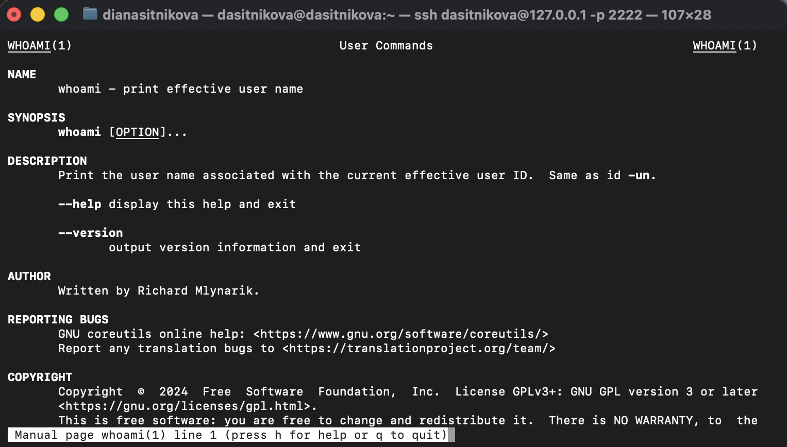{#fig-001 width=85%}

Команда `sudo` описана в разделе 8. В описании указано, что политикой безопасности по умолчанию является `sudoers`, которая настраивается в файле `/etc/sudoers` ([рис. @fig-002]).

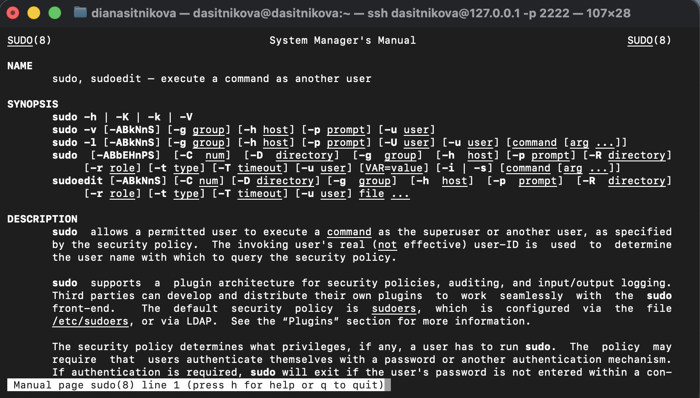{#fig-002 width=85%}

## Переключение учётных записей пользователей

Текущая учётная запись определена командами `whoami` и `id` ([рис. @fig-003]).

~~~bash
whoami
id
~~~

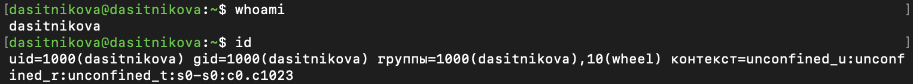{#fig-003 width=100%}

Вывод команды `id` содержит следующие сведения:

- `uid=1000(dasitnikova)` --- идентификатор и имя пользователя; 1000 --- первый UID, выдаваемый обычным пользователям;
- `gid=1000(dasitnikova)` --- первичная группа, одноимённая пользователю;
- `группы=1000(dasitnikova),10(wheel)` --- полный список групп; членство в группе `wheel` даёт право выполнять `sudo`;
- `контекст=` --- контекст безопасности SELinux: пользователь `unconfined_u`, роль `unconfined_r`, тип `unconfined_t` и диапазон уровней `s0-s0:c0.c1023`. Тип `unconfined_t` означает, что процессы пользователя не ограничиваются целевой политикой SELinux.

Командой `su` выполнено переключение на учётную запись `root` с вводом пароля суперпользователя, а командой `exit` --- возврат к исходной учётной записи ([рис. @fig-004]).

~~~bash
su
exit
~~~

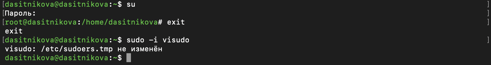{#fig-004 width=100%}

После ввода пароля приглашение командной строки сменилось на `root@dasitnikova:/home/dasitnikova#`. Символ `#` в конце приглашения обозначает сеанс суперпользователя. Текущий каталог остался прежним, поскольку `su` без ключа `-` не выполняет вход в систему заново и не переходит в домашний каталог `root`. Учётная запись `root` имеет идентификатор 0, что подтверждает команда `id -u root` ([рис. @fig-014]); этот идентификатор даёт процессу полные права в системе.

Файл `/etc/sudoers` открыт в безопасном режиме командой `sudo -i visudo`. Поиском `/%wheel` найдена строка 107 с правилом для группы `wheel` ([рис. @fig-005]). Файл закрыт без изменений, и `visudo` сообщил, что временная копия `/etc/sudoers.tmp` не изменена, поэтому исходный файл не перезаписывался ([рис. @fig-004]).

~~~bash
sudo -i visudo
~~~

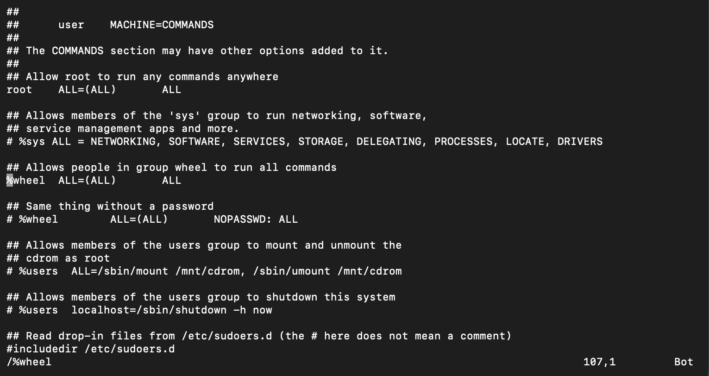{#fig-005 width=85%}

Правило `%wheel ALL=(ALL) ALL` разрешает членам группы `wheel` выполнять на любом хосте любые команды от имени любого пользователя после ввода собственного пароля. Группа `wheel` служит для выдачи административных прав: чтобы пользователь мог администрировать систему через `sudo`, его достаточно включить в эту группу, не сообщая ему пароль `root`. Выше расположено аналогичное правило для `root`, ниже --- закомментированный вариант с ключевым словом `NOPASSWD`, отменяющим запрос пароля. Директива `#includedir /etc/sudoers.d` подключает дополнительные файлы политики; символ `#` в ней не означает комментарий.

Для работы с файлом `/etc/sudoers` используется `visudo`, а не произвольный редактор, потому что `visudo` блокирует файл от одновременной правки и проверяет синтаксис перед сохранением. Ошибочная политика не будет установлена, и пользователи группы `wheel` не потеряют доступ к `sudo`.

Создан пользователь `alice`, входящий в группу `wheel`, и задан его пароль ([рис. @fig-006]).

~~~bash
sudo -i useradd -G wheel alice
id alice
sudo -i passwd alice
~~~

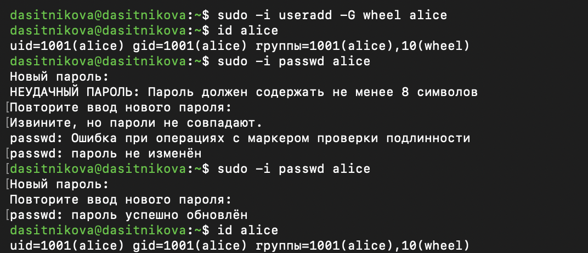{#fig-006 width=85%}

Пользователь `alice` получил UID 1001 и собственную первичную группу `alice` с тем же номером, а в списке дополнительных групп присутствует `wheel`. Команда `passwd` проверяет качество пароля и требует повторного ввода: при несовпадении введённых значений пароль не изменяется, при совпадении выводится сообщение об успешном обновлении.

Выполнено переключение на учётную запись `alice`, от её имени создан пользователь `bob` и задан его пароль ([рис. @fig-007]).

~~~bash
su alice
sudo useradd bob
sudo passwd bob
id bob
~~~

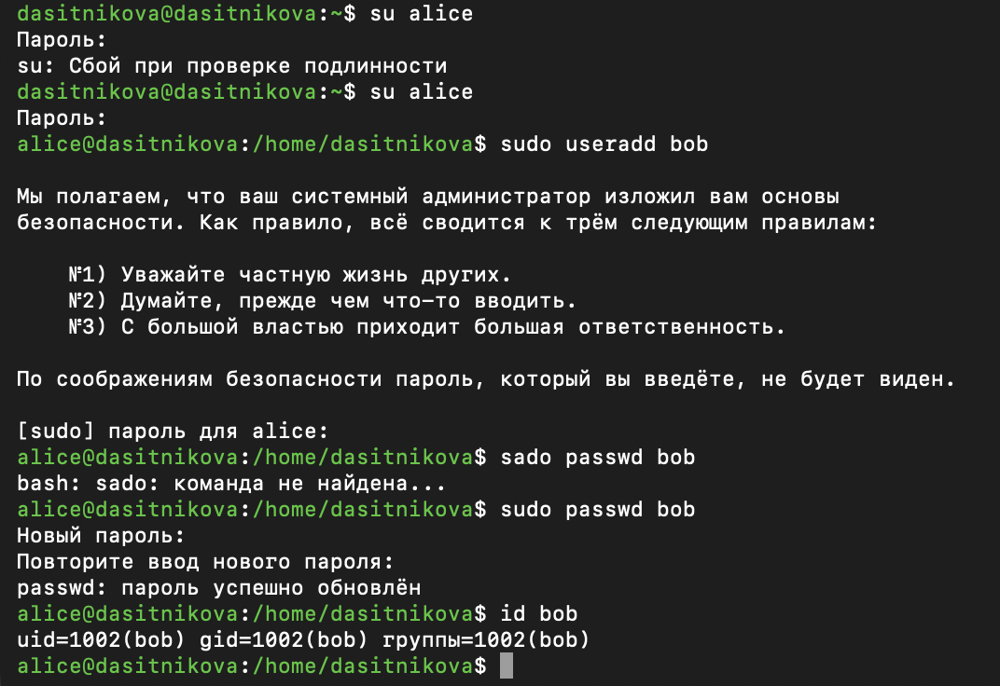{#fig-007 width=85%}

Команда `su alice` запрашивает пароль пользователя `alice`, а `sudo` --- пароль вызывающего пользователя, то есть снова `alice`. При первом обращении к `sudo` выводится предупреждение о правилах работы с правами администратора. Пользователь `bob` получил UID 1002 и входит только в собственную группу `bob`, поскольку дополнительные группы при его создании не указывались.

## Создание учётных записей пользователей

Для настройки параметров создания учётных записей выполнено переключение на учётную запись `root`. Значения параметров `CREATE_HOME` и `USERGROUPS_ENAB` в файле `/etc/login.defs` выведены командой `grep`, после чего файл открыт в редакторе `nano` и параметр `USERGROUPS_ENAB` установлен в значение `no` ([рис. @fig-008]).

~~~bash
su
grep -E "^(CREATE_HOME|USERGROUPS_ENAB)" /etc/login.defs
nano /etc/login.defs
~~~

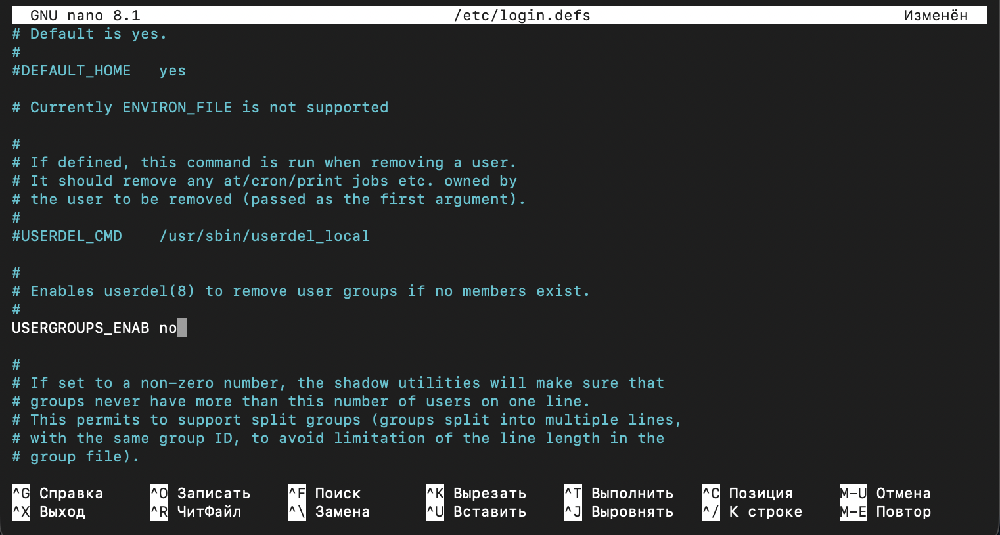{#fig-008 width=85%}

Затем в каталоге шаблона `/etc/skel` созданы каталоги `Pictures` и `Documents`, а в конец файла `.bashrc` добавлена строка, назначающая `vim` редактором по умолчанию ([рис. @fig-009]).

~~~bash
cd /etc/skel
mkdir Pictures
mkdir Documents
echo 'export EDITOR=/usr/bin/vim' >> .bashrc
tail -3 .bashrc
ls -A
~~~

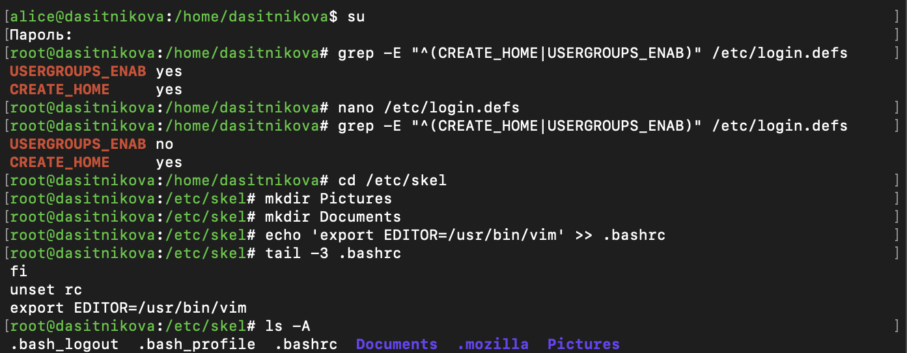{#fig-009 width=85%}

До правки оба параметра были равны `yes`; после правки `USERGROUPS_ENAB` равен `no`, а `CREATE_HOME` остался `yes`. Новые пользователи будут получать домашний каталог, но не собственную группу. Оператор `>>` дописывает строку в конец файла, не затрагивая остальное содержимое. В шаблоне теперь находятся файлы настройки оболочки `.bash_logout`, `.bash_profile` и `.bashrc`, созданные каталоги и уже присутствовавший там каталог `.mozilla`.

Выполнено переключение на учётную запись `alice`, от её имени создан пользователь `carol` и задан его пароль. Затем выполнен вход под учётной записью `carol` и проверены её параметры и содержимое домашнего каталога ([рис. @fig-010]).

~~~bash
su alice
sudo -i useradd carol
sudo passwd carol
su carol
id
cd
ls -Al
~~~

{#fig-010 width=85%}

Переключение из сеанса `root` на учётную запись `alice` выполнено без запроса пароля: суперпользователю переход в чужую учётную запись разрешён без проверки. Пользователь `carol` получил UID 1003 и первичную группу `users` с GID 100, собственная группа для него не создана --- так действует значение `USERGROUPS_ENAB no`. Номер группы взят из параметра `GROUP=100` файла `/etc/default/useradd` ([рис. @fig-014]). Домашний каталог создан автоматически и содержит копию шаблона `/etc/skel`, в том числе каталоги `Documents` и `Pictures`; владельцем всех файлов назначен пользователь `carol` с группой `users`.

Выполнено переключение на учётную запись `alice` и выведена строка пользователя `carol` из файла `/etc/shadow`. Затем изменены параметры срока действия его пароля, и строка выведена повторно ([рис. @fig-011]).

~~~bash
su alice
sudo cat /etc/shadow | grep carol
sudo passwd -n 30 -w 3 -x 90 carol
sudo cat /etc/shadow | grep carol
~~~

{#fig-011 width=95%}

Значения полей записи до и после изменения приведены в [табл. @tbl-carol-shadow].

| Поле | До изменения | После изменения |
|---|---|---|
| Имя пользователя | `carol` | `carol` |
| Хеш пароля | `$y$j9T$…` | не изменился |
| Последняя смена пароля | 20708 | 20708 |
| Минимальный срок, дней | 0 | 30 |
| Максимальный срок, дней | 99999 | 90 |
| Предупреждение, дней | 7 | 3 |
| Отключение после истечения срока | не задано | не задано |
| Дата отключения учётной записи | не задано | не задано |

: Запись пользователя carol в файле /etc/shadow {#tbl-carol-shadow}

Хеш пароля начинается с `$y$`, то есть вычислен алгоритмом yescrypt. Число 20708 --- это 12 сентября 2026 года, день установки пароля. Исходные значения 0, 99999 и 7 соответствуют параметрам `PASS_MIN_DAYS`, `PASS_MAX_DAYS` и `PASS_WARN_AGE` из `/etc/login.defs`. После изменения пользователь `carol` не сможет сменить пароль раньше чем через 30 дней после последней смены, обязан менять его не реже чем раз в 90 дней и получит предупреждение за 3 дня до истечения срока.

Проверено наличие учётных записей `alice` и `carol` в трёх системных базах ([рис. @fig-012]).

~~~bash
grep alice /etc/passwd /etc/shadow /etc/group
sudo grep alice /etc/passwd /etc/shadow /etc/group
sudo grep carol /etc/passwd /etc/shadow /etc/group
~~~

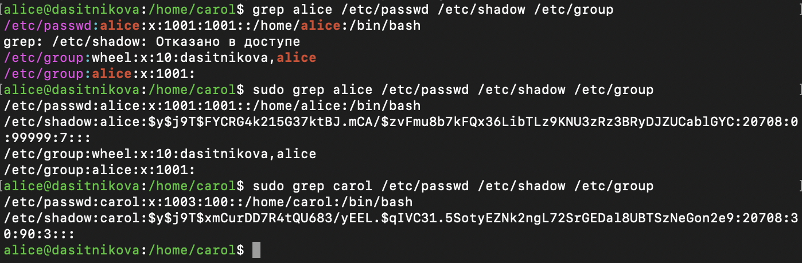{#fig-012 width=95%}

Без `sudo` команда `grep` читает `/etc/passwd` и `/etc/group`, но для `/etc/shadow` выводит «Отказано в доступе»: этот файл доступен только суперпользователю. С правами `root` учётная запись `alice` найдена во всех трёх файлах. В `/etc/passwd` указаны UID и GID 1001, пустой комментарий, домашний каталог `/home/alice` и оболочка `/bin/bash`. В `/etc/shadow` хранится хеш пароля с параметрами срока действия по умолчанию. В `/etc/group` пользователь `alice` перечислен в строке группы `wheel` как дополнительный участник, а строка `alice:x:1001:` описывает её собственную группу с пустым списком участников, поскольку для `alice` эта группа первичная.

Учётная запись `carol` найдена только в `/etc/passwd`, где указан GID 100, и в `/etc/shadow` с изменёнными параметрами пароля. В `/etc/group` она не упоминается: собственной группы у неё нет, а в дополнительные группы она на этом этапе не входит.

## Работа с группами

Созданы группы `main` и `thrid`. Пользователи `alice` и `bob` добавлены в группу `main`, пользователь `carol` --- в группу `thrid`, после чего выведены сведения о группах всех трёх пользователей ([рис. @fig-013]).

~~~bash
sudo groupadd main
sudo groupadd thrid
sudo usermod -aG main alice
sudo usermod -aG main bob
sudo usermod -aG thrid carol
id carol
id alice
id bob
~~~

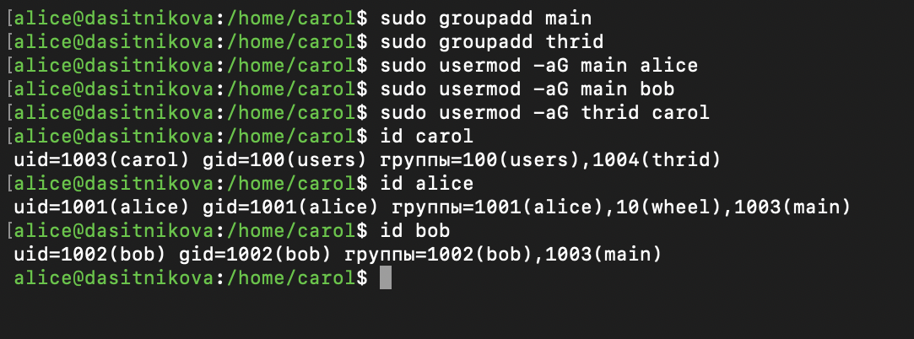{#fig-013 width=85%}

Членство пользователей в группах сведено в [табл. @tbl-groups].

| Пользователь | UID | Первичная группа | Дополнительные группы |
|---|---|---|---|
| `alice` | 1001 | `alice` (1001) | `wheel` (10), `main` (1003) |
| `bob` | 1002 | `bob` (1002) | `main` (1003) |
| `carol` | 1003 | `users` (100) | `thrid` (1004) |

: Членство пользователей в группах {#tbl-groups}

Пользователю `carol` назначена основная группа `users` с GID 100, дополнительная группа --- `thrid`. Пользователь `alice` сохранил членство в группе `wheel`, поскольку группа `main` добавлена с ключом `-a`.

# Выводы

В ходе лабораторной работы получены практические навыки работы с учётными записями пользователей и группами в Rocky Linux 10.2. Изучены системные базы `/etc/passwd`, `/etc/shadow` и `/etc/group` и назначение их полей. Выполнено переключение между учётными записями командами `su` и `sudo`, рассмотрено правило политики `sudo` для группы `wheel` в файле `/etc/sudoers`.

Созданы пользователи `alice`, `bob` и `carol`. На примере пользователя `carol` показано, как параметры файлов `/etc/login.defs` и `/etc/default/useradd` и шаблон `/etc/skel` определяют первичную группу и содержимое домашнего каталога нового пользователя, а также как изменяется срок действия пароля. Созданы две группы, и пользователи добавлены в них с сохранением прежнего членства в группах.

# Контрольные вопросы

1. **При помощи каких команд можно получить информацию о номере (идентификаторе), назначенном пользователю Linux, о группах, в которые включён пользователь?**

   Команда `id` выводит UID, GID первичной группы и список всех групп пользователя. С ключом `-u` она выводит только UID, с ключом `-g` --- только GID, с ключом `-G` --- идентификаторы всех групп, а добавление ключа `-n` заменяет номера именами. Команда `groups` выводит имена групп, `whoami` --- имя текущего пользователя. Без аргумента эти команды описывают текущий сеанс, с именем пользователя --- указанную учётную запись. Те же сведения содержатся в системных базах и выводятся командами `getent passwd имя` и `grep имя /etc/group`.

   ~~~bash
   id -u
   id -nG
   groups
   id alice
   ~~~

   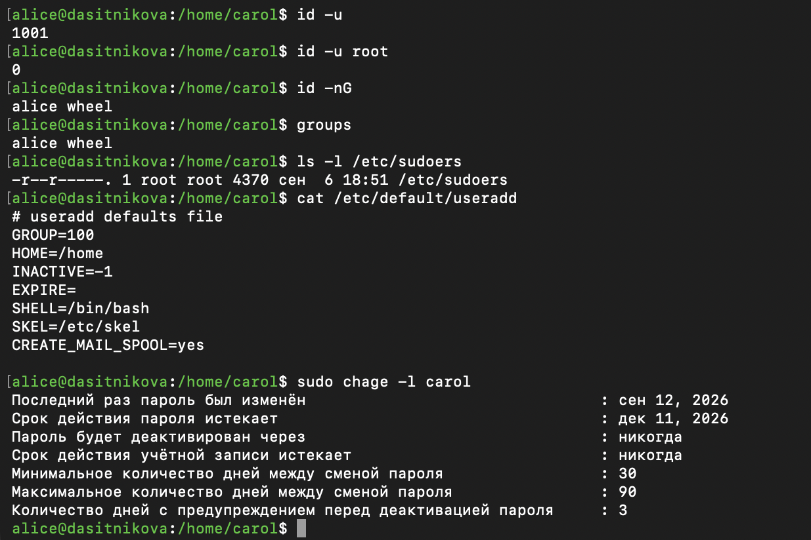{#fig-014 width=85%}

   Разница между сеансом и учётной записью видна на [рис. @fig-014]: в сеансе `alice`, открытом до её добавления в группу `main`, команды `id -nG` и `groups` выводят только группы `alice` и `wheel`, тогда как `id alice` на [рис. @fig-013] уже показывает группу `main`.

2. **Какой UID имеет пользователь root? При помощи какой команды можно узнать UID пользователя? Приведите примеры.**

   Пользователь `root` имеет UID 0. UID выводит команда `id -u`: без аргумента --- для текущего пользователя, с именем --- для указанного. На [рис. @fig-014] команда `id -u` в сеансе `alice` выводит 1001, а `id -u root` --- 0. UID также указан в третьем поле записи пользователя в `/etc/passwd`, которую выводит `getent passwd имя`.

   ~~~bash
   id -u
   id -u root
   getent passwd root
   ~~~

3. **В чём состоит различие между командами su и sudo?**

   Команда `su` запускает новую командную оболочку от имени другого пользователя и запрашивает пароль этого пользователя; чтобы получить права `root`, нужно знать пароль `root`. Оболочка работает до выхода из неё, и все команды в ней выполняются с правами целевого пользователя.

   Команда `sudo` выполняет одну команду с правами другого пользователя и запрашивает пароль вызывающего пользователя. Разрешено ли выполнение, определяет политика `/etc/sudoers`, которая может ограничивать набор команд. `sudo` на время запоминает успешную проверку и записывает выполненные команды в системный журнал. Поэтому административные права можно выдать нескольким пользователям, не сообщая им пароль `root`.

4. **В каком конфигурационном файле определяются параметры sudo?**

   Параметры `sudo` определяются в файле `/etc/sudoers`. Директива `#includedir /etc/sudoers.d` подключает также все файлы каталога `/etc/sudoers.d`, в которых удобно хранить отдельные правила.

5. **Какую команду следует использовать для безопасного изменения конфигурации sudo?**

   Для изменения конфигурации используется команда `visudo`. Она блокирует файл от одновременной правки, открывает временную копию и устанавливает её только после успешной проверки синтаксиса. Сам файл `/etc/sudoers` имеет права `-r--r-----` и доступен только для чтения даже владельцу `root` ([рис. @fig-014]). Файлы из каталога `/etc/sudoers.d` редактируются командой `visudo -f`.

   ~~~bash
   sudo visudo
   sudo visudo -f /etc/sudoers.d/имя_файла
   ls -l /etc/sudoers
   ~~~

6. **Если вы хотите предоставить пользователю доступ ко всем командам администрирования системы через sudo, членом какой группы он должен быть?**

   Пользователь должен быть членом группы `wheel`: правило `%wheel ALL=(ALL) ALL` в `/etc/sudoers` разрешает её участникам выполнять любые команды. Пользователь добавляется в группу командой `usermod -aG wheel имя` или сразу при создании: `useradd -G wheel имя`.

7. **Какие файлы/каталоги можно использовать для определения параметров, которые будут использоваться при создании учётных записей пользователей? Приведите примеры настроек.**

   Параметры создания учётных записей определяются файлами `/etc/login.defs` и `/etc/default/useradd` и каталогом `/etc/skel`. В данной работе в `/etc/login.defs` параметр `USERGROUPS_ENAB` установлен в `no`, а `CREATE_HOME` оставлен `yes`, поэтому новые пользователи получают домашний каталог без собственной группы. Файл `/etc/default/useradd` задаёт группу по умолчанию `GROUP=100`, оболочку `SHELL=/bin/bash` и каталог шаблона `SKEL=/etc/skel` ([рис. @fig-014]). В каталог `/etc/skel` добавлены каталоги `Pictures` и `Documents` и строка `export EDITOR=/usr/bin/vim` в файле `.bashrc`. Текущие значения по умолчанию также выводит команда `useradd -D`.

   ~~~bash
   grep -E "^(CREATE_HOME|USERGROUPS_ENAB)" /etc/login.defs
   cat /etc/default/useradd
   ls -A /etc/skel
   ~~~

8. **Где хранится информация о первичной и дополнительных группах пользователей ОС типа Linux? В отчёте приведите пояснение таких записей для пользователя alice.**

   Идентификатор первичной группы хранится в четвёртом поле записи пользователя в `/etc/passwd`. Дополнительные группы хранятся в `/etc/group`: пользователь перечисляется в последнем поле строки каждой группы, в которую он входит.

   Для пользователя `alice` в системных базах найдены следующие записи ([рис. @fig-012]):

   ~~~
   /etc/passwd:alice:x:1001:1001::/home/alice:/bin/bash
   /etc/group:wheel:x:10:dasitnikova,alice
   /etc/group:alice:x:1001:
   ~~~

   Четвёртое поле записи в `/etc/passwd` указывает первичную группу с GID 1001. В `/etc/group` этой группе соответствует строка `alice:x:1001:` --- собственная группа `alice` с пустым списком участников, поскольку для `alice` она первичная. Строка группы `wheel` показывает, что `alice` входит в неё как дополнительный участник. После выполнения раздела о работе с группами имя `alice` появляется также в строке группы `main`.

9. **Какие команды вы можете использовать для изменения информации о пароле пользователя (например о сроке действия пароля)?**

   Пароль изменяется командой `passwd`. Она же меняет параметры срока действия: `-n` задаёт минимальный срок, `-x` --- максимальный, `-w` --- срок предупреждения, `-i` --- число дней до отключения учётной записи после истечения срока. Те же параметры меняет команда `chage` с ключами `-m`, `-M`, `-W` и `-I`, а ключ `-E` задаёт дату отключения учётной записи. Команда `chage -l` выводит параметры в удобочитаемом виде: для пользователя `carol` на [рис. @fig-014] видны минимальный срок 30 дней, максимальный 90 дней, предупреждение за 3 дня и дата истечения срока пароля --- 11 декабря 2026 года.

   ~~~bash
   sudo passwd -n 30 -w 3 -x 90 carol
   sudo chage -M 90 carol
   sudo chage -l carol
   ~~~

10. **Какую команду следует использовать для прямого изменения информации в файле /etc/group и почему?**

    Для прямого изменения `/etc/group` следует использовать команду `vigr`, а для `/etc/gshadow` --- `vigr -s`. Команда открывает файл в текстовом редакторе и устанавливает блокировки, которые не позволяют другим программам, например `useradd` или `groupadd`, изменить файл одновременно с правкой и повредить его. Проверить целостность файла после правки позволяет команда `grpck`. Для типовых изменений удобнее специальные команды: `groupmod`, `gpasswd` и `usermod`.

# Список литературы{.unnumbered}

::: {#refs}
:::
