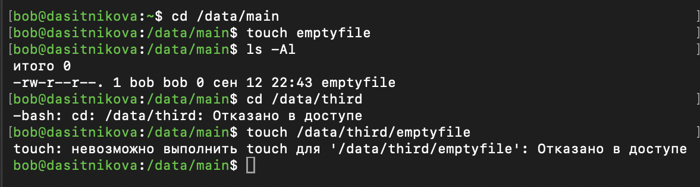
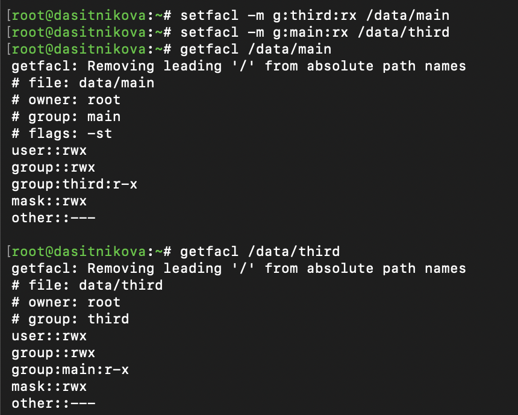

---
## Author
author:
  name: Ситникова Диана Александровна
  degrees: BSc
  email: 1032201746@rudn.ru
  affiliation:
    - name: Российский университет дружбы народов
      country: Российская Федерация
      postal-code: 117198
      city: Москва
      address: ул. Миклухо-Маклая, д. 6
## Title
title: "Лабораторная работа № 3"
subtitle: "Настройка прав доступа"
institute:
  - "Российский университет дружбы народов им. П. Лумумбы"
  - "Преподаватель: д.ф.-м.н., профессор Кулябов Дмитрий Сергеевич"
license: CC BY
date: today
date-format: "YYYY-MM-DD"
---

# Информация

## Докладчик

:::::::::::::: {.columns align=center}
::: {.column width="68%"}

- Ситникова Диана Александровна
- направление 09.03.03 «Прикладная информатика»
- Российский университет дружбы народов
- [1032201746@rudn.ru](mailto:1032201746@rudn.ru)

:::
::: {.column width="32%"}

{width=100%}

:::
::::::::::::::

# Вводная часть

## Актуальность

- Права доступа определяют, кто может читать, изменять и удалять данные в системе, которой пользуются многие люди.
- Модели «владелец — группа — остальные» не всегда достаточно: общим каталогам нужны специальные биты, а доступу нескольких групп --- списки ACL.
- Ошибка в правах открывает чужие данные или мешает совместной работе.

## Объект, предмет, цель и задачи

**Объект** --- каталоги `/data/main` и `/data/third` в Rocky Linux 10.2 и файлы в них.

**Предмет** --- базовые, специальные и расширенные права доступа для групп пользователей.

**Цель** --- получить навыки настройки базовых и специальных прав доступа для групп пользователей в операционной системе типа Linux.

**Задачи:** настроить базовые права; организовать общий каталог с помощью setgid и sticky bit; открыть доступ второй группе через ACL и ACL по умолчанию; проверить права от имени пользователей.

## Материалы и методы

| Компонент | Значение |
|---|---|
| Стенд | Rocky Linux 10.2, файловая система XFS |
| Пользователи | `alice`, `bob` --- группа `main`; `carol` --- группа `third` |
| Базовые права | `chgrp`, `chmod` |
| Специальные права | `chmod g+s,o+t` |
| Списки ACL | `setfacl`, `getfacl` |

# Содержание исследования

## Доступ к каталогу получает его группа

:::::::::::::: {.columns align=center}
::: {.column width="40%"}

`/data/main` --- группа `main`, `/data/third` --- группа `third`, права 770.

`bob` входит в `main`: зашёл в каталог и создал файл.

В `/data/third` для `bob` действуют права остальных `---`: «Отказано в доступе».

:::
::: {.column width="60%"}

{width=100%}

:::
::::::::::::::

## Удаление файла --- операция над каталогом

:::::::::::::: {.columns align=center}
::: {.column width="42%"}

`bob` удалил файлы `alice`, хотя права на запись в них у него нет.

Для удаления достаточно права `w` на каталог, а оно у `bob` есть как у члена группы `main`.

:::
::: {.column width="58%"}

{width=100%}

:::
::::::::::::::

## setgid и sticky bit делают каталог общим

:::::::::::::: {.columns align=center}
::: {.column width="42%"}

`chmod g+s,o+t` → `drwxrws--T`

**setgid:** `alice3` и `alice4` получили группу `main`.

**sticky bit:** `alice` не может удалить файлы `bob` --- «Операция не позволена».

:::
::: {.column width="58%"}

{width=100%}

:::
::::::::::::::

## ACL открывает каталог второй группе

:::::::::::::: {.columns align=center}
::: {.column width="42%"}

`group:third:r-x` в `/data/main` и `group:main:r-x` в `/data/third`.

`mask::rwx` --- верхняя граница прав записей групп.

`flags: -st` --- установлены setgid и sticky bit.

:::
::: {.column width="58%"}

{width=100%}

:::
::::::::::::::

## Новые файлы наследуют только ACL по умолчанию

:::::::::::::: {.columns align=center}
::: {.column width="45%"}

| Файл | Запись для `third` |
|---|---|
| `newfile1` | нет |
| `newfile2` | `rwx`, действует `rw-` |

`newfile1` создан до `setfacl -m d:g:third:rwx`, `newfile2` --- после.

Маска `rw-` ограничивает права: `touch` не запрашивает `x`.

:::
::: {.column width="55%"}

{width=100%}

:::
::::::::::::::

## Проверка от имени carol

{width=75%}

:::::::::::::: {.columns align=center}
::: {.column width="45%"}

| Действие | `newfile1` | `newfile2` |
|---|---|---|
| Удаление | отказано | отказано |
| Запись | отказано | выполнено |

:::
::: {.column width="55%"}

Удалить нельзя: у `third` на каталог только `r-x`.

Записать можно только в `newfile2` --- у него есть ACL группы `third`.

:::
::::::::::::::

# Результаты

## Права доступа настроены и проверены

- Каталогам `/data/main` и `/data/third` назначены группы-владельцы и права 770.
- Проверено, что доступ к каталогу получают только члены его группы.
- Для `/data/main` установлены setgid и sticky bit, их действие проверено от имени `alice`.
- Группам `third` и `main` через ACL открыт доступ к каталогам друг друга.
- ACL по умолчанию обеспечил права группы для новых файлов, что подтверждено от имени `carol`.

## Вывод

Права доступа в Linux настраиваются на трёх уровнях: базовые права дают доступ группе-владельцу, специальные биты превращают каталог в общий и защищают чужие файлы, а ACL открывает доступ дополнительным группам.

Права для файлов, которые появятся в каталоге позже, обеспечивает только ACL по умолчанию, а действующие права записей ограничивает маска.
