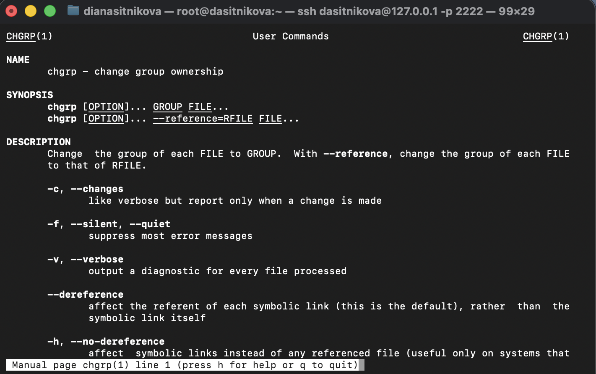
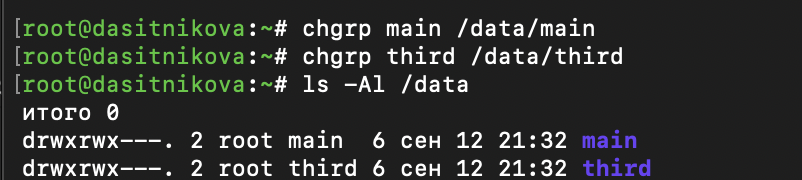
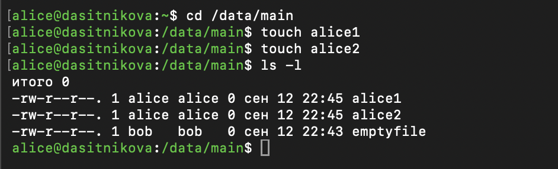
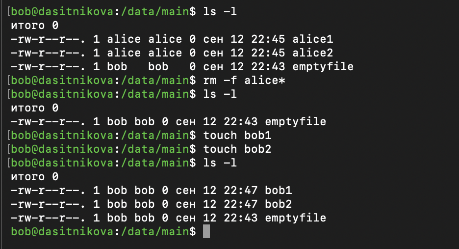
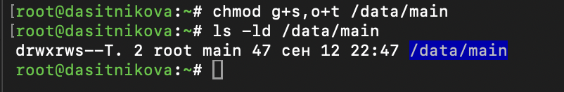
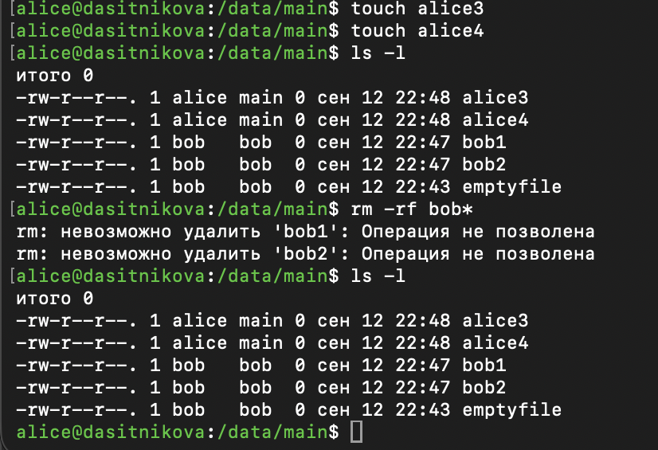
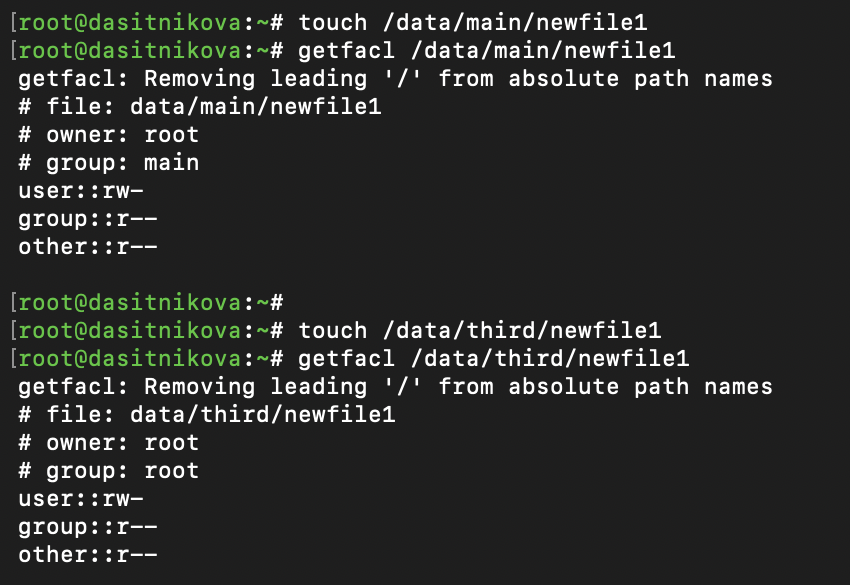
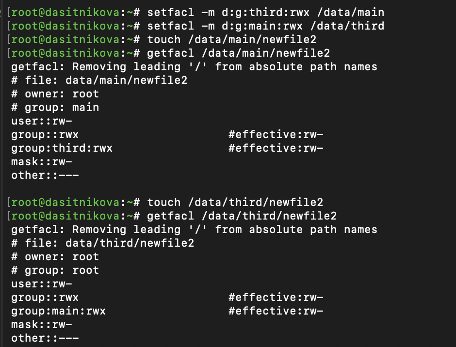
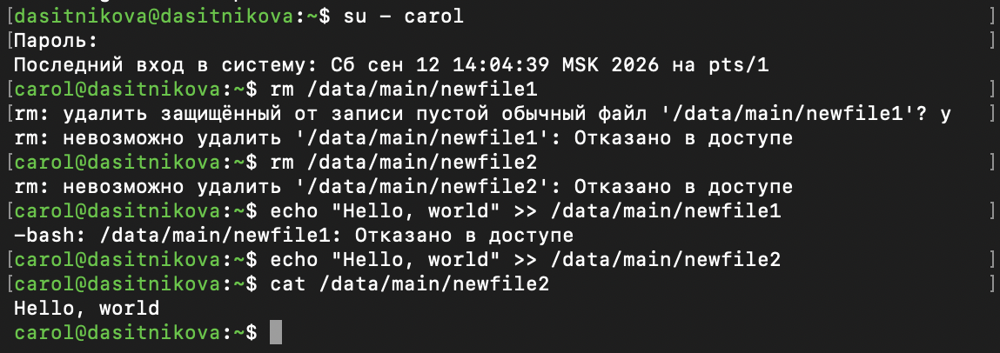
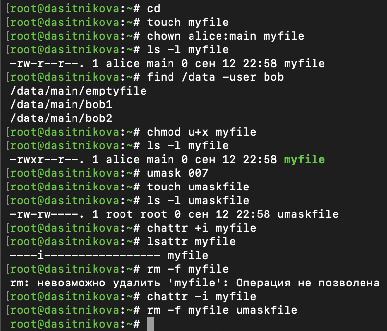

---
## Author
author:
  name: Ситникова Диана Александровна
  degrees: BSc
  email: 1032201746@rudn.ru
  affiliation:
    - name: Российский университет дружбы народов
      country: Российская Федерация
      postal-code: 117198
      city: Москва
      address: ул. Миклухо-Маклая, д. 6

## Title
title: "Отчёт по лабораторной работе №3"
subtitle: "Настройка прав доступа"
license: "CC BY"
bibliography: bib/cite.bib
---

# Цель работы

Целью данной работы является получение навыков настройки базовых и специальных прав доступа для групп пользователей в операционной системе типа Linux.

# Задание

- Прочитать справочное описание `man` по командам `chgrp`, `chmod`, `getfacl`, `setfacl`.
- Выполнить действия по управлению базовыми разрешениями для групп пользователей.
- Выполнить действия по управлению специальными разрешениями для групп пользователей.
- Выполнить действия по управлению расширенными разрешениями с использованием списков ACL для групп пользователей.

# Теоретическое введение

## Базовые права доступа

Каждый файл и каталог в Linux имеет владельца и группу-владельца. Права доступа задаются отдельно для трёх классов субъектов: владельца, членов группы-владельца и всех остальных пользователей. При обращении к файлу ядро определяет, к какому классу относится процесс, проверяя классы по порядку --- владелец, группа, остальные, --- и применяет права первого подходящего класса; права разных классов не складываются [@robachevsky_book_unix_ru; @tanenbaum_book_modern-os_ru].

Смысл прав `r`, `w` и `x` различается для файлов и каталогов ([табл. @tbl-rwx]). Каталог --- это список имён файлов, поэтому удаление, создание и переименование файла являются операциями над каталогом: для них нужны права `w` и `x` на каталог, а права на сам файл значения не имеют.

| Право | Для файла | Для каталога |
|-------|----------------------|------------------------------------|
| `r` | чтение содержимого | получение списка имён файлов |
| `w` | изменение содержимого | создание, удаление и переименование файлов |
| `x` | запуск как программы | переход в каталог и доступ к файлам по имени |

: Значение базовых прав для файлов и каталогов {#tbl-rwx}

Группа-владелец изменяется командой `chgrp`, владелец и группа --- командой `chown`, права --- командой `chmod` в символьной или восьмеричной записи. Права новых файлов определяются маской режима создания `umask`: из режима, который запрашивает создающая программа (обычно 666 для файлов и 777 для каталогов), исключаются биты, установленные в маске. При маске 022 новые файлы получают права 644, а каталоги --- 755.

## Специальные права

Помимо девяти базовых битов, режим доступа содержит три специальных бита ([табл. @tbl-special]). В выводе `ls -l` они отображаются на месте права `x` соответствующего класса: строчной буквой `s` или `t`, если право `x` установлено, и заглавной `S` или `T`, если нет [@nemeth_book_unix-linux-admin_ru].

| Бит | Код | Для файла | Для каталога |
|------|----|--------------------------|--------------------------------|
| setuid | 4000 | запуск с правами владельца файла | не используется |
| setgid | 2000 | запуск с правами группы файла | новые файлы получают группу каталога |
| sticky | 1000 | не используется | удалять файл могут только его владелец, владелец каталога и `root` |

: Специальные биты режима доступа {#tbl-special}

Бит setgid на каталоге применяют для общих рабочих каталогов групп: все файлы в них получают одну группу-владельца независимо от первичной группы создавшего их пользователя. Sticky bit защищает файлы в каталоге, доступном на запись многим пользователям, от удаления посторонними; классический пример --- каталог `/tmp`.

## Списки управления доступом ACL

Списки управления доступом POSIX ACL расширяют базовую модель: они позволяют задать права для произвольных пользователей и групп, а не только для трёх классов [@kolisnichenko_book_linux-admin_ru]. Типы записей ACL приведены в [табл. @tbl-acl]. Файловая система XFS поддерживает ACL без дополнительных параметров монтирования, о чём ядро сообщает при загрузке строкой `SGI XFS with ACLs`.

| Запись | Назначение |
|----------------|--------------------------------------------------|
| `user::` | права владельца файла |
| `user:имя:` | права указанного пользователя |
| `group::` | права группы-владельца |
| `group:имя:` | права указанной группы |
| `mask::` | наибольшие права для записей пользователей и групп, кроме владельца |
| `other::` | права остальных пользователей |

: Типы записей ACL {#tbl-acl}

Маска ограничивает права всех записей, кроме `user::` и `other::`: действующие права записи равны пересечению её прав с маской. Если они меньше записанных, `getfacl` выводит их с пометкой `#effective`. При изменении ACL командой `setfacl` маска по умолчанию пересчитывается как объединение прав ограничиваемых записей.

ACL бывает двух видов. ACL доступа проверяется при обращении к самому объекту. ACL по умолчанию задаётся только каталогам и не влияет на доступ к ним: он копируется в ACL файлов и подкаталогов, создаваемых внутри. Если у родительского каталога есть ACL по умолчанию, маска `umask` к новому объекту не применяется --- его права определяются ACL по умолчанию и режимом, который запрашивает создающая программа. Наличие ACL у файла отмечается символом `+` после строки прав в выводе `ls -l`.

ACL изменяется командой `setfacl`: ключ `-m` добавляет или изменяет записи, `-x` удаляет их, `-b` удаляет весь список, `-R` применяет изменения рекурсивно, а префикс `d:` в записи или ключ `-d` относят её к ACL по умолчанию. Просмотр ACL выполняет команда `getfacl` [@neil_book_learning-centos_en].

## Атрибуты файлов

Кроме прав доступа, файлы в Linux имеют атрибуты, которые изменяются командой `chattr` и выводятся командой `lsattr`. Атрибут `i` делает файл неизменяемым: его нельзя изменить, переименовать или удалить, пока атрибут не будет снят, в том числе от имени `root`. Атрибут `a` разрешает только дописывать данные в конец файла. Устанавливать и снимать эти атрибуты может только суперпользователь.

# Выполнение лабораторной работы

Работа выполнена в виртуальной машине с Rocky Linux 10.2 с учётными записями, созданными в лабораторной работе № 2. Для одновременной работы нескольких пользователей открыто несколько окон терминала, подключённых к гостевой системе по SSH; в каждом окне выполнен вход под учётной записью `root`, `bob`, `alice` или `carol` командой `su -`.

Предпосылки задания предполагают группу `third`, поэтому группа `thrid`, созданная в лабораторной работе № 2, предварительно переименована командой `groupmod`. Участник группы `carol` при этом сохранился.

~~~bash
sudo groupmod -n third thrid
~~~

## Справочная информация по командам

Изучено справочное описание `man` по командам `chgrp`, `chmod`, `getfacl` и `setfacl`. Команда `chgrp` описана в разделе 1 справочника и изменяет группу-владельца каждого указанного файла. Ключ `--reference` позволяет взять группу у другого файла, а ключи `-c` и `-v` выводят сведения о выполненных изменениях ([рис. @fig-001]).

{#fig-001 width=85%}

## Управление базовыми разрешениями

От имени `root` созданы каталоги `/data/main` и `/data/third`. Созданные каталоги принадлежали пользователю `root` и группе `root` и имели права 755. Для обоих каталогов установлены права 770, а группы-владельцы изменены на `main` и `third` ([рис. @fig-002]).

~~~bash
su -
mkdir -p /data/main /data/third
ls -Al /data
chmod 770 /data/main
chmod 770 /data/third
chgrp main /data/main
chgrp third /data/third
ls -Al /data
~~~

{#fig-002 width=85%}

Владельцем обоих каталогов остался `root`, группами-владельцами стали `main` и `third`. Права `rwxrwx---` дают полный доступ владельцу и группе-владельцу и запрещают любой доступ остальным пользователям.

Под учётной записью `bob` выполнены попытки создать файл `emptyfile` в каждом из каталогов ([рис. @fig-003]).

~~~bash
su - bob
cd /data/main
touch emptyfile
ls -Al
cd /data/third
touch /data/third/emptyfile
~~~

{#fig-003 width=95%}

В каталоге `/data/main` файл создан. Пользователь `bob` входит в группу `main`, поэтому к нему применяются права группы-владельца `rwx`: право `x` позволяет перейти в каталог, право `w` --- создать в нём файл. Владельцем файла стал `bob`, группой-владельцем --- его первичная группа `bob`, а права 644 получены из маски 022.

В каталог `/data/third` перейти не удалось, и создать в нём файл тоже: `bob` не входит в группу `third`, поэтому к нему применяются права остальных пользователей `---`. Без права `x` нельзя перейти в каталог, без права `w` --- создать в нём файл.

## Управление специальными разрешениями

Под учётной записью `alice` в каталоге `/data/main` созданы файлы `alice1` и `alice2` ([рис. @fig-004]). Их владельцем и группой-владельцем стал пользователь `alice` и его первичная группа `alice`.

~~~bash
su - alice
cd /data/main
touch alice1
touch alice2
ls -l
~~~

{#fig-004 width=85%}

Под учётной записью `bob` файлы пользователя `alice` удалены, после чего созданы файлы `bob1` и `bob2` ([рис. @fig-005]).

~~~bash
ls -l
rm -f alice*
ls -l
touch bob1
touch bob2
ls -l
~~~

{#fig-005 width=85%}

Пользователь `bob` удалил файлы `alice1` и `alice2`, хотя права на запись в сами файлы у него нет: для них он относится к остальным пользователям с правами `r--`. Удаление файла --- это удаление записи из каталога, поэтому достаточно прав `w` и `x` на каталог `/data/main`, которые `bob` имеет как член группы `main`. Ключ `-f` отключил запрос подтверждения на удаление защищённых от записи файлов.

От имени `root` для каталога `/data/main` установлены бит setgid и sticky bit ([рис. @fig-006]).

~~~bash
chmod g+s,o+t /data/main
ls -ld /data/main
~~~

{#fig-006 width=85%}

Права каталога приняли вид `drwxrws--T`, что соответствует восьмеричному значению 3770. Буква `s` на месте права `x` группы означает бит setgid при установленном праве выполнения. Заглавная `T` на месте права `x` остальных означает sticky bit при отсутствии у остальных права выполнения.

Под учётной записью `alice` созданы файлы `alice3` и `alice4` и выполнена попытка удалить файлы пользователя `bob` ([рис. @fig-007]).

~~~bash
touch alice3
touch alice4
ls -l
rm -rf bob*
ls -l
~~~

{#fig-007 width=85%}

Файлы `alice3` и `alice4` получили группу-владельца `main`, а не первичную группу `alice`, как `alice1` и `alice2`: так действует бит setgid каталога. Файлы `bob1` и `bob2` удалить не удалось, команда `rm` сообщила «Операция не позволена», и ключ `-f` это сообщение не подавил. Sticky bit разрешает удалять файл только его владельцу, владельцу каталога и `root`, а `alice` не является ни владельцем этих файлов, ни владельцем каталога `/data/main` --- им остаётся `root`. Собственные файлы `alice3` и `alice4` пользователь `alice` может удалить как их владелец.

## Управление расширенными разрешениями с использованием списков ACL

От имени `root` группе `third` предоставлены права на чтение и выполнение в каталоге `/data/main`, а группе `main` --- в каталоге `/data/third` ([рис. @fig-008]).

~~~bash
setfacl -m g:third:rx /data/main
setfacl -m g:main:rx /data/third
getfacl /data/main
getfacl /data/third
~~~

{#fig-008 width=80%}

Сообщение `Removing leading '/' from absolute path names` означает, что `getfacl` выводит пути без начального символа `/`; ошибкой оно не является. Заголовок вывода содержит имя файла, владельца и группу-владельца. Строка `# flags: -st` для `/data/main` показывает специальные биты в порядке setuid, setgid, sticky: бит setuid не установлен, setgid и sticky bit установлены. Для `/data/third` специальных битов нет, и строка `flags` не выводится.

В каждом списке записи `user::`, `group::` и `other::` повторяют базовые права 770, запись `group:third:r-x` или `group:main:r-x` добавляет права указанной группы, а маска `mask::rwx` пересчитана автоматически. Члены группы `third` получили возможность просматривать каталог `/data/main` и обращаться к файлам в нём, но не создавать и не удалять файлы; то же для группы `main` в каталоге `/data/third`.

В каталогах `/data/main` и `/data/third` созданы файлы `newfile1`, и выведены их списки ACL ([рис. @fig-009]).

~~~bash
touch /data/main/newfile1
getfacl /data/main/newfile1
touch /data/third/newfile1
getfacl /data/third/newfile1
~~~

{#fig-009 width=80%}

Файлы `newfile1` имеют только базовые права `rw-r--r--` без записей для групп `third` и `main`: ACL доступа каталога действует только на сам каталог и новыми файлами не наследуется. Права 644 получены из маски 022 суперпользователя. Файл в `/data/main` получил группу `main` благодаря биту setgid каталога, а файл в `/data/third`, где этого бита нет, --- первичную группу `root`. Для членов группы `third` файл `/data/main/newfile1` доступен только на чтение, как и для всех остальных пользователей.

Затем для каталогов установлены ACL по умолчанию, созданы файлы `newfile2` и выведены их списки ACL ([рис. @fig-010]).

~~~bash
setfacl -m d:g:third:rwx /data/main
setfacl -m d:g:main:rwx /data/third
touch /data/main/newfile2
getfacl /data/main/newfile2
touch /data/third/newfile2
getfacl /data/third/newfile2
~~~

{#fig-010 width=80%}

Файлы `newfile2` унаследовали ACL по умолчанию своих каталогов: в `/data/main` появилась запись `group:third:rwx`, в `/data/third` --- `group:main:rwx`. При добавлении первой записи ACL по умолчанию `setfacl` дополнил его записями владельца, группы-владельца и остальных, скопированными из ACL доступа каталога, поэтому файлы получили `group::rwx` и `other::---`.

Маска `umask` при наличии ACL по умолчанию не применяется. Команда `touch` запрашивает режим 666 без права выполнения, поэтому маска файла стала `rw-`, и действующие права записей `group::` и `group:third:` ограничены значением `rw-`, что отмечено пометкой `#effective`.

Для проверки прав группы `third` под учётной записью `carol` выполнены попытки удалить файлы `newfile1` и `newfile2` в каталоге `/data/main` и записать в них строку ([рис. @fig-011]).

~~~bash
su - carol
rm /data/main/newfile1
rm /data/main/newfile2
echo "Hello, world" >> /data/main/newfile1
echo "Hello, world" >> /data/main/newfile2
cat /data/main/newfile2
~~~

{#fig-011 width=95%}

Результаты проверки сведены в [табл. @tbl-carol].

| Действие | Результат | Причина |
|------------------|-------------|--------------------------------------|
| удаление `newfile1` | отказано | у группы `third` нет права `w` на каталог |
| удаление `newfile2` | отказано | у группы `third` нет права `w` на каталог |
| запись в `newfile1` | отказано | записи для `third` нет, действуют права остальных `r--` |
| запись в `newfile2` | выполнено | действующие права записи `group:third` --- `rw-` |

: Проверка прав пользователя carol {#tbl-carol}

Пользователь `carol` входит в группу `third`. Запись `group:third:r-x` в ACL каталога `/data/main` позволяет обращаться к файлам этого каталога, но не удалять их: для удаления нужно право `w` на каталог. Перед попыткой удалить `newfile1` команда `rm` запросила подтверждение, поскольку права на запись в этот файл у `carol` нет; для `newfile2` запроса не было, так как запись разрешена ACL. Строка записана только в `newfile2`, и команда `cat` вывела её содержимое.

# Выводы

В ходе лабораторной работы получены навыки настройки базовых, специальных и расширенных прав доступа для групп пользователей в Rocky Linux 10.2. Для каталогов `/data/main` и `/data/third` назначены группы-владельцы и права 770, и проверено, что доступ к каталогу получают только члены его группы, а удаление файла определяется правами на каталог, а не на сам файл.

Для общего каталога `/data/main` установлены бит setgid и sticky bit: новые файлы получают группу каталога, а пользователи не могут удалять чужие файлы. С помощью списков ACL группам `third` и `main` предоставлен доступ к каталогам друг друга, и показано, что права для новых файлов обеспечивает только ACL по умолчанию, а действующие права ограничиваются маской.

# Контрольные вопросы

1. **Как следует использовать команду chown, чтобы установить владельца группы для файла? Приведите пример.**

   Группа-владелец указывается после двоеточия: `chown :группа файл` меняет только группу, а `chown пользователь:группа файл` --- одновременно владельца и группу. На [рис. @fig-012] команда `chown alice:main myfile` назначила файлу владельца `alice` и группу `main`. Ту же задачу для группы решает команда `chgrp группа файл`.

   ~~~bash
   chown :main myfile
   chown alice:main myfile
   ls -l myfile
   ~~~

   {#fig-012 width=80%}

2. **С помощью какой команды можно найти все файлы, принадлежащие конкретному пользователю? Приведите пример.**

   Файлы пользователя находит команда `find` с условием `-user`. На [рис. @fig-012] команда `find /data -user bob` вывела три файла пользователя `bob`: `emptyfile`, `bob1` и `bob2`. Для поиска по всей системе в качестве начального каталога указывается `/`, а сообщения об отказе в доступе можно скрыть перенаправлением `2>/dev/null`. Файлы группы находит условие `-group`.

   ~~~bash
   find /data -user bob
   find / -user bob 2>/dev/null
   ~~~

3. **Как применить разрешения на чтение, запись и выполнение для всех файлов в каталоге /data для пользователей и владельцев групп, не устанавливая никаких прав для других? Приведите пример.**

   Для этого используется команда `chmod` с ключом `-R`, который применяет права ко всем файлам и подкаталогам. Запись 770 или `ug=rwx,o=` даёт владельцу и группе-владельцу права `rwx` и отнимает все права у остальных.

   ~~~bash
   chmod -R 770 /data
   chmod -R ug=rwx,o= /data
   ~~~

4. **Какая команда позволяет добавить разрешение на выполнение для файла, который необходимо сделать исполняемым?**

   Право на выполнение добавляет команда `chmod +x файл`, для одного владельца --- `chmod u+x файл`. На [рис. @fig-012] после `chmod u+x myfile` права файла изменились с `-rw-r--r--` на `-rwxr--r--`.

   ~~~bash
   chmod u+x myfile
   ~~~

5. **Какая команда позволяет убедиться, что групповые разрешения для всех новых файлов, создаваемых в каталоге, будут присвоены владельцу группы этого каталога? Приведите пример.**

   Для этого каталогу устанавливается бит setgid командой `chmod g+s каталог`. В данной работе после `chmod g+s,o+t /data/main` файлы `alice3` и `alice4` получили группу `main` ([рис. @fig-007]).

   ~~~bash
   chmod g+s /data/main
   ls -ld /data/main
   ~~~

6. **Необходимо, чтобы пользователи могли удалять только те файлы, владельцами которых они являются, или которые находятся в каталоге, владельцами которого они являются. С помощью какой команды можно это сделать? Приведите пример.**

   Для этого каталогу устанавливается sticky bit командой `chmod +t каталог` или `chmod o+t каталог`. После этого удалять файл могут только его владелец, владелец каталога и `root`. В данной работе sticky bit не позволил пользователю `alice` удалить файлы `bob1` и `bob2` ([рис. @fig-007]).

   ~~~bash
   chmod +t /data/main
   ~~~

7. **Какая команда добавляет ACL, который предоставляет членам группы права доступа на чтение для всех существующих файлов в текущем каталоге?**

   Запись ACL добавляет команда `setfacl -m g:группа:r *`: шаблон `*` передаёт команде все файлы текущего каталога, кроме скрытых.

   ~~~bash
   setfacl -m g:third:r *
   ~~~

8. **Что нужно сделать для гарантии того, что члены группы получат разрешения на чтение для всех файлов в текущем каталоге и во всех его подкаталогах, а также для всех файлов, которые будут созданы в этом каталоге в будущем? Приведите пример.**

   Нужно выполнить две команды. Первая рекурсивно добавляет запись ACL доступа ко всем существующим файлам и подкаталогам. Вторая рекурсивно устанавливает ACL по умолчанию для каталога и его подкаталогов, чтобы права получали файлы, созданные в будущем. Право `X` означает выполнение только для каталогов и уже исполняемых файлов: оно позволяет членам группы переходить в подкаталоги, не делая исполняемыми обычные файлы.

   ~~~bash
   setfacl -R -m g:main:rX .
   setfacl -R -m d:g:main:rX .
   ~~~

9. **Какое значение umask нужно установить, чтобы «другие» пользователи не получали какие-либо разрешения на новые файлы? Приведите пример.**

   Нужно установить маску, в которой для остальных пользователей исключены все права, например `umask 007`. На [рис. @fig-012] после `umask 007` новый файл `umaskfile` получил права `-rw-rw----`. Команда `umask` действует в текущем сеансе; чтобы маска применялась постоянно, её добавляют в файл `~/.bashrc`.

   ~~~bash
   umask 007
   touch umaskfile
   ls -l umaskfile
   ~~~

10. **Какая команда гарантирует, что никто не сможет удалить файл myfile случайно?**

    Такую защиту даёт атрибут неизменяемости, который устанавливает команда `chattr +i myfile`. На [рис. @fig-012] после его установки `lsattr` показывает атрибут `i`, а команда `rm -f myfile` даже от имени `root` завершилась сообщением «Операция не позволена». После снятия атрибута командой `chattr -i myfile` файл удалён.

    ~~~bash
    chattr +i myfile
    lsattr myfile
    chattr -i myfile
    ~~~

# Список литературы{.unnumbered}

::: {#refs}
:::
