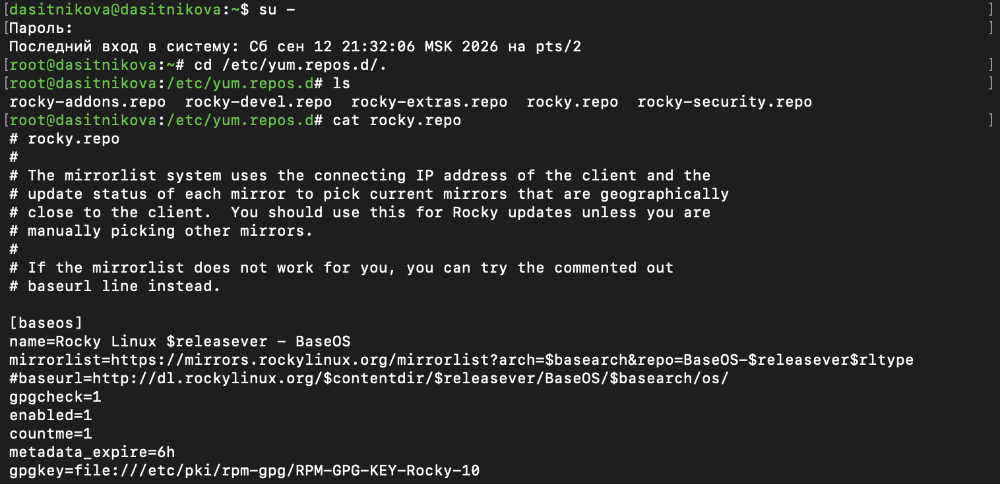
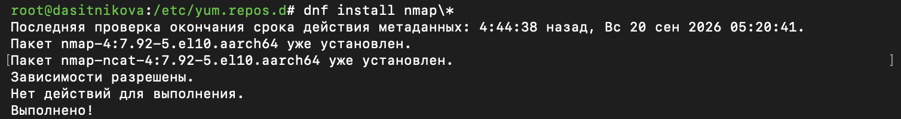
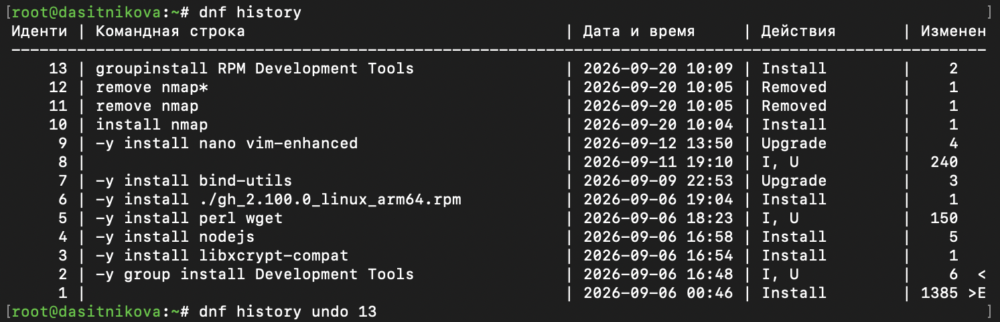
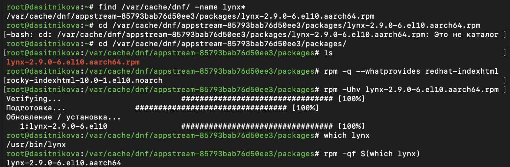
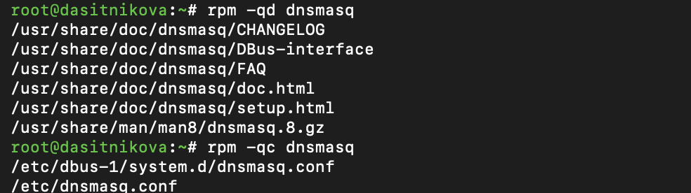
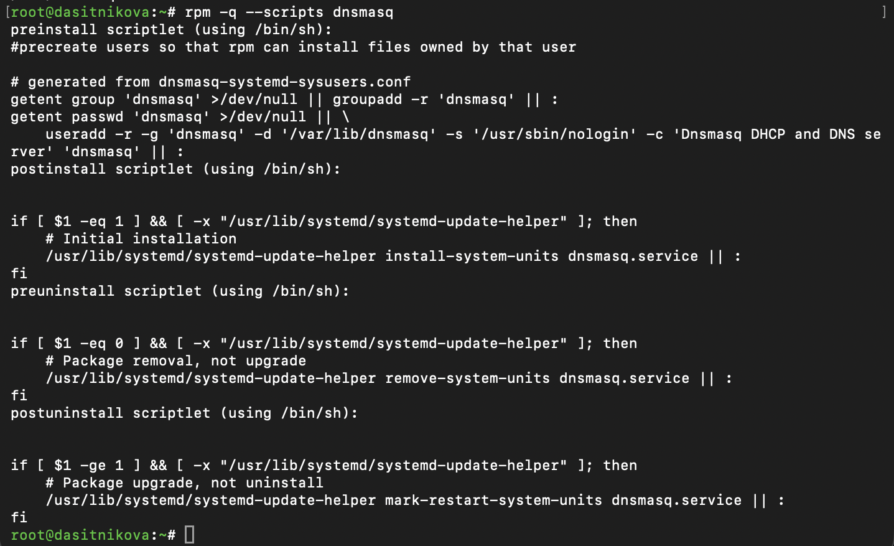

---
## Author
author:
  name: Ситникова Диана Александровна
  degrees: BSc
  email: 1032201746@rudn.ru
  affiliation:
    - name: Российский университет дружбы народов
      country: Российская Федерация
      postal-code: 117198
      city: Москва
      address: ул. Миклухо-Маклая, д. 6
## Title
title: "Лабораторная работа № 4"
subtitle: "Работа с программными пакетами"
institute:
  - "Российский университет дружбы народов им. П. Лумумбы"
  - "Преподаватель: д.ф.-м.н., профессор Кулябов Дмитрий Сергеевич"
license: CC BY
date: today
date-format: "YYYY-MM-DD"
---

# Информация

## Докладчик

:::::::::::::: {.columns align=center}
::: {.column width="68%"}

- Ситникова Диана Александровна
- направление 09.03.03 «Прикладная информатика»
- Российский университет дружбы народов
- [1032201746@rudn.ru](mailto:1032201746@rudn.ru)

:::
::: {.column width="32%"}

{width=100%}

:::
::::::::::::::

# Вводная часть

## Актуальность

- Программы в Linux устанавливаются пакетами, и от менеджера пакетов зависят состав и целостность системы.
- Администратор должен знать, откуда берутся пакеты, что они устанавливают и какие действия выполняют при установке.
- Незнакомый пакет может содержать сценарии, которые выполняются с правами `root`, поэтому его содержимое проверяют до установки.

## Объект, предмет, цель и задачи

**Объект** --- программные пакеты и репозитории Rocky Linux 10.2.

**Предмет** --- средства управления пакетами `dnf` и `rpm`.

**Цель** --- получить навыки работы с репозиториями и менеджерами пакетов.

**Задачи:** изучить подключение репозиториев; установить и удалить пакеты средствами `dnf`; установить и удалить пакет из файла средствами `rpm`; исследовать содержимое пакетов.

## Материалы и методы

| Компонент | Значение |
|---|---|
| Стенд | Rocky Linux 10.2, архитектура aarch64 |
| Репозитории | BaseOS, AppStream, Extras |
| Высокий уровень | `dnf`: поиск, установка, группы, история |
| Низкий уровень | `rpm`: установка из файла, запросы `-q` |
| Пакеты | `nmap`, RPM Development Tools, `lynx`, `dnsmasq` |

# Содержание исследования

## Репозитории описываются файлами в /etc/yum.repos.d

:::::::::::::: {.columns align=center}
::: {.column width="40%"}

Каждый раздел файла `.repo` задаёт один репозиторий: адрес зеркал, ключ подписи, срок действия кэша.

Из 36 описанных репозиториев включены три: `baseos`, `appstream`, `extras`.

:::
::: {.column width="60%"}

{width=100%}

:::
::::::::::::::

## Шаблон nmap\* охватывает все пакеты с префиксом

{width=100%}

- `dnf install nmap` --- один пакет с точным именем.
- `dnf install nmap\*` --- все пакеты с именем на `nmap`: `nmap` и `nmap-ncat`.
- `nmap-ncat` входит в систему с установки, поэтому действий не потребовалось.

## История позволяет отменить транзакцию

:::::::::::::: {.columns align=center}
::: {.column width="40%"}

Каждый запуск `dnf` --- транзакция с номером в истории.

`dnf history undo 13` удалил только `rpmdevtools`: остальные пакеты группы транзакция 13 не устанавливала.

:::
::: {.column width="60%"}

{width=100%}

:::
::::::::::::::

## rpm устанавливает файл, но не ищет зависимости

:::::::::::::: {.columns align=center}
::: {.column width="40%"}

`dnf install --downloadonly` положил пакет в кэш.

Зависимость `redhat-indexhtml` проверена заранее: `rpm` её не установит.

`rpm -Uhv` проверил подпись и установил `lynx`.

:::
::: {.column width="60%"}

{width=100%}

:::
::::::::::::::

## Запросы rpm раскрывают состав пакета

:::::::::::::: {.columns align=center}
::: {.column width="45%"}

| Запрос | Результат для `dnsmasq` |
|---|---|
| `-ql` | 23 объекта |
| `-qd` | 6 файлов документации |
| `-qc` | 2 конфигурационных файла |
| `-qf` | пакет по имени файла |

:::
::: {.column width="55%"}

{width=100%}

:::
::::::::::::::

## Сценарии пакета выполняются с правами root

:::::::::::::: {.columns align=center}
::: {.column width="40%"}

`preinstall` создаёт пользователя `dnsmasq`.

`postinstall`, `preuninstall`, `postuninstall` регистрируют, снимают и перезапускают службу.

`rpm -qp --scripts` показывает их до установки.

:::
::: {.column width="60%"}

{width=100%}

:::
::::::::::::::

# Результаты

## Пакеты установлены, исследованы и удалены

- Изучены файлы репозиториев и конфигурация `dnf`.
- Средствами `dnf` установлен и удалён `nmap`, установлена и отменена группа RPM Development Tools.
- Средствами `rpm` из загруженного файла установлен `lynx`, установка проверена от имени пользователя.
- Изучены файлы, документация, конфигурация и сценарии пакетов `lynx` и `dnsmasq`.

## Вывод

`dnf` работает с репозиториями: находит пакеты, разрешает зависимости и ведёт историю транзакций, которую можно отменить.

`rpm` работает с отдельными файлами пакетов и позволяет до установки проверить их содержимое, в том числе сценарии, выполняемые с правами `root`.
