---
## Author
author:
  name: Ситникова Диана Александровна
  degrees: BSc
  email: 1032201746@rudn.ru
  affiliation:
    - name: Российский университет дружбы народов
      country: Российская Федерация
      postal-code: 117198
      city: Москва
      address: ул. Миклухо-Маклая, д. 6

## Title
title: "Отчёт по лабораторной работе №4"
subtitle: "Работа с программными пакетами"
license: "CC BY"
bibliography: bib/cite.bib
---

# Цель работы

Целью данной работы является получение навыков работы с репозиториями и менеджерами пакетов.

# Задание

- Изучить, как и в каких файлах подключаются репозитории для установки программного обеспечения; изучить основные возможности команды `dnf`: поиск, установку, обновление и удаление пакета, работу с историей действий.
- Изучить и повторить процесс установки и удаления определённого пакета с использованием возможностей `dnf`.
- Изучить и повторить процесс установки и удаления определённого пакета с использованием возможностей `rpm`.

# Теоретическое введение

## Пакеты RPM

В дистрибутивах семейства Red Hat Enterprise Linux программное обеспечение распространяется в виде пакетов формата RPM [@nemeth_book_unix-linux-admin_ru]. Пакет --- это архив с файлами программы и заголовок с метаданными: именем, версией, архитектурой, описанием, списком файлов, зависимостями и цифровой подписью. Имя файла пакета строится по схеме `имя-версия-выпуск.архитектура.rpm`, например `lynx-2.9.0-6.el10.aarch64.rpm`. Выпуск `6.el10` означает шестую сборку этой версии для Enterprise Linux 10. Пакеты без машинного кода, например документация и сценарии, имеют архитектуру `noarch`.

Полная версия пакета может включать эпоху --- число, которое записывается перед версией через двоеточие, например `4:7.92-5.el10`. Эпоха сравнивается раньше версии и позволяет сборщику дистрибутива исправить порядок версий, если схема нумерации программы изменилась.

В списке файлов пакета часть файлов помечается особым образом. Конфигурационные файлы при обновлении пакета не перезаписываются, если администратор их изменил. Файлы документации можно не устанавливать в системах с ограниченным местом на диске. Кроме файлов пакет может содержать сценарии, или скриптлеты, которые выполняются до и после установки и удаления: они создают системных пользователей, регистрируют службы, обновляют кэши.

## Менеджеры пакетов rpm и dnf

Работа с пакетами организована на двух уровнях [@vanvugt_book_rhcsa_en]. Низкоуровневая утилита `rpm` устанавливает, удаляет и проверяет отдельные файлы пакетов и ведёт базу установленных пакетов. Зависимости она проверяет, но не разрешает: если требуемого пакета нет в системе, установка завершается ошибкой.

Высокоуровневый менеджер `dnf` работает с репозиториями. Он находит пакеты по имени и описанию, сам определяет недостающие зависимости и загружает их, объединяет все изменения в одну транзакцию и сохраняет её в истории. Менеджер `dnf` пришёл на смену `yum` и сохранил его синтаксис; в Rocky Linux 10 используется `dnf` версии 4, а команда `yum` является ссылкой на него. Сравнение утилит приведено в [табл. @tbl-rpm-dnf].

| Возможность | `rpm` | `dnf` |
|---------------------------------|----------|-----------|
| Установка из файла пакета | да | да |
| Загрузка пакетов из репозиториев | нет | да |
| Разрешение зависимостей | нет | да |
| Установка групп пакетов | нет | да |
| История и отмена транзакций | нет | да |
| Запросы к содержимому пакета | да | частично |

: Сравнение утилит rpm и dnf {#tbl-rpm-dnf}

## Репозитории

Репозиторий --- это каталог на сервере, в котором лежат пакеты и метаданные: список пакетов, их зависимости, группы и контрольные суммы. Менеджер `dnf` загружает метаданные включённых репозиториев, хранит их в кэше `/var/cache/dnf` и по ним выбирает пакеты для установки [@goyal_book_centos7_en].

Репозитории описываются в файлах с расширением `.repo` в каталоге `/etc/yum.repos.d`. Каждый раздел файла, заголовок которого записан в квадратных скобках, задаёт один репозиторий. Основные параметры раздела приведены в [табл. @tbl-repo-options]. В адресах используются переменные: `$releasever` --- версия дистрибутива, `$basearch` --- архитектура. Общие настройки `dnf` задаются в файле `/etc/dnf/dnf.conf`.

| Параметр | Назначение |
|----------------|-----------------------------------------------------|
| `name` | понятное название репозитория |
| `baseurl` | адрес каталога репозитория |
| `mirrorlist` | адрес, по которому выдаётся список зеркал |
| `enabled` | включён ли репозиторий: 1 или 0 |
| `gpgcheck` | проверять ли цифровую подпись пакетов |
| `gpgkey` | путь к открытому ключу для проверки подписи |
| `metadata_expire` | срок, после которого метаданные загружаются заново |

: Основные параметры описания репозитория {#tbl-repo-options}

Основное программное обеспечение Rocky Linux 10 распределено по нескольким репозиториям. BaseOS содержит ядро и базовые компоненты системы, AppStream --- прикладные программы, языки программирования и базы данных, Extras --- дополнительные пакеты проекта Rocky Linux. Репозиторий CRB содержит пакеты для разработчиков и по умолчанию выключен. Для многих репозиториев существуют варианты `-debuginfo` с отладочной информацией и `-source` с исходными пакетами.

## Группы пакетов

Пакеты, которые обычно устанавливаются вместе, объединены в группы. Описания групп хранятся в метаданных репозитория. Пакеты внутри группы делятся на обязательные, устанавливаемые по умолчанию и необязательные; команда `dnf groupinstall` ставит обязательные пакеты и пакеты по умолчанию. Группы рабочих сред, например `Server with GUI`, объединяют несколько групп и задают состав системы при установке.

## Транзакции и история

Все изменения, которые `dnf` вносит за один запуск, выполняются как транзакция: сначала проверяются зависимости и подписи, затем пакеты устанавливаются и удаляются, и если на каком-то шаге происходит ошибка, система не остаётся в промежуточном состоянии. Каждая транзакция записывается в историю с номером, командной строкой, временем и списком изменённых пакетов. Команда `dnf history undo номер` выполняет обратную транзакцию: удаляет установленные в ней пакеты и возвращает удалённые.

## Запросы к базе RPM

Команда `rpm -q` выполняет запросы к базе установленных пакетов, а с ключом `-p` --- к файлу пакета, который ещё не установлен [@neil_book_learning-centos_en]. Основные виды запросов приведены в [табл. @tbl-rpm-query].

| Команда | Результат |
|----------------------|-------------------------------------------------|
| `rpm -qa` | список всех установленных пакетов |
| `rpm -qi пакет` | сведения о пакете |
| `rpm -ql пакет` | список всех файлов пакета |
| `rpm -qd пакет` | файлы документации |
| `rpm -qc пакет` | конфигурационные файлы |
| `rpm -qf файл` | пакет, которому принадлежит файл |
| `rpm -q --scripts пакет` | сценарии установки и удаления |
| `rpm -qp… файл.rpm` | те же запросы к файлу пакета |

: Запросы к базе RPM {#tbl-rpm-query}

# Выполнение лабораторной работы

Работа выполнена в виртуальной машине с Rocky Linux 10.2 от имени суперпользователя: в терминале, подключённом к гостевой системе по SSH, выполнен вход командой `su -`. Для проверки установленной программы от имени обычного пользователя использован терминал графической среды гостевой системы.

## Работа с репозиториями

Выполнен переход в каталог `/etc/yum.repos.d`, выведен список файлов и содержимое файла `rocky.repo` ([рис. @fig-001]).

~~~bash
su -
cd /etc/yum.repos.d/.
ls
cat rocky.repo
~~~

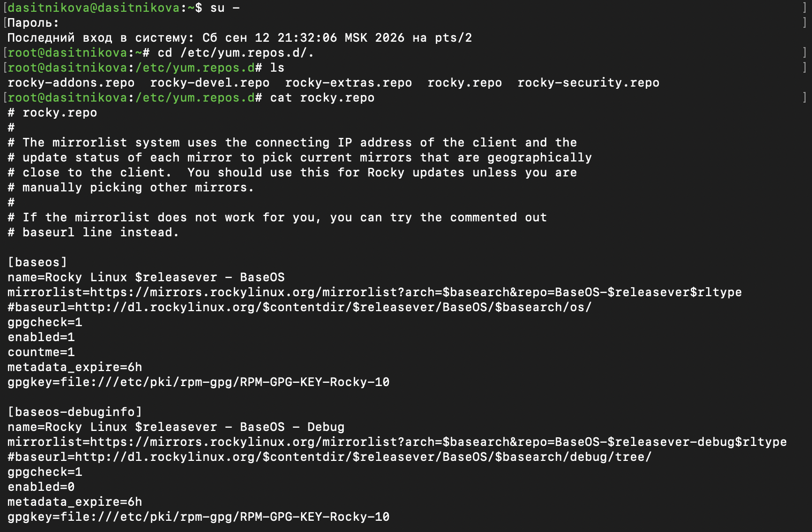{#fig-001 width=85%}

В каталоге находятся пять файлов. Файл `rocky.repo` описывает основные репозитории BaseOS, AppStream и CRB, файл `rocky-extras.repo` --- Extras и Plus, `rocky-devel.repo` --- служебный репозиторий Devel, `rocky-security.repo` --- репозиторий Security, а `rocky-addons.repo` --- дополнения High Availability, NFV, Realtime, SAP и SAP HANA.

Раздел `[baseos]` задаёт название репозитория с переменной `$releasever` и адрес `mirrorlist`, по которому сервер проекта выдаёт список ближайших зеркал. Прямой адрес `baseurl` закомментирован и служит запасным вариантом. Параметры `gpgcheck=1` и `gpgkey` включают проверку подписи пакетов ключом Rocky Linux 10, `enabled=1` включает репозиторий, `metadata_expire=6h` ограничивает срок действия кэша метаданных шестью часами. Параметр `countme=1` разрешает `dnf` раз в неделю передавать вместе с запросом списка зеркал анонимный счётчик, по которому проект оценивает число работающих систем. Раздел `[baseos-debuginfo]` устроен так же, но выключен: `enabled=0`.

Затем выведено содержимое основного конфигурационного файла `dnf` ([рис. @fig-002]).

~~~bash
cat /etc/dnf/dnf.conf
~~~

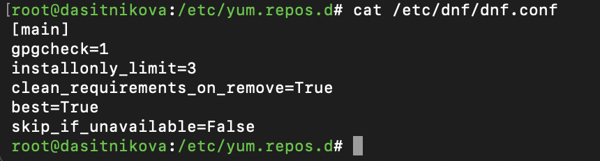{#fig-002 width=70%}

Параметры раздела `[main]` приведены в [табл. @tbl-dnf-conf].

| Параметр и значение | Смысл |
|-----------------------------------|---------------------------------|
| `gpgcheck=1` | проверять подпись всех устанавливаемых пакетов |
| `installonly_limit=3` | хранить не более трёх версий пакетов, которые устанавливаются рядом друг с другом, например ядра |
| `clean_requirements_on_remove=True` | при удалении пакета удалять зависимости, которые больше не нужны |
| `best=True` | устанавливать только наилучшую доступную версию, иначе сообщать об ошибке |
| `skip_if_unavailable=False` | считать недоступный репозиторий ошибкой, а не пропускать его |

: Параметры файла /etc/dnf/dnf.conf {#tbl-dnf-conf}

Выведены списки включённых и всех описанных в системе репозиториев ([рис. @fig-003]).

~~~bash
dnf repolist
dnf repolist all
~~~

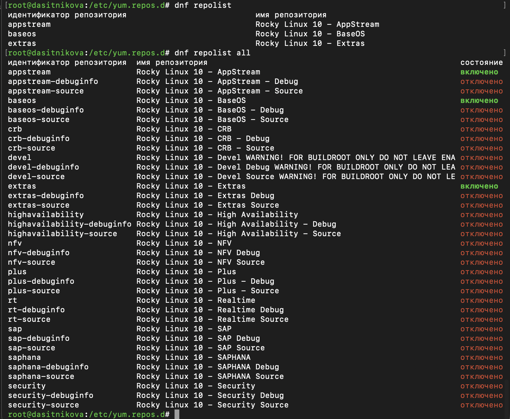{#fig-003 width=85%}

Команда `dnf repolist` выводит идентификатор и название каждого включённого репозитория. Включены три репозитория: `appstream`, `baseos` и `extras`. Команда `dnf repolist all` дополнительно выводит состояние и показывает 36 репозиториев из пяти файлов каталога `/etc/yum.repos.d`; остальные 33 отключены, в том числе CRB, отладочные и исходные варианты и дополнения. Название репозитория `devel` содержит предупреждение о том, что он предназначен только для сборочной среды и не должен оставаться включённым.

## Поиск пакетов и сведения о пакете

Выполнен поиск пакетов, в названии или кратком описании которых встречается слово `user` ([рис. @fig-004]).

~~~bash
dnf search user
~~~

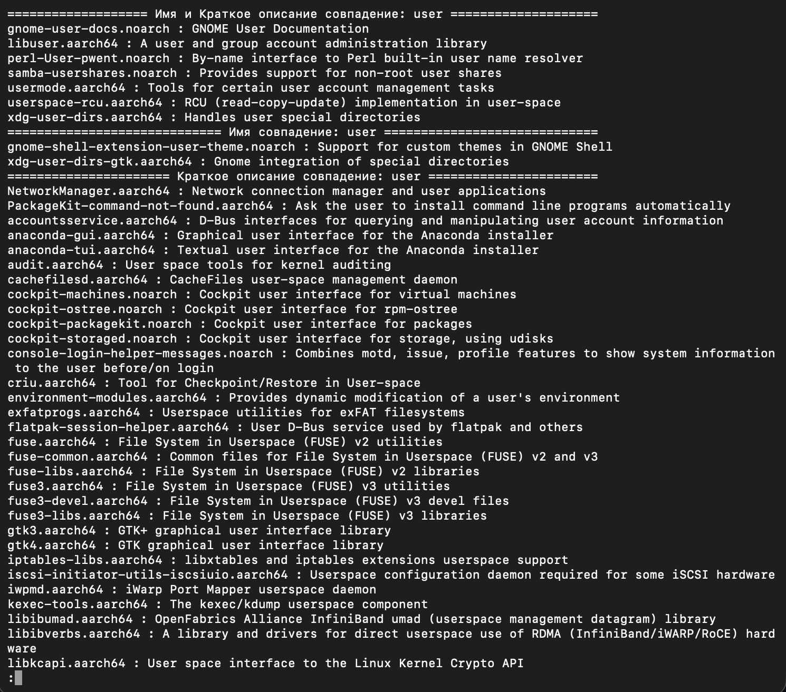{#fig-004 width=85%}

Результаты сгруппированы по месту совпадения: сначала пакеты, у которых слово найдено и в имени, и в кратком описании, затем --- только в имени, затем --- только в описании. Каждая строка содержит имя пакета с архитектурой и краткое описание. Поиск выполняется по метаданным всех включённых репозиториев и находит как установленные, так и доступные для установки пакеты.

Перед установкой сетевого сканера `nmap` выполнены поиск по имени и вывод сведений о пакете, после чего пакет установлен ([рис. @fig-005]).

~~~bash
dnf search nmap
dnf info nmap
dnf install nmap
~~~

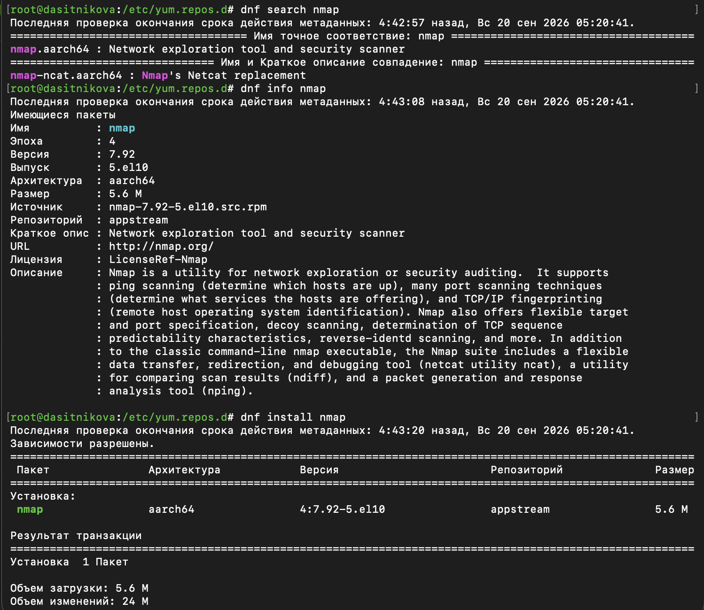{#fig-005 width=85%}

Поиск нашёл два пакета: `nmap` с точным совпадением имени и `nmap-ncat` --- реализацию утилиты `netcat` из проекта Nmap. Команда `dnf info` вывела эпоху 4, версию 7.92, выпуск `5.el10`, архитектуру `aarch64`, размер 5,6 МБ, исходный пакет, репозиторий `appstream`, адрес проекта, лицензию и описание. Перед установкой `dnf` вывел таблицу транзакции: один пакет, 5,6 МБ для загрузки и 24 МБ на диске.

## Установка и удаление пакетов

Выполнена установка всех пакетов, имена которых начинаются с `nmap`, после чего пакеты удалены по имени и по шаблону ([рис. @fig-006]).

~~~bash
dnf install nmap\*
dnf remove nmap
dnf remove nmap\*
~~~

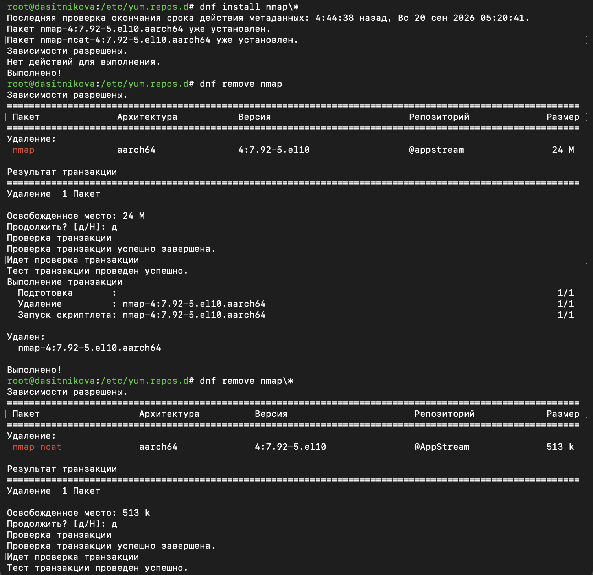{#fig-006 width=85%}

Команда `dnf install nmap` устанавливает один пакет с точно указанным именем. Команда `dnf install nmap\*` передаёт `dnf` шаблон, которому соответствуют все пакеты с именем, начинающимся на `nmap`, --- в данном случае `nmap` и `nmap-ncat`. Символ `\` не даёт командной оболочке самой подставить вместо `*` имена файлов текущего каталога. Оба пакета уже были установлены, и `dnf` сообщил, что действий для выполнения нет: пакет `nmap-ncat` входит в состав системы с момента её установки.

Команда `dnf remove nmap` удалила один пакет и освободила 24 МБ, команда `dnf remove nmap\*` --- оставшийся пакет `nmap-ncat`. В столбце «Репозиторий» установленные пакеты отмечаются символом `@`: `@appstream` означает, что `nmap` загружен из сетевого репозитория, а `@AppStream` у пакета `nmap-ncat` --- что он установлен из одноимённого репозитория установочного образа.

## Группы пакетов

Выведен список групп пакетов на языке системы и на английском языке ([рис. @fig-007]).

~~~bash
dnf groups list
LANG=C dnf groups list
~~~

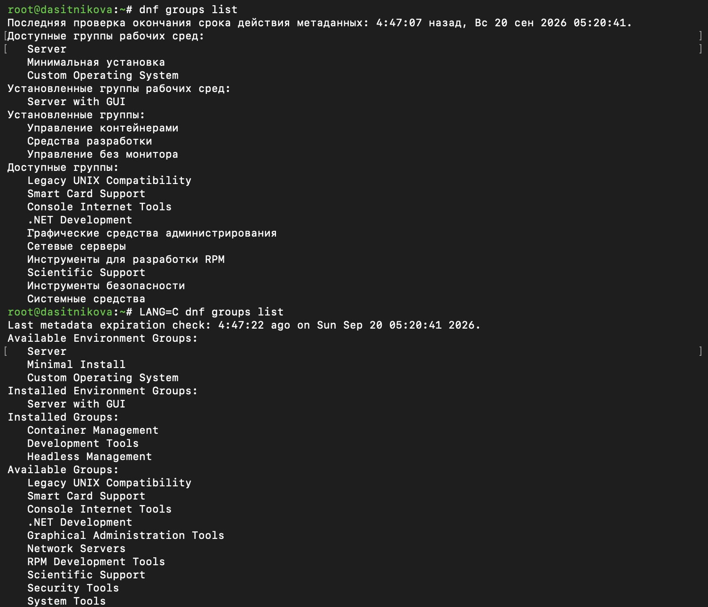{#fig-007 width=85%}

Список разделён на четыре части. Установлена группа рабочей среды `Server with GUI` и группы «Управление контейнерами», «Средства разработки» и «Управление без монитора»; последняя обеспечивает работу веб-консоли Cockpit, адрес которой выводится при входе в систему. Среди доступных групп --- «Инструменты для разработки RPM» и «Инструменты безопасности». Переменная `LANG=C` отключает перевод и выводит исходные английские названия групп, которые удобно указывать в командах и сценариях.

Выведены сведения о группе RPM Development Tools, и группа установлена ([рис. @fig-008]).

~~~bash
dnf groups info "RPM Development Tools"
dnf groupinstall "RPM Development Tools"
~~~

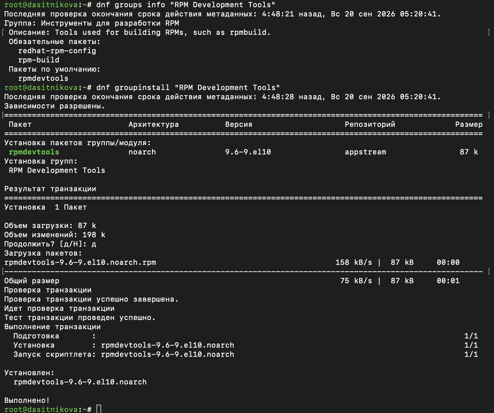{#fig-008 width=85%}

Группа предназначена для сборки пакетов RPM. Обязательными пакетами в ней являются `redhat-rpm-config` и `rpm-build`, пакетом по умолчанию --- `rpmdevtools`. Обязательные пакеты уже были установлены вместе с группой «Средства разработки» в лабораторной работе № 1, поэтому транзакция установила только пакет `rpmdevtools` и отметила группу как установленную.

## История транзакций

Выведена история транзакций `dnf` и отменена последняя из них ([рис. @fig-009]).

~~~bash
dnf history
dnf history undo 13
~~~

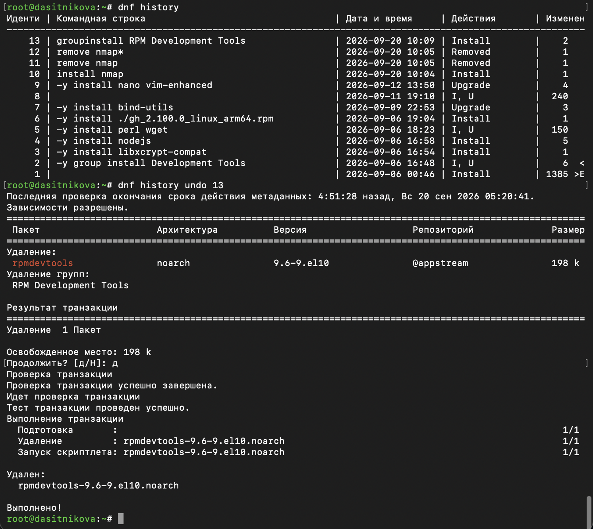{#fig-009 width=85%}

История содержит 13 транзакций --- все изменения состава пакетов с момента установки системы. Транзакция 1 соответствует установке системы: 1385 пакетов 6 сентября 2026 года. Транзакции 2--9 относятся к подготовке стенда и предыдущим лабораторным работам, например установка группы «Средства разработки», Node.js и `gh`, транзакции 10--13 --- к данной работе. Для каждой транзакции указаны номер, командная строка, дата и время, вид действий (установка, удаление, обновление) и число изменённых пакетов. Знаки `>` и `<` в последнем столбце означают, что база RPM изменялась в обход `dnf` после транзакции 1 и перед транзакцией 2, а знак `E` --- что во время транзакции выводились предупреждения или сообщения об ошибках.

Команда `dnf history undo 13` выполнила транзакцию, обратную установке группы: удалила пакет `rpmdevtools` и сняла отметку об установке группы RPM Development Tools. Пакеты `redhat-rpm-config` и `rpm-build` остались в системе, поскольку транзакция 13 их не устанавливала.

## Установка пакета из файла средствами rpm

Выведены сведения о доступной версии текстового браузера `lynx`, и пакет загружен без установки ([рис. @fig-010]).

~~~bash
dnf list lynx
dnf install lynx --downloadonly
~~~

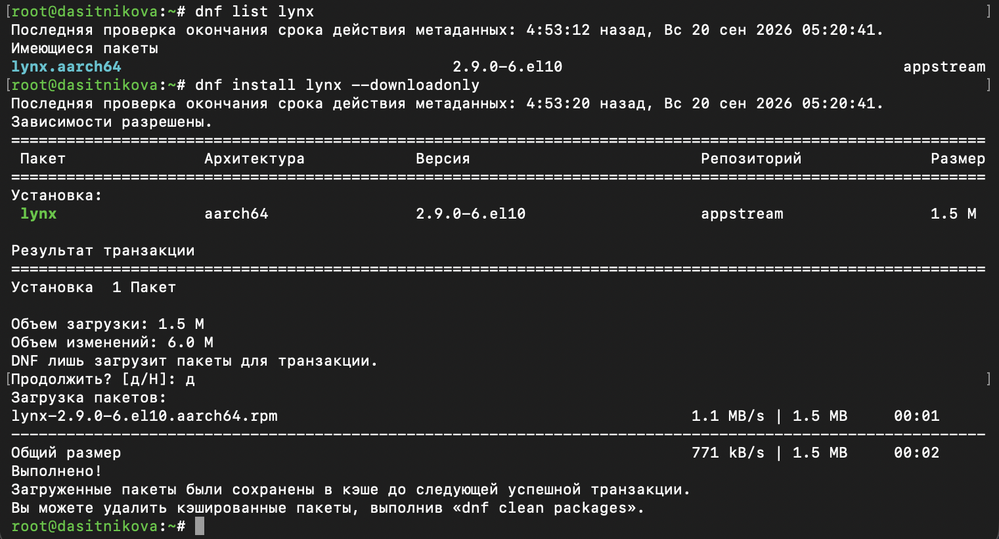{#fig-010 width=85%}

Команда `dnf list` показала, что пакет `lynx` версии `2.9.0-6.el10` доступен в репозитории `appstream`. С ключом `--downloadonly` `dnf` выполнил разрешение зависимостей и загрузку, но не установку. Все зависимости пакета уже были установлены, поэтому загружен только файл `lynx-2.9.0-6.el10.aarch64.rpm`. Загруженные пакеты хранятся в кэше до следующей успешной транзакции.

Загруженный файл найден в кэше `dnf` и установлен командой `rpm` ([рис. @fig-011]).

~~~bash
find /var/cache/dnf/ -name lynx*
cd /var/cache/dnf/appstream-85793bab76d50ee3/packages/
ls
rpm -q --whatprovides redhat-indexhtml
rpm -Uhv lynx-2.9.0-6.el10.aarch64.rpm
which lynx
rpm -qf $(which lynx)
rpm -qi lynx
~~~

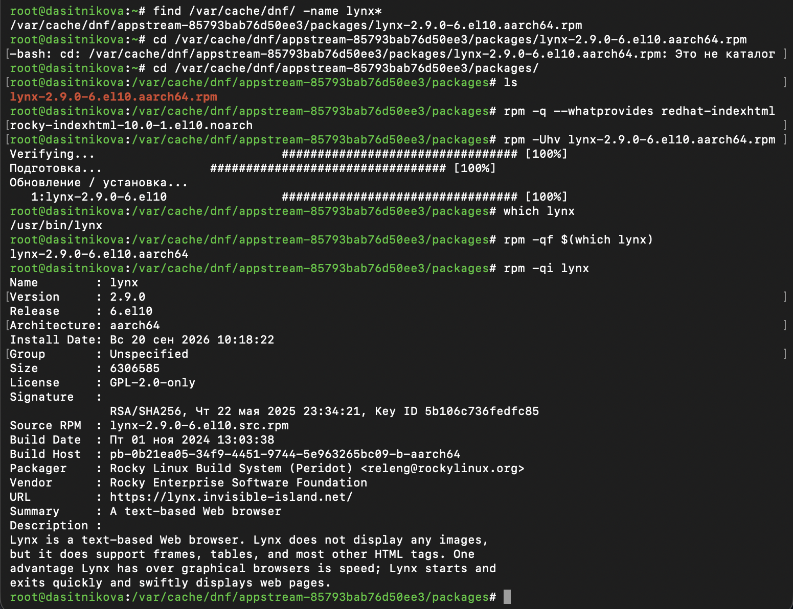{#fig-011 width=85%}

Кэш каждого репозитория хранится в отдельном каталоге, имя которого состоит из идентификатора репозитория и контрольной суммы его адреса, а загруженные пакеты --- в подкаталоге `packages`. Пакет `lynx` требует пакет `redhat-indexhtml`, а `rpm` не устанавливает зависимости сам, поэтому перед установкой проверено, что эту возможность уже предоставляет пакет `rocky-indexhtml`.

Команда `rpm -Uhv` установила пакет: ключ `-U` обновляет пакет или устанавливает его, если он отсутствует, `-h` выводит индикатор выполнения из символов `#`, `-v` включает подробный вывод. Перед установкой `rpm` проверил подпись и контрольные суммы пакета (этап Verifying). Исполняемый файл размещён в `/usr/bin/lynx`, и команда `rpm -qf` подтвердила, что он принадлежит пакету `lynx-2.9.0-6.el10.aarch64`.

Команда `rpm -qi` вывела сведения из заголовка пакета: имя, версию, выпуск, архитектуру, дату установки, размер 6306585 байт, лицензию GPL-2.0-only, подпись RSA/SHA256 ключом `5b106c736fedfc85`, исходный пакет, дату и узел сборки, сборщика --- систему сборки Rocky Linux Peridot, поставщика, адрес проекта и описание.

Получен список всех файлов пакета ([рис. @fig-012]) и отдельно --- список файлов документации ([рис. @fig-013]), после чего просмотрена справка `man lynx` ([рис. @fig-014]).

~~~bash
rpm -ql lynx
rpm -qd lynx
man lynx
~~~

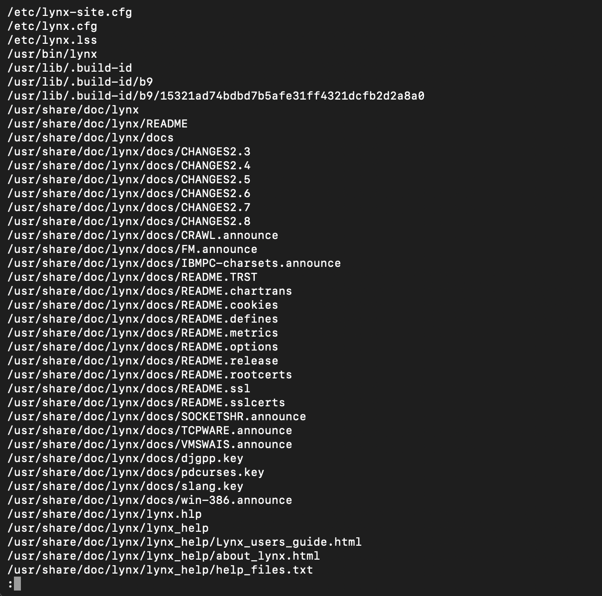{#fig-012 width=75%}

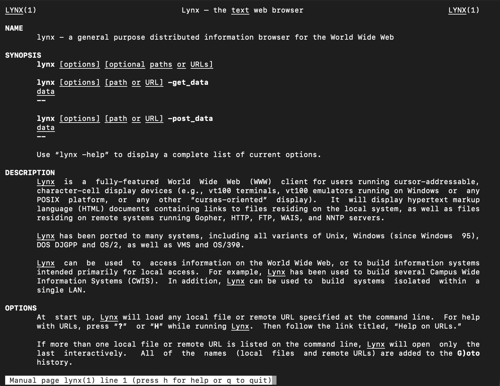{#fig-013 width=85%}

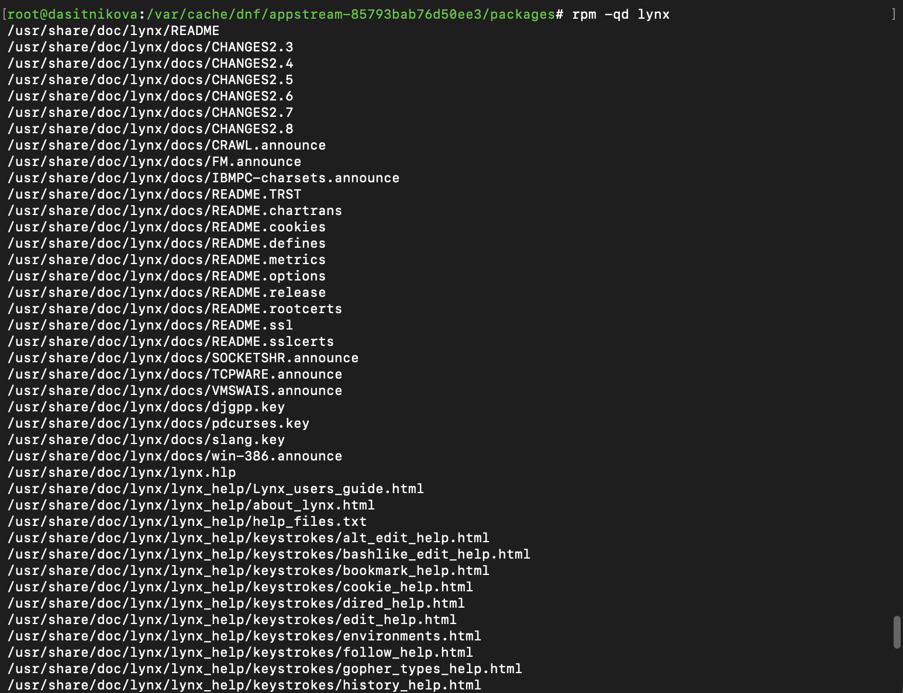{#fig-014 width=85%}

Пакет устанавливает конфигурационные файлы в `/etc`, исполняемый файл `/usr/bin/lynx`, ссылку в каталоге `/usr/lib/.build-id`, связывающую исполняемый файл с отладочной информацией, и документацию в `/usr/share/doc/lynx`. Документация составляет большую часть пакета: журналы изменений, файлы README, руководство пользователя в формате HTML и справка по клавишам. В перечень `rpm -qd` входит и страница справочного руководства, которую выводит команда `man lynx`.

Выведены конфигурационные файлы и сценарии установки пакета ([рис. @fig-015]).

~~~bash
rpm -qc lynx
rpm -q --scripts lynx
~~~

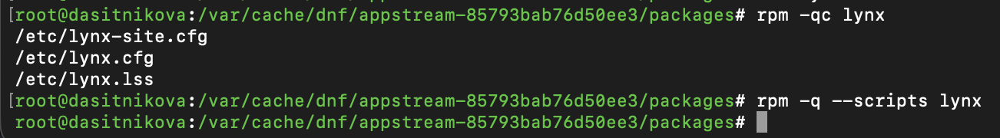{#fig-015 width=85%}

Пакет содержит три конфигурационных файла: основные настройки `/etc/lynx.cfg`, локальные настройки `/etc/lynx-site.cfg` и цветовую схему `/etc/lynx.lss`. Команда `rpm -q --scripts` ничего не вывела: у пакета `lynx` нет сценариев установки и удаления, поскольку для его работы не нужно создавать пользователей, регистрировать службы или обновлять системные кэши.

Для проверки установки браузер `lynx` запущен от имени обычного пользователя `dasitnikova` в терминале графической среды гостевой системы ([рис. @fig-016]).

~~~bash
lynx
~~~

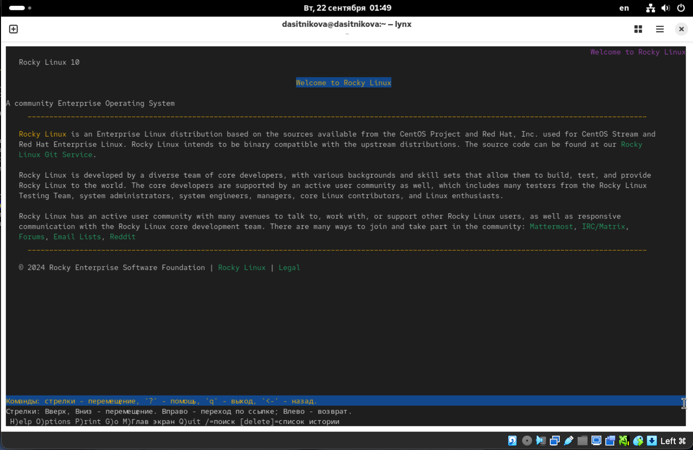{#fig-016 width=85%}

Браузер открыл страницу «Welcome to Rocky Linux» из пакета `rocky-indexhtml`, которую он показывает при запуске без аргументов, --- именно поэтому пакет `lynx` зависит от `redhat-indexhtml`. Страница отображается в текстовом режиме, ссылки выделены цветом, в нижних строках приведены клавиши управления.

В терминале суперпользователя пакет удалён ([рис. @fig-017]).

~~~bash
rpm -e lynx
ls
which lynx
~~~

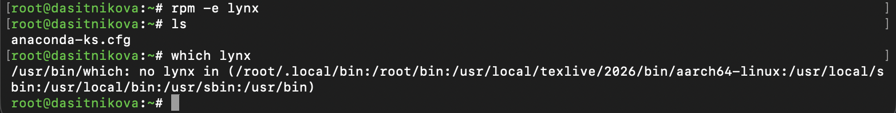{#fig-017 width=85%}

Команда `rpm -e` удалила пакет без вывода сообщений. Команда `which` больше не находит `lynx` ни в одном каталоге переменной `PATH`.

## Сведения о пакете dnsmasq

Для DNS-, DHCP- и TFTP-сервера `dnsmasq` выведены сведения о наличии пакета, расположение исполняемого файла, принадлежащий ему пакет и сведения о пакете ([рис. @fig-018]).

~~~bash
dnf list dnsmasq
dnf install dnsmasq
which dnsmasq
rpm -qf $(which dnsmasq)
rpm -qi dnsmasq
~~~

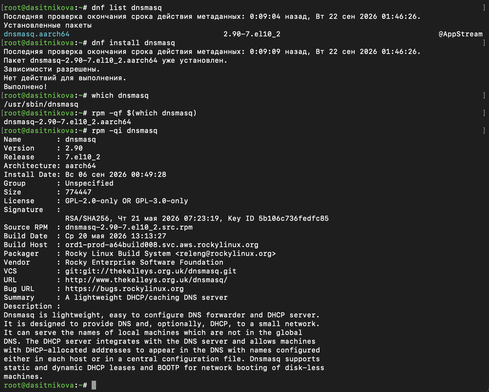{#fig-018 width=85%}

Пакет `dnsmasq` уже присутствовал в системе: `dnf list` выводит его в разделе «Установленные пакеты» с репозиторием `@AppStream` установочного образа, а `dnf install` сообщает, что пакет уже установлен и действий не требуется. Дата установки в выводе `rpm -qi` --- 6 сентября 2026 года, то есть пакет установлен вместе с системой. Исполняемый файл размещён в каталоге `/usr/sbin`, предназначенном для программ системного администрирования и служб. Пакет подписан тем же ключом `5b106c736fedfc85`, что и `lynx`, и собран для выпуска `el10_2`, то есть для Rocky Linux 10.2.

Выведены полный список файлов пакета, файлы документации и конфигурационные файлы ([рис. @fig-019]).

~~~bash
rpm -ql dnsmasq
rpm -qd dnsmasq
rpm -qc dnsmasq
~~~

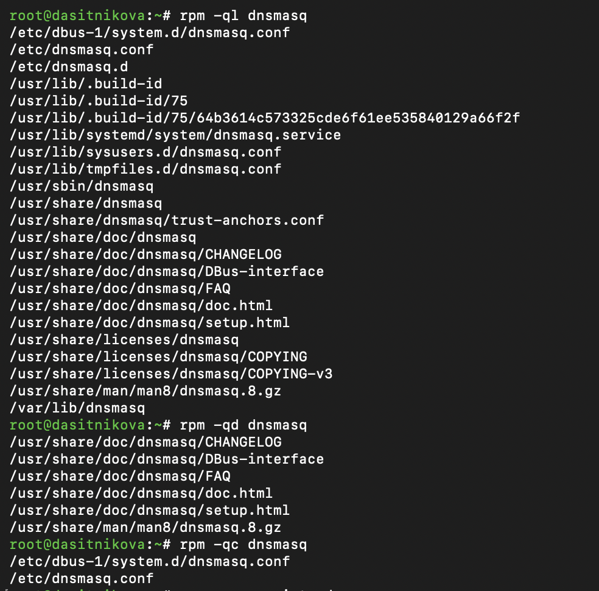{#fig-019 width=75%}

Состав пакета типичен для системной службы. Кроме исполняемого файла и документации он содержит модуль службы `dnsmasq.service` для systemd, описание системного пользователя в каталоге `sysusers.d`, правила создания временных файлов в `tmpfiles.d`, рабочий каталог `/var/lib/dnsmasq` и каталог `/etc/dnsmasq.d` для дополнительных настроек. Документация включает журнал изменений, ответы на частые вопросы, описания в формате HTML и страницу справочного руководства в разделе 8, отведённом для команд администрирования. Конфигурационных файлов два: `/etc/dnsmasq.conf` с настройками службы и `/etc/dbus-1/system.d/dnsmasq.conf`, определяющий права службы в системной шине D-Bus.

Выведены сценарии установки и удаления пакета ([рис. @fig-020]).

~~~bash
rpm -q --scripts dnsmasq
~~~

{#fig-020 width=85%}

Пакет содержит четыре сценария, их назначение приведено в [табл. @tbl-scripts]. Сценариям передаётся аргумент `$1` --- число экземпляров пакета, которое останется в системе после операции: 1 при первой установке, 2 при обновлении, 0 при удалении. По нему сценарий отличает установку от обновления и удаление от обновления. Конструкция `|| :` гарантирует, что ошибка команды внутри сценария не прервёт всю транзакцию.

| Сценарий | Когда выполняется | Действие |
|--------------|----------------------|-----------------------------------------|
| `preinstall` | перед установкой файлов | создаёт системную группу и пользователя `dnsmasq` с домашним каталогом `/var/lib/dnsmasq` и оболочкой `/usr/sbin/nologin`, чтобы файлы пакета можно было сразу назначить этому пользователю |
| `postinstall` | после первой установки | регистрирует модуль `dnsmasq.service` в systemd |
| `preuninstall` | перед удалением | снимает модуль службы с регистрации и останавливает её |
| `postuninstall` | после обновления | отмечает службу для перезапуска новой версией |

: Сценарии пакета dnsmasq {#tbl-scripts}

Пакет удалён средствами `rpm`, и его отсутствие проверено запросом к базе ([рис. @fig-021]).

~~~bash
rpm -e dnsmasq
rpm -q dnsmasq
~~~

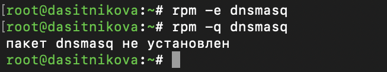{#fig-021 width=60%}

Перед удалением `rpm` проверяет, не требуют ли удаляемый пакет другие установленные пакеты, и при наличии таких зависимостей отказывает в удалении. Удаление прошло без сообщений, следовательно, ни один установленный пакет не зависит от `dnsmasq`. Запрос `rpm -q` сообщил, что пакет не установлен.

# Выводы

В ходе лабораторной работы получены навыки работы с репозиториями и менеджерами пакетов в Rocky Linux 10.2. Изучены файлы описания репозиториев в каталоге `/etc/yum.repos.d` и конфигурационный файл `/etc/dnf/dnf.conf`. Средствами `dnf` выполнены поиск пакетов, получение сведений о них, установка и удаление пакета `nmap` по имени и по шаблону, установка группы пакетов RPM Development Tools и её отмена через историю транзакций.

Средствами `rpm` пакет `lynx` установлен из загруженного файла с предварительной проверкой зависимости, изучены его файлы, документация и конфигурация, установка проверена запуском от имени обычного пользователя. Для пакета `dnsmasq` изучены состав файлов и сценарии установки, которые создают системного пользователя и регистрируют службу. Показано, что `dnf` разрешает зависимости и ведёт историю изменений, а `rpm` работает с отдельными файлами пакетов и позволяет подробно исследовать их содержимое.

# Контрольные вопросы

1. **Какая команда позволяет вам искать пакет rpm, содержащий файл useradd?**

   Пакет, содержащий файл, находит команда `dnf provides` с шаблоном пути. Команда `dnf provides "*/useradd"` проверяет все пакеты в репозиториях и среди установленных. Она нашла файл `/usr/sbin/useradd` в пакете `shadow-utils`, а также одноимённый сценарий автодополнения в пакете `bash-completion` ([рис. @fig-022]). Если файл уже установлен, тот же ответ даёт команда `rpm -qf $(which useradd)`.

   ~~~bash
   dnf provides "*/useradd"
   rpm -qf $(which useradd)
   ~~~

   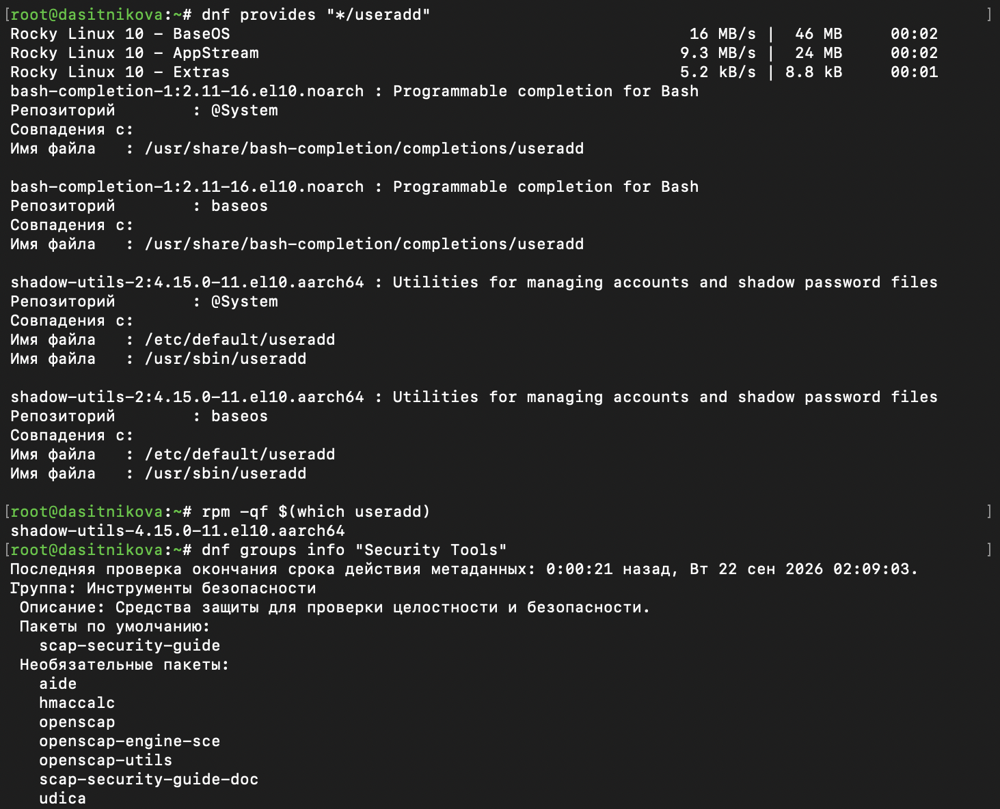{#fig-022 width=85%}

2. **Какие команды вам нужно использовать, чтобы показать имя группы dnf, которая содержит инструменты безопасности и показывает, что находится в этой группе?**

   Имя группы выводит команда `dnf groups list`: группа называется «Инструменты безопасности», а в выводе `LANG=C dnf groups list` --- `Security Tools` ([рис. @fig-007]). Состав группы выводит команда `dnf groups info "Security Tools"`: пакет по умолчанию `scap-security-guide` и необязательные пакеты `aide`, `hmaccalc`, `openscap`, `openscap-engine-sce`, `openscap-utils`, `scap-security-guide-doc` и `udica` ([рис. @fig-022]).

   ~~~bash
   LANG=C dnf groups list
   dnf groups info "Security Tools"
   ~~~

3. **Какая команда позволяет вам установить rpm, который вы загрузили из Интернета и который не находится в репозиториях?**

   Загруженный файл пакета устанавливает команда `dnf install ./файл.rpm`: она проверяет подпись и сама загружает недостающие зависимости из подключённых репозиториев. Можно использовать и `rpm -ivh файл.rpm` или `rpm -Uvh файл.rpm`, как при установке `lynx` в данной работе ([рис. @fig-011]), но тогда все зависимости необходимо установить заранее.

   ~~~bash
   dnf install ./lynx-2.9.0-6.el10.aarch64.rpm
   rpm -Uvh lynx-2.9.0-6.el10.aarch64.rpm
   ~~~

4. **Вы хотите убедиться, что пакет rpm, который вы загрузили, не содержит никакого опасного кода сценария. Какая команда позволяет это сделать?**

   Сценарии файла пакета без его установки выводит команда `rpm -qp --scripts файл.rpm`. На [рис. @fig-023] пакет `dnsmasq` загружен в отдельный каталог командой `dnf install --downloadonly --downloaddir`, а на [рис. @fig-024] его сценарии выведены прямо из файла. Они совпадают со сценариями установленного пакета ([рис. @fig-020]).

   ~~~bash
   dnf install dnsmasq --downloadonly --downloaddir ~/rpms
   rpm -qp --scripts ~/rpms/dnsmasq-*.rpm
   ~~~

   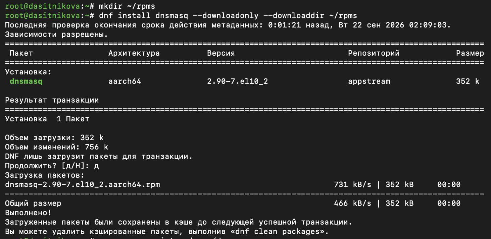{#fig-023 width=85%}

   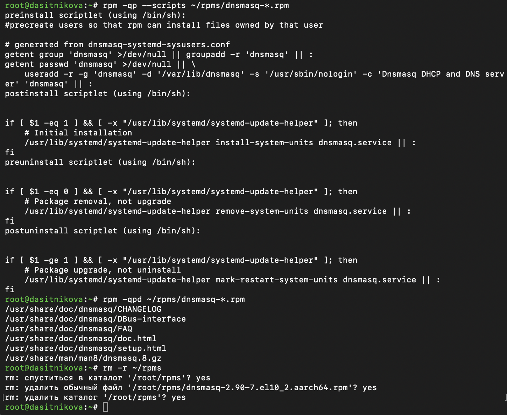{#fig-024 width=85%}

5. **Какая команда показывает всю документацию в rpm?**

   Файлы документации установленного пакета выводит команда `rpm -qd пакет` ([рис. @fig-013], [рис. @fig-019]), а файла пакета --- команда `rpm -qpd файл.rpm` ([рис. @fig-024]).

   ~~~bash
   rpm -qd dnsmasq
   rpm -qpd ~/rpms/dnsmasq-*.rpm
   ~~~

6. **Какая команда показывает, какому пакету rpm принадлежит файл?**

   Пакет, которому принадлежит файл, показывает команда `rpm -qf путь_к_файлу`. В данной работе она определила пакеты для `/usr/bin/lynx` ([рис. @fig-011]), `/usr/sbin/dnsmasq` ([рис. @fig-018]) и `/usr/sbin/useradd` ([рис. @fig-022]).

   ~~~bash
   rpm -qf $(which lynx)
   rpm -qf /usr/sbin/useradd
   ~~~

# Список литературы{.unnumbered}

::: {#refs}
:::
