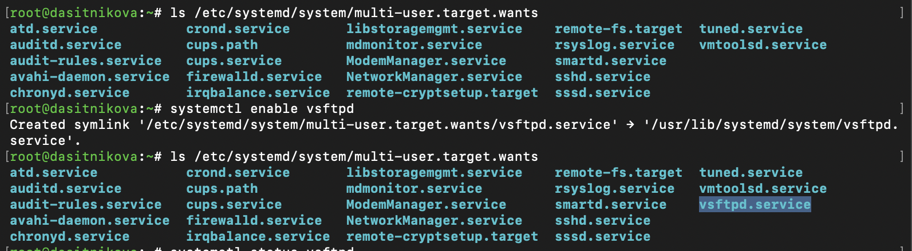
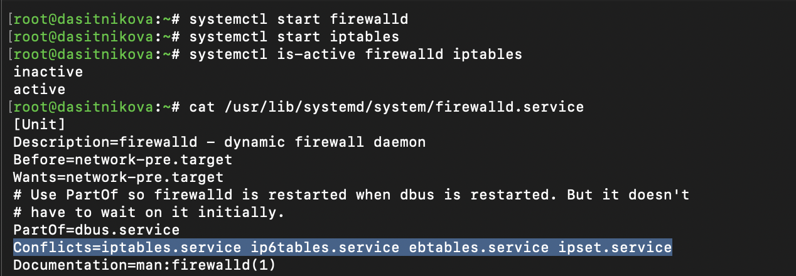
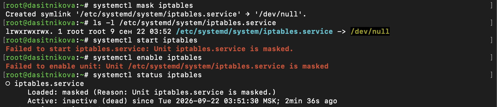
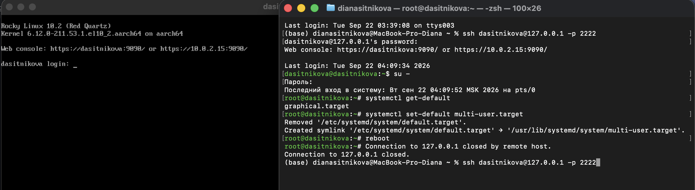

---
## Author
author:
  name: Ситникова Диана Александровна
  degrees: BSc
  email: 1032201746@rudn.ru
  affiliation:
    - name: Российский университет дружбы народов
      country: Российская Федерация
      postal-code: 117198
      city: Москва
      address: ул. Миклухо-Маклая, д. 6
## Title
title: "Лабораторная работа № 5"
subtitle: "Управление системными службами"
institute:
  - "Российский университет дружбы народов им. П. Лумумбы"
  - "Преподаватель: д.ф.-м.н., профессор Кулябов Дмитрий Сергеевич"
license: CC BY
date: today
date-format: "YYYY-MM-DD"
---

# Информация

## Докладчик

:::::::::::::: {.columns align=center}
::: {.column width="68%"}

- Ситникова Диана Александровна
- направление 09.03.03 «Прикладная информатика»
- Российский университет дружбы народов
- [1032201746@rudn.ru](mailto:1032201746@rudn.ru)

:::
::: {.column width="32%"}

{width=100%}

:::
::::::::::::::

# Вводная часть

## Актуальность

- Все службы Linux, от SSH до графического входа, запускает и контролирует systemd.
- Администратор должен управлять не только работой службы, но и её автозапуском, зависимостями и конфликтами с другими службами.
- Цели systemd определяют режим работы всей системы, в том числе режим восстановления после сбоев.

## Объект, предмет, цель и задачи

**Объект** --- системные службы и цели Rocky Linux 10.2.

**Предмет** --- средства управления юнитами systemd.

**Цель** --- получить навыки управления системными службами операционной системы посредством systemd.

**Задачи:** управлять запуском и автозапуском службы; разрешить конфликт двух служб; изолировать цели и изменить цель по умолчанию.

## Материалы и методы

| Компонент | Значение |
|---|---|
| Стенд | Rocky Linux 10.2, systemd 257 |
| Службы | `vsftpd`, `firewalld`, `iptables` |
| Управление службами | `systemctl start`, `enable`, `mask` |
| Анализ юнитов | `status`, `list-dependencies`, файлы юнитов |
| Цели | `isolate`, `get-default`, `set-default` |

# Содержание исследования

## enable управляет автозапуском, а не работой службы

:::::::::::::: {.columns align=center}
::: {.column width="40%"}

`enable` и `disable` меняют строку `Loaded`: `enabled` или `disabled`.

Строка `Active` при этом не меняется: служба работает с 03:32:16.

:::
::: {.column width="60%"}

{width=100%}

:::
::::::::::::::

## Автозапуск --- это ссылка в каталоге цели

:::::::::::::: {.columns align=center}
::: {.column width="40%"}

`WantedBy=multi-user.target` → ссылка в `multi-user.target.wants`.

Обратные зависимости: `vsftpd` ← `multi-user.target` ← `graphical.target`.

:::
::: {.column width="60%"}

{width=100%}

:::
::::::::::::::

## Conflicts не даёт двум экранам работать вместе

:::::::::::::: {.columns align=center}
::: {.column width="40%"}

Запуск `iptables` остановил `firewalld`: `inactive` и `active`.

Конфликт объявлен только в `firewalld.service`, но действует в обе стороны.

:::
::: {.column width="60%"}

{width=100%}

:::
::::::::::::::

## Маска блокирует любой запуск

{width=100%}

- `mask` создаёт в `/etc/systemd/system` ссылку на `/dev/null`.
- Каталог `/etc` приоритетнее `/usr/lib`, поэтому файл юнита перекрыт.
- `start` и `enable` отказывают: `Unit iptables.service is masked`.

## Изолировать можно только цели с AllowIsolate=yes

:::::::::::::: {.columns align=center}
::: {.column width="45%"}

22 цели, каждая описывает законченное состояние системы.

`runlevel0`--`runlevel6` --- псевдонимы целей SysV init.

`isolate` останавливает всё, что не входит в цель.

:::
::: {.column width="55%"}

{width=85%}

:::
::::::::::::::

## rescue.target оставляет только консоль root

{width=90%}

- Графика, сеть и SSH остановлены, на консоли запрошен пароль `root`.
- `systemctl isolate reboot.target` перезагрузил систему.

## Цель по умолчанию --- ссылка default.target

{width=100%}

- `set-default multi-user.target` заменил ссылку `/etc/systemd/system/default.target`.
- После перезагрузки --- текстовый вход, SSH работает: `sshd` входит в `multi-user.target`.
- `set-default graphical.target` вернул графический вход.

# Результаты

## Службы и цели настроены и проверены

- Служба `vsftpd` установлена, запущена и добавлена в автозапуск, изучены её зависимости.
- Показан конфликт `firewalld` и `iptables`, запуск `iptables` заблокирован маской.
- Система переведена в режим восстановления и перезагружена изоляцией цели.
- Проверена загрузка в текстовом и графическом режимах.

## Вывод

Systemd описывает всё через юниты и связи между ними: автозапуск --- это ссылка в каталоге цели, конфликт --- зависимость `Conflicts`, запрет запуска --- ссылка на `/dev/null`.

Режим работы системы задаётся целью: изоляция меняет его сразу, а цель по умолчанию --- при следующей загрузке.
