---
## Author
author:
  name: Ситникова Диана Александровна
  degrees: BSc
  email: 1032201746@rudn.ru
  affiliation:
    - name: Российский университет дружбы народов
      country: Российская Федерация
      postal-code: 117198
      city: Москва
      address: ул. Миклухо-Маклая, д. 6

## Title
title: "Отчёт по лабораторной работе №5"
subtitle: "Управление системными службами"
license: "CC BY"
bibliography: bib/cite.bib
---

# Цель работы

Целью данной работы является получение навыков управления системными службами операционной системы посредством systemd.

# Задание

- Выполнить основные операции по запуску и останову, определению статуса, добавлению в автозапуск и удалению из него службы Very Secure FTP.
- Продемонстрировать навыки по разрешению конфликтов юнитов для служб `firewalld` и `iptables`.
- Продемонстрировать навыки работы с изолированными целями.

# Теоретическое введение

## От SysV init к systemd

После загрузки ядро Linux запускает первый процесс пространства пользователя с идентификатором 1. Этот процесс --- система инициализации --- доводит систему до рабочего состояния, запускает все остальные службы и остаётся работать до выключения; кроме того, он становится родителем процессов, чей родитель завершился.

Долгое время системой инициализации в Linux был SysV init, унаследованный от UNIX System V. Он переводил систему на один из уровней запуска (runlevel), выполняя последовательно сценарии оболочки из каталогов `/etc/rc.d/rcN.d`; порядок задавался числом в имени сценария, а о запущенных процессах init знал только по файлам с их идентификаторами. Такая схема медленна, поскольку службы запускаются строго по одной, и ненадёжна: служба, породившая дочерние процессы, могла «потеряться». В Red Hat Enterprise Linux 6 ей на смену пришёл событийный Upstart, а начиная с RHEL 7 используется systemd [@vanvugt_book_rhcsa_en].

Systemd создан в 2010 году Леннартом Поттерингом и Каем Сиверсом [@pottering_systemd-admins_ru]. Его основные идеи:

- декларативные файлы конфигурации вместо сценариев: администратор описывает, что нужно запустить и от чего это зависит, а порядок действий вычисляет systemd;
- параллельный запуск независимых служб;
- запуск по требованию: служба может стартовать при первом обращении к её сокету, шине D-Bus, файлу или по таймеру;
- учёт процессов через контрольные группы ядра (cgroups): каждая служба получает свою группу, поэтому systemd знает все её процессы, может ограничить им ресурсы и гарантированно остановить их;
- единый журнал `systemd-journald` и единая программа управления `systemctl`.

Запуск по требованию используется и в установленной системе. Веб-консоль Cockpit, адрес которой выводится при входе в систему, представлена юнитом `cockpit.socket`: systemd сам слушает TCP-порт 9090, а служба веб-консоли запускается только при первом подключении к нему. Пока консолью никто не пользуется, её процессы не занимают память.

## Юниты и их типы

Все объекты, которыми управляет systemd, называются юнитами. Юнит описывается файлом конфигурации, а его тип определяется расширением имени файла. Типы юнитов, поддерживаемые установленной версией systemd, выводит команда `systemctl -t help`; их назначение приведено в [табл. @tbl-unit-types].

| Тип | Назначение |
|-----------------|------------------------------------------------------|
| `.service` | служба: запуск, останов и перезапуск процесса |
| `.socket` | сокет, при обращении к которому запускается служба |
| `.target` | цель --- группа юнитов, задающая состояние системы |
| `.mount` | точка монтирования файловой системы |
| `.automount` | монтирование при первом обращении к каталогу |
| `.swap` | раздел или файл подкачки |
| `.device` | устройство, обнаруженное ядром и `udev` |
| `.timer` | запуск юнита по расписанию, аналог `cron` |
| `.path` | запуск юнита при изменении файла или каталога |
| `.slice` | группа процессов для распределения ресурсов |
| `.scope` | группа процессов, запущенных не самим systemd |

: Типы юнитов systemd {#tbl-unit-types}

Юниты типов `.device`, `.mount` и `.scope` systemd может создавать сам, без файла на диске: например, юнит устройства появляется, когда ядро сообщает о новом диске, а юнит точки монтирования --- для каждой строки файла `/etc/fstab`.

## Расположение файлов юнитов и их переопределение

Файлы юнитов хранятся в нескольких каталогах, которые различаются назначением и приоритетом ([табл. @tbl-unit-dirs]). Если файлы с одинаковым именем есть в нескольких каталогах, используется файл из каталога с наибольшим приоритетом. Благодаря этому администратор может переопределить юнит из пакета, не изменяя сам пакет, а обновление пакета не затрагивает настройки администратора. Кроме системных, существуют пользовательские юниты в каталоге `~/.config/systemd/user`, которыми управляет отдельный экземпляр systemd для каждого пользователя (`systemctl --user`).

| Каталог | Содержимое | Приоритет |
|------------------------------|----------------------------------|-----------|
| `/etc/systemd/system` | юниты и ссылки, созданные администратором | высший |
| `/run/systemd/system` | юниты, созданные во время работы системы | средний |
| `/usr/lib/systemd/system` | юниты, установленные из пакетов | низший |

: Каталоги файлов юнитов {#tbl-unit-dirs}

Заменять файл юнита целиком требуется редко. Обычно отдельные параметры переопределяются дополнительными файлами в каталоге `/etc/systemd/system/имя_юнита.d/`, которые systemd накладывает поверх основного файла. Такой файл создаёт команда `systemctl edit юнит`, а итоговую конфигурацию юнита вместе со всеми дополнениями выводит `systemctl cat юнит`. После ручного изменения файлов юнитов systemd нужно перечитать конфигурацию командой `systemctl daemon-reload` [@archwiki_systemd].

## Структура файла юнита

Файл юнита состоит из разделов, заголовки которых записаны в квадратных скобках, а параметры заданы в виде `имя=значение` [@systemd_man]. Раздел `[Unit]` содержит описание и зависимости и есть у юнита любого типа. Второй раздел определяется типом юнита, например `[Service]` для служб или `[Mount]` для точек монтирования. Раздел `[Install]` используется только при добавлении юнита в автозапуск. Основные параметры приведены в [табл. @tbl-unit-options].

| Параметр | Раздел | Назначение |
|----------------|----------|----------------------------------------------|
| `Description` | `[Unit]` | краткое описание юнита |
| `Requires` | `[Unit]` | обязательная зависимость: при её сбое юнит не запускается |
| `Wants` | `[Unit]` | желательная зависимость: запускается вместе с юнитом, но её сбой не мешает ему |
| `PartOf` | `[Unit]` | останов и перезапуск указанного юнита распространяются на данный |
| `After`, `Before` | `[Unit]` | порядок запуска относительно других юнитов |
| `Conflicts` | `[Unit]` | юниты, которые не могут работать одновременно с данным |
| `AllowIsolate` | `[Unit]` | разрешает изолировать юнит командой `systemctl isolate` |
| `Type` | `[Service]` | способ запуска службы |
| `ExecStart` | `[Service]` | команда запуска службы |
| `Restart` | `[Service]` | условия автоматического перезапуска: `no`, `on-failure`, `always` и др. |
| `WantedBy` | `[Install]` | цель, в каталоге `.wants` которой создаётся ссылка при `enable` |

: Основные параметры файла юнита {#tbl-unit-options}

Зависимости `Requires` и `Wants` определяют, какие юниты запускаются вместе, а `After` и `Before` --- в каком порядке. Эти два вида зависимостей независимы: если не задан порядок, связанные юниты запускаются одновременно. Большинство юнитов также получают зависимости по умолчанию: например, каждая служба требует цель `sysinit.target`, запускается после `basic.target` и помещается в контрольную группу `system.slice`.

Параметр `Type` определяет, в какой момент systemd считает службу запущенной и может запускать зависящие от неё юниты ([табл. @tbl-service-types]).

| Тип | Служба считается запущенной | Пример |
|------------|----------------------------------------------|--------------|
| `simple` | сразу после создания процесса; тип по умолчанию | `firewalld` |
| `exec` | после успешного запуска исполняемого файла | --- |
| `forking` | после завершения родительского процесса, создавшего демона | `vsftpd` |
| `oneshot` | после завершения команды; с `RemainAfterExit=yes` остаётся активной | `iptables` |
| `notify` | после сообщения самой службы о готовности | `sshd` |
| `dbus` | после регистрации службы на шине D-Bus | --- |
| `idle` | как `simple`, но после завершения остальных заданий загрузки | --- |

: Типы запуска служб {#tbl-service-types}

В разделе `[Service]` также задаются параметры изоляции службы от остальной системы. Например, `ProtectSystem=yes` делает каталоги `/usr` и `/boot` доступными службе только для чтения, `PrivateDevices=yes` скрывает от неё физические устройства, а `ProtectHome` ограничивает доступ к домашним каталогам. Эти ограничения реализуются пространствами имён ядра и защищают систему, если в службе будет найдена уязвимость.

## Транзакции и задания

Команда `systemctl start` не запускает юнит напрямую. Systemd строит транзакцию: добавляет задание на запуск самого юнита и всех его зависимостей `Requires` и `Wants`, упорядочивает задания по `After` и `Before` и добавляет задания на останов всех юнитов, перечисленных в `Conflicts`. Если транзакция внутренне противоречива, например требует одновременно запустить и остановить один и тот же юнит, systemd отклоняет её целиком. Выполняющиеся задания выводит команда `systemctl list-jobs`.

Именно так разрешаются конфликты служб: запуск одной из конфликтующих служб автоматически включает в ту же транзакцию останов другой. Конфликт при этом действует в обе стороны, даже если он объявлен только в одном из двух файлов.

## Состояние юнита и автозапуск

Команда `systemctl status` выводит состояние юнита в двух строках. Строка `Loaded` показывает, найден ли файл юнита и включён ли он в автозапуск: `enabled` --- включён, `disabled` --- выключен, `static` --- в файле нет раздела `[Install]`, и юнит запускается только как зависимость других юнитов, `masked` --- юнит замаскирован. Строка `Active` показывает текущее состояние: `active (running)` --- служба работает, `active (exited)` --- команда выполнена и служба считается активной, `inactive (dead)` --- служба остановлена, `failed` --- служба завершилась с ошибкой.

Эти две характеристики независимы. Команды `start` и `stop` меняют только текущее состояние, а `enable` и `disable` --- только поведение при следующей загрузке; команда `systemctl enable --now` выполняет оба действия сразу. Команда `systemctl enable` читает раздел `[Install]` и создаёт символическую ссылку на файл юнита в каталоге `/etc/systemd/system/цель.wants`, где цель задана параметром `WantedBy`. Так цель получает желательную зависимость от службы, и при загрузке служба запускается вместе с целью. Команда `systemctl disable` удаляет эту ссылку.

Значение `preset` в строке `Loaded` показывает состояние, которое рекомендует для юнита дистрибутив. Рекомендации записаны в файлах каталога `/usr/lib/systemd/system-preset`. В Rocky Linux 10 файл `90-default.preset` перечисляет службы, включаемые при установке, среди них `sshd.service`, `firewalld.service` и `cockpit.socket`, а последний по порядку файл `99-default-disable.preset` содержит правило `disable *`: все остальные службы по умолчанию выключены. Поэтому сетевая служба, установленная из пакета, не запускается при загрузке, пока администратор явно её не включит. Вернуть юниту рекомендованное состояние можно командой `systemctl preset`.

Команда `systemctl mask` создаёт в каталоге `/etc/systemd/system` ссылку с именем юнита, указывающую на `/dev/null`. Из-за наивысшего приоритета этого каталога systemd находит вместо файла юнита пустое устройство и отказывается запускать юнит любым способом: вручную, при загрузке или как зависимость других юнитов. Команда `systemctl unmask` удаляет ссылку.

## Цели и изоляция

Цель --- это юнит, который не запускает процессов, а объединяет другие юниты и тем самым задаёт состояние системы. Цели, соответствующие уровням запуска SysV init, приведены в [табл. @tbl-targets] [@neil_book_learning-centos_en]. Для совместимости в systemd есть юниты `runlevel0.target`--`runlevel6.target`, которые являются псевдонимами этих целей.

| Цель | Уровень запуска | Состояние системы |
|----------------------|--------------|--------------------------------------|
| `poweroff.target` | 0 | выключение |
| `rescue.target` | 1 | режим восстановления: базовые службы и консоль `root` |
| `multi-user.target` | 3 | многопользовательский режим без графики |
| `graphical.target` | 5 | многопользовательский режим с графическим входом |
| `reboot.target` | 6 | перезагрузка |

: Цели systemd и уровни запуска SysV init {#tbl-targets}

Цели образуют иерархию: `graphical.target` требует `multi-user.target`, та --- `basic.target`, а та --- `sysinit.target`, отвечающую за монтирование файловых систем и начальную настройку. Поэтому в графическом режиме работают и все службы текстового режима.

Для восстановления системы предназначены две цели. `rescue.target` поднимает `sysinit.target` --- локальные файловые системы смонтированы, основные системные службы работают --- и запрашивает пароль `root` на консоли. `emergency.target` запускает только командную оболочку `root`, не поднимая даже `sysinit.target`; её используют, когда систему не удаётся довести даже до режима восстановления, например из-за ошибки в `/etc/fstab`. Обе цели можно выбрать при загрузке, добавив к параметрам ядра `systemd.unit=rescue.target` или `systemd.unit=emergency.target`.

Команда `systemctl isolate цель` запускает указанную цель со всеми её зависимостями и останавливает все юниты, которые в неё не входят. Изолировать можно только юнит, в файле которого задан параметр `AllowIsolate=yes`: иначе переход в состояние, в котором не хватает нужных юнитов, мог бы остановить важные службы. Цель, в которую systemd переводит систему при загрузке, задаётся ссылкой `/etc/systemd/system/default.target`; её выводит команда `systemctl get-default`, а изменяет --- `systemctl set-default`.

## Подсистема netfilter

Фильтрацию сетевых пакетов в Linux выполняет ядро, а точнее его подсистема netfilter, созданная в 1998 году Расти Расселом и включённая в ядро 2.4 [@netfilter_docs]. До неё эту задачу решали механизмы ipfwadm в ядре 2.0 и ipchains в ядре 2.2. Программы в пространстве пользователя --- `iptables`, `nft`, `firewalld` --- только загружают в ядро правила, а проверяет по ним каждый пакет само ядро.

Netfilter встраивает в сетевой стек ядра пять точек перехвата --- хуков ([табл. @tbl-hooks]). Входящий пакет проходит хук PREROUTING, после чего ядро решает, адресован ли он самой системе (хук INPUT) или его нужно переслать дальше (хук FORWARD). Пакеты, созданные локальными процессами, проходят хук OUTPUT, и все исходящие пакеты --- хук POSTROUTING.

| Хук | Какие пакеты проходят |
|------------------|------------------------------------------------------|
| `PREROUTING` | все входящие пакеты до принятия решения о маршрутизации |
| `INPUT` | пакеты, адресованные самой системе |
| `FORWARD` | пакеты, которые система пересылает в другую сеть |
| `OUTPUT` | пакеты, созданные локальными процессами |
| `POSTROUTING` | все исходящие пакеты после маршрутизации |

: Хуки подсистемы netfilter {#tbl-hooks}

Важная часть netfilter --- отслеживание соединений (conntrack). Ядро запоминает каждое соединение и относит пакет к одному из состояний: `NEW` --- первый пакет нового соединения, `ESTABLISHED` --- пакет уже установленного соединения, `RELATED` --- пакет нового соединения, связанного с существующим, `INVALID` --- пакет, не относящийся ни к одному соединению. Это позволяет писать короткие правила вида «разрешить ответы на уже разрешённые соединения». Для протоколов, открывающих дополнительные соединения, есть модули-помощники: например, помощник `ftp` разбирает команды FTP и помечает соединение для передачи данных как `RELATED`.

## iptables

Утилита `iptables` задаёт правила netfilter в виде таблиц, содержащих цепочки правил ([табл. @tbl-iptables]). Встроенные цепочки названы по хукам, к которым они привязаны; администратор может создавать и собственные цепочки. Правила цепочки проверяются по порядку: первое правило, условиям которого удовлетворяет пакет, определяет действие --- `ACCEPT` (пропустить), `DROP` (молча отбросить), `REJECT` (отбросить и сообщить отправителю), `LOG` (записать в журнал и продолжить) или переход в другую цепочку. Если ни одно правило не подошло, применяется политика цепочки [@nemeth_book_unix-linux-admin_ru].

| Таблица | Назначение | Встроенные цепочки |
|-----------|------------------------------------|--------------------------------|
| `filter` | фильтрация: пропустить или отбросить пакет | INPUT, FORWARD, OUTPUT |
| `nat` | трансляция адресов и портов | PREROUTING, INPUT, OUTPUT, POSTROUTING |
| `mangle` | изменение заголовков и меток пакетов | все пять |
| `raw` | исключение пакетов из отслеживания соединений | PREROUTING, OUTPUT |
| `security` | назначение пакетам меток SELinux | INPUT, FORWARD, OUTPUT |

: Таблицы iptables {#tbl-iptables}

Правила, заданные командой `iptables`, действуют до перезагрузки. Для их сохранения служит служба `iptables` из пакета `iptables-nft-services`: при запуске она загружает правила из файла `/etc/sysconfig/iptables` командой `iptables-restore`, а при останове устанавливает всем цепочкам политику `ACCEPT` и удаляет все правила. Для IPv6 используются отдельная утилита `ip6tables` и служба `ip6tables` с файлом `/etc/sysconfig/ip6tables`. Файл правил, установленный пакетом по умолчанию, приведён ниже.

~~~
*filter
:INPUT ACCEPT [0:0]
:FORWARD ACCEPT [0:0]
:OUTPUT ACCEPT [0:0]
-A INPUT -m state --state RELATED,ESTABLISHED -j ACCEPT
-A INPUT -p icmp -j ACCEPT
-A INPUT -i lo -j ACCEPT
-A INPUT -p tcp -m state --state NEW -m tcp --dport 22 -j ACCEPT
-A INPUT -j REJECT --reject-with icmp-host-prohibited
-A FORWARD -j REJECT --reject-with icmp-host-prohibited
COMMIT
~~~

Строка `*filter` открывает описание таблицы `filter`, строки с двоеточием задают политики цепочек, а строки `-A` добавляют правила. Входящие пакеты пропускаются, если они относятся к уже разрешённым соединениям, являются пакетами ICMP, пришли с локального интерфейса `lo` или открывают новое соединение с портом 22 (SSH). Все остальные входящие и пересылаемые пакеты отклоняются с сообщением «узел запрещён». Строка `COMMIT` применяет таблицу целиком.

В Rocky Linux 10 программа `iptables` предоставляется пакетом `iptables-nft`: она сохраняет привычный синтаксис, но не обращается к старому интерфейсу ядра, а преобразует правила в правила nftables.

## nftables

Nftables --- преемник iptables, включённый в ядро 3.13 в 2014 году [@nftables_wiki]. Вместо отдельных утилит `iptables`, `ip6tables`, `arptables` и `ebtables` используется одна утилита `nft`, а правила для IPv4 и IPv6 можно описать вместе в таблице семейства `inet`. Готовых таблиц и цепочек в nftables нет: администратор создаёт их сам и указывает для каждой базовой цепочки хук и приоритет. Поддерживаются множества и словари, позволяющие одним правилом проверить сотни адресов или портов, а весь набор правил заменяется атомарно, без момента, когда часть правил уже удалена, а новые ещё не загружены.

К одному хуку могут быть привязаны базовые цепочки из разных таблиц, и пакет проходит их по порядку приоритета. Действие `ACCEPT` завершает проверку только в текущей цепочке, а `DROP` окончателен. Поэтому пакет пропускается лишь тогда, когда его пропускают все таблицы, привязанные к хуку.

## firewalld

Firewalld --- служба управления межсетевым экраном, разработанная Red Hat и используемая по умолчанию начиная с RHEL 7 [@firewalld_docs]. В отличие от службы `iptables`, она управляет правилами динамически: изменения применяются без перезагрузки всего набора правил и без разрыва установленных соединений. Управляют firewalld через системную шину D-Bus --- отсюда псевдоним `dbus-org.fedoraproject.FirewallD1.service` в файле его юнита --- с помощью утилиты `firewall-cmd`, графической программы `firewall-config` или веб-консоли Cockpit.

Основное понятие firewalld --- зона: набор правил, определяющий уровень доверия к сети. Каждый сетевой интерфейс относится к одной зоне, а интерфейсы, не отнесённые явно, --- к зоне по умолчанию. Зоны Rocky Linux 10 приведены в [табл. @tbl-zones].

| Зона | Входящие соединения |
|------------|----------------------------------------------------------|
| `drop` | отбрасываются без ответа; разрешены только ответы на исходящие |
| `block` | отклоняются с сообщением ICMP; разрешены только ответы на исходящие |
| `public` | разрешены `ssh`, `dhcpv6-client`, `cockpit`; зона по умолчанию |
| `external` | разрешён `ssh`; включена маскировка адресов (NAT) для маршрутизатора |
| `dmz` | разрешён `ssh`; для общедоступных узлов с ограниченным доступом внутрь |
| `work` | разрешены `ssh`, `dhcpv6-client`, `cockpit` |
| `home` | разрешены `ssh`, `dhcpv6-client`, `cockpit`, `mdns`, `samba-client` |
| `internal` | то же, что в зоне `home` |
| `trusted` | разрешены все соединения |

: Зоны firewalld {#tbl-zones}

Разрешения в зонах задаются через службы firewalld --- XML-описания портов и помощников netfilter. В каталоге `/usr/lib/firewalld/services` их более двухсот пятидесяти: например, служба `ssh` открывает порт TCP 22, а служба `ftp` --- порт TCP 21 и подключает помощник `ftp`. Поскольку в зоне `public` служба `ftp` не разрешена, установленный в данной работе сервер `vsftpd` недоступен извне, пока администратор не выполнит команду `firewall-cmd --add-service=ftp`.

Конфигурация firewalld существует в двух видах. Текущая конфигурация действует до перезапуска службы, постоянная хранится в файлах каталога `/etc/firewalld` и загружается при запуске. Команда без ключа `--permanent` изменяет только текущую конфигурацию, с ключом --- только постоянную, а команда `firewall-cmd --reload` загружает постоянную конфигурацию в текущую.

~~~bash
firewall-cmd --get-default-zone
firewall-cmd --list-all
firewall-cmd --add-service=ftp
firewall-cmd --permanent --add-service=ftp
firewall-cmd --reload
~~~

Общие параметры службы задаются в файле `/etc/firewalld/firewalld.conf`. В Rocky Linux 10 в нём указаны зона по умолчанию `DefaultZone=public` и механизм `FirewallBackend=nftables`: firewalld записывает правила непосредственно в собственную таблицу nftables `inet firewalld`. Параметр `NftablesTableOwner=yes` делает firewalld владельцем этой таблицы, так что другие программы не могут её изменить, а при завершении службы таблица удаляется.

## Причина конфликта firewalld и iptables

Сравнение двух способов управления межсетевым экраном приведено в [табл. @tbl-fw-compare].

| Характеристика | Служба `iptables` | `firewalld` |
|--------------------|------------------------------|------------------------------|
| Описание правил | статический файл `/etc/sysconfig/iptables` | зоны и службы |
| Применение изменений | перезагрузка всего набора правил | динамически, без разрыва соединений |
| IPv4 и IPv6 | отдельные службы `iptables` и `ip6tables` | общие правила |
| Интерфейс управления | утилиты `iptables`, `iptables-save`, `iptables-restore` | `firewall-cmd`, D-Bus, Cockpit |
| Механизм ядра | nftables через совместимость с iptables | nftables напрямую |

: Сравнение службы iptables и firewalld {#tbl-fw-compare}

Обе службы управляют одним и тем же фильтром пакетов ядра, но ничего не знают друг о друге. Когда обе использовали один интерфейс iptables, каждая при запуске и перезагрузке правил перезаписывала таблицы другой. При механизме nftables их правила лежат в разных таблицах, но привязаны к одним и тем же хукам. Поэтому пакет пропускается, только если его пропускают правила обеих служб, а останов службы `iptables` сбрасывает её правила и оставляет систему с неполной защитой. Итоговое поведение межсетевого экрана зависело бы от того, какая служба и когда последней изменила правила, а у администратора не было бы единого места, где описана политика доступа. Поэтому в файле `firewalld.service` объявлен конфликт со всеми службами, которые управляют фильтром пакетов напрямую: `iptables`, `ip6tables`, `ebtables` и `ipset`.

# Выполнение лабораторной работы

Работа выполнена в виртуальной машине с Rocky Linux 10.2 от имени суперпользователя: в терминале, подключённом к гостевой системе по SSH, выполнен вход командой `su -`. Режим восстановления и загрузка системы в текстовом режиме наблюдались в окне виртуальной машины, поскольку при переходе в эти состояния подключение по SSH разрывается.

## Управление службой Very Secure FTP

Выведен список типов юнитов, после чего проверен статус службы Very Secure FTP, и служба установлена ([рис. @fig-001]).

~~~bash
su -
systemctl -t help
systemctl status vsftpd
dnf -y install vsftpd
~~~

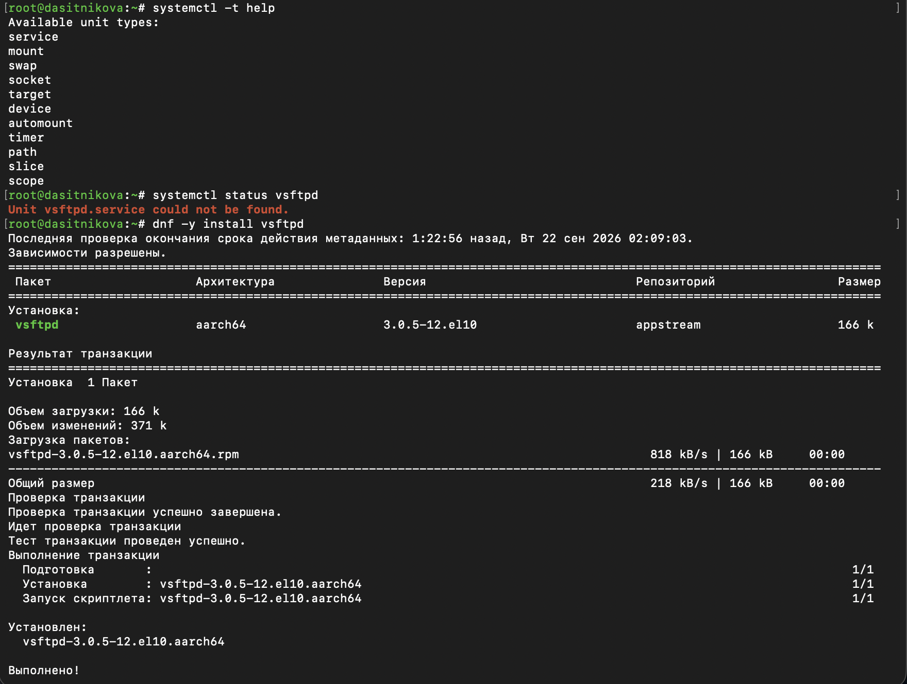{#fig-001 width=85%}

Установленная версия systemd поддерживает одиннадцать типов юнитов. До установки пакета `systemctl status` сообщает, что юнит `vsftpd.service` не найден: файла юнита в системе ещё нет. Пакет `vsftpd` версии `3.0.5-12.el10` установлен из репозитория `appstream`, и при установке выполнен его сценарий.

Служба запущена, и выведен её статус ([рис. @fig-002]).

~~~bash
systemctl start vsftpd
systemctl status vsftpd
~~~

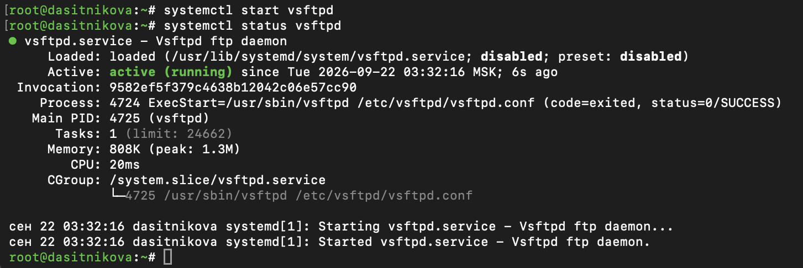{#fig-002 width=85%}

Строка `Loaded` показывает, что файл юнита `vsftpd.service` загружен из каталога `/usr/lib/systemd/system`, а служба не включена в автозапуск: `disabled`. Такое же значение рекомендует дистрибутив (`preset: disabled`): сетевые службы после установки пакета не запускаются при загрузке автоматически. Строка `Active` показывает, что служба работает: `active (running)`.

В выводе видно, как работает запуск типа `forking`. Процесс 4724, выполнивший команду `ExecStart`, завершился с кодом 0, а главным процессом службы стал созданный им дочерний процесс 4725. Он помещён в контрольную группу `/system.slice/vsftpd.service`. Внизу приведены записи журнала о запуске службы.

Служба добавлена в автозапуск и удалена из него; после каждого действия выведен её статус ([рис. @fig-003]).

~~~bash
systemctl enable vsftpd
systemctl status vsftpd
systemctl disable vsftpd
systemctl status vsftpd
~~~

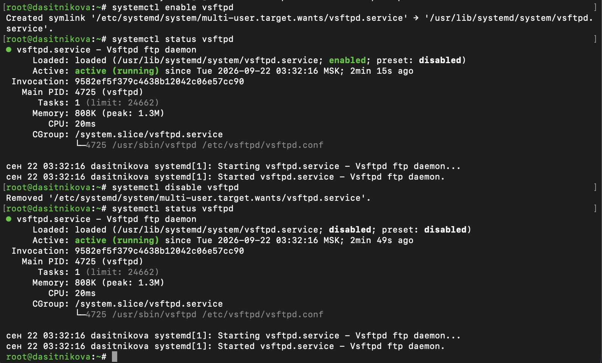{#fig-003 width=85%}

Команда `enable` создала символическую ссылку `/etc/systemd/system/multi-user.target.wants/vsftpd.service` на файл юнита, и состояние в строке `Loaded` изменилось на `enabled`. Команда `disable` удалила эту ссылку, и состояние вернулось к `disabled`. При этом служба всё время продолжала работать: время запуска в строке `Active` осталось прежним, 03:32:16. Добавление в автозапуск и удаление из него определяют поведение при следующей загрузке и не влияют на текущее состояние службы.

Выведено содержимое каталога ссылок цели `multi-user.target`, служба снова добавлена в автозапуск, после чего каталог и статус службы выведены повторно ([рис. @fig-004]).

~~~bash
ls /etc/systemd/system/multi-user.target.wants
systemctl enable vsftpd
ls /etc/systemd/system/multi-user.target.wants
systemctl status vsftpd
~~~

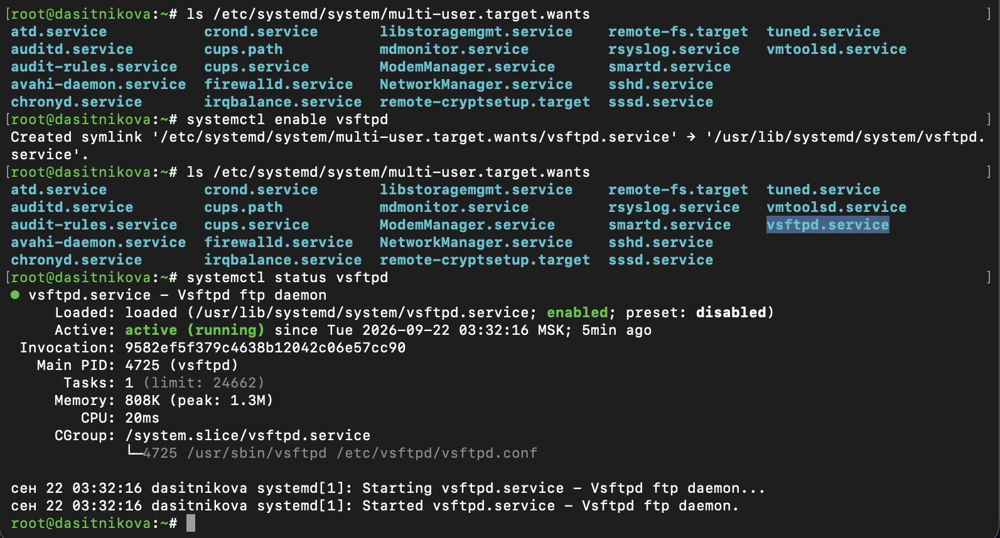{#fig-004 width=85%}

Каталог содержит ссылки на юниты, которые запускаются при загрузке системы вместе с целью `multi-user.target`. Среди них --- службы `sshd`, `firewalld`, `NetworkManager`, `chronyd`, `crond`, а также юнит другого типа `cups.path` и цели `remote-fs.target` и `remote-cryptsetup.target`. До повторного выполнения `enable` ссылки `vsftpd.service` в каталоге нет, после --- она появляется, а состояние службы снова `enabled`.

Выведены зависимости службы и юниты, которые зависят от неё ([рис. @fig-005]).

~~~bash
systemctl list-dependencies vsftpd
systemctl list-dependencies vsftpd --reverse
~~~

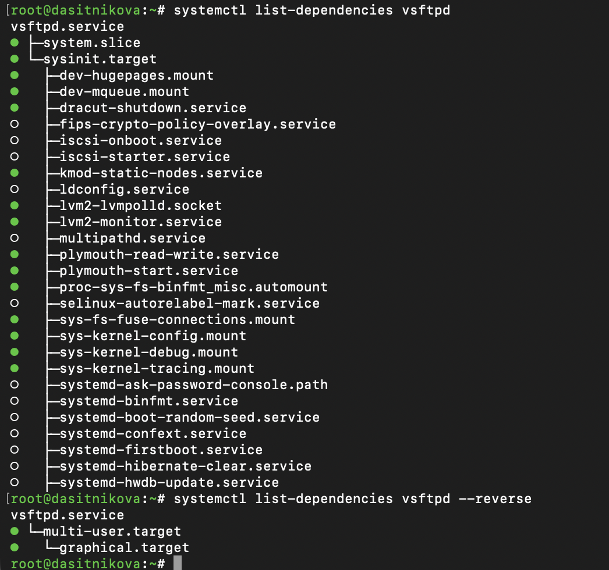{#fig-005 width=85%}

В файле юнита `vsftpd.service` не задано ни одной зависимости, кроме порядка запуска `After=network-online.target`. Все зависимости в дереве --- зависимости по умолчанию: служба помещается в `system.slice` и требует цель `sysinit.target`, а та, в свою очередь, объединяет юниты начальной инициализации системы: точки монтирования `/dev/hugepages` и `/dev/mqueue`, сокет `lvm2-lvmpolld.socket`, службы `kmod-static-nodes` и `systemd-binfmt` и другие. Закрашенный кружок обозначает активный юнит, незакрашенный --- неактивный.

Обратное дерево короткое: службу запрашивает цель `multi-user.target` --- через ссылку, созданную командой `enable`, --- а её требует цель `graphical.target`. Таким образом, при загрузке в графическом режиме служба `vsftpd` будет запущена через `multi-user.target`.

## Конфликты юнитов

Установлены все пакеты, имена которых начинаются с `iptables` ([рис. @fig-006]).

~~~bash
dnf -y install iptables\*
~~~

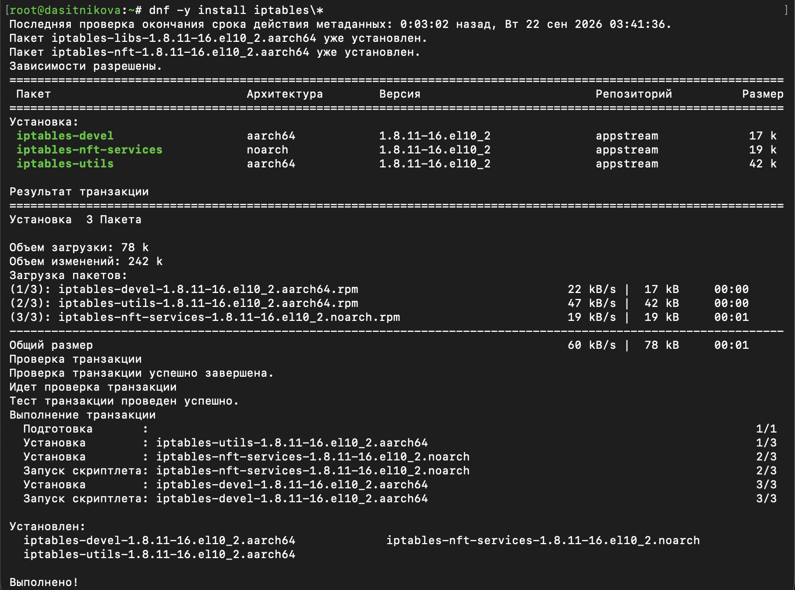{#fig-006 width=85%}

Пакеты `iptables-libs` и `iptables-nft` уже были установлены: это библиотеки и программа `iptables`, которая в Rocky Linux 10 преобразует правила в формат nftables. Дополнительно установлены пакеты `iptables-nft-services` со службой `iptables`, `iptables-utils` и `iptables-devel`.

Запущены обе службы межсетевого экрана и выведено их текущее состояние, после чего просмотрен файл юнита `firewalld.service` ([рис. @fig-007]).

~~~bash
systemctl start firewalld
systemctl start iptables
systemctl is-active firewalld iptables
cat /usr/lib/systemd/system/firewalld.service
~~~

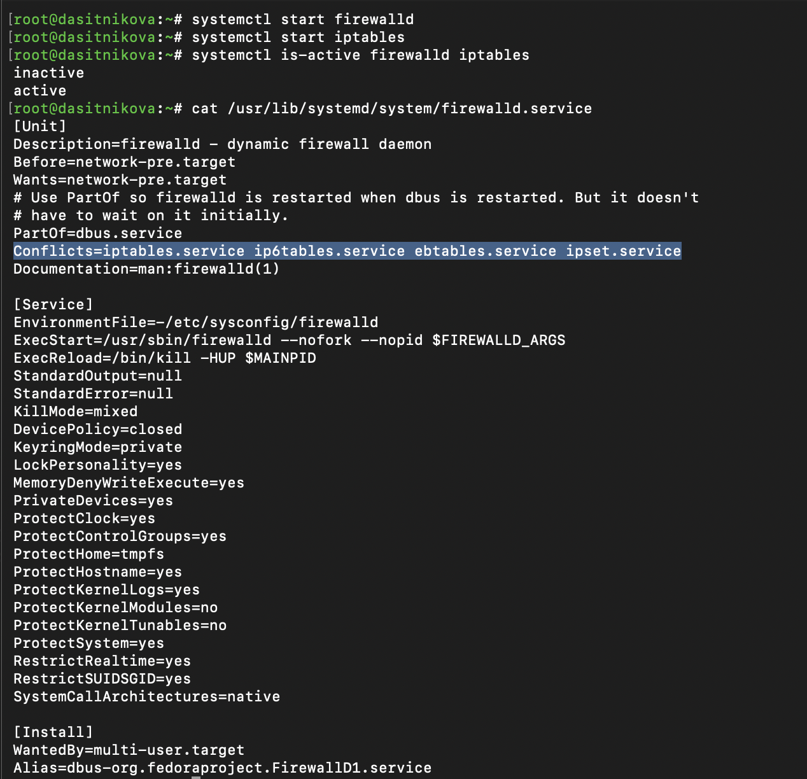{#fig-007 width=85%}

После запуска `iptables` служба `firewalld` перешла в состояние `inactive`, а `iptables` --- в состояние `active`: команда `systemctl start iptables` построила транзакцию, в которую systemd включил задание на останов `firewalld`. Причина --- строка `Conflicts=iptables.service ip6tables.service ebtables.service ipset.service` в разделе `[Unit]` файла `firewalld.service`: она объявляет конфликт с четырьмя службами, которые управляют правилами netfilter напрямую.

Остальные параметры файла описывают саму службу. `Before=network-pre.target` запускает межсетевой экран до настройки сети, чтобы сеть никогда не работала без защиты. `PartOf=dbus.service` перезапускает `firewalld` вместе с системной шиной D-Bus, через которую им управляют клиенты. Параметры `Protect…`, `Private…` и `Restrict…` ограничивают службе доступ к системе. Раздел `[Install]` добавляет службу в `multi-user.target` и задаёт ей псевдоним `dbus-org.fedoraproject.FirewallD1.service` для активации через D-Bus.

Просмотрен файл юнита `iptables.service`, после чего служба `iptables` остановлена, `firewalld` снова запущен, и выведено состояние обеих служб ([рис. @fig-008]).

~~~bash
cat /usr/lib/systemd/system/iptables.service
systemctl stop iptables
systemctl start firewalld
systemctl is-active firewalld iptables
~~~

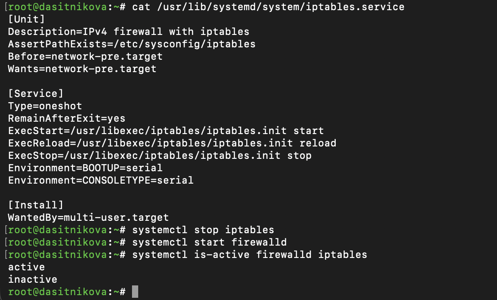{#fig-008 width=85%}

В файле `iptables.service` строки `Conflicts` нет, и тем не менее запуск `iptables` остановил `firewalld`. Дело в том, что зависимость `Conflicts` действует в обе стороны: если юнит A конфликтует с юнитом B, то запуск A останавливает B, а запуск B останавливает A. Поэтому достаточно объявить конфликт в одном из двух файлов. Строка `AssertPathExists=/etc/sysconfig/iptables` не даёт запустить службу без файла правил, а сочетание `Type=oneshot` и `RemainAfterExit=yes` означает, что сценарий `iptables.init` загружает правила и завершается, а служба остаётся активной. После останова `iptables` и запуска `firewalld` состояния поменялись: `active` и `inactive`.

Запуск службы `iptables` заблокирован маскированием, после чего проверено, что служба не запускается и не добавляется в автозапуск ([рис. @fig-009]).

~~~bash
systemctl mask iptables
ls -l /etc/systemd/system/iptables.service
systemctl start iptables
systemctl enable iptables
systemctl status iptables
~~~

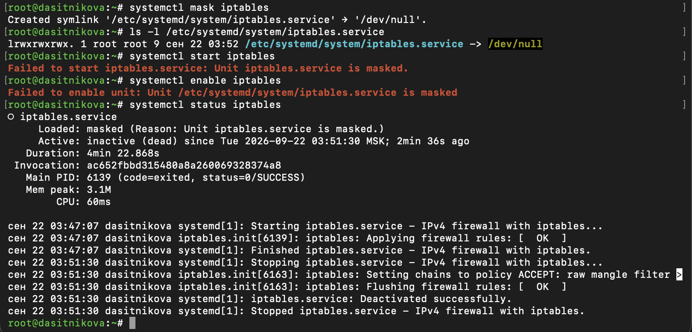{#fig-009 width=85%}

Команда `mask` создала в каталоге `/etc/systemd/system` символическую ссылку `iptables.service`, указывающую на `/dev/null`, что подтверждает вывод `ls -l`. Ссылка лежит в каталоге с наивысшим приоритетом и перекрывает файл юнита из `/usr/lib/systemd/system`. Попытки запустить службу и добавить её в автозапуск завершились сообщениями о том, что юнит замаскирован, а строка `Loaded` показывает состояние `masked`.

Журнал в выводе `status` сохранил историю службы: в 03:47:07 она загрузила правила из файла, а в 03:51:30 при останове перевела цепочки в режим `ACCEPT` и сбросила правила. Именно такое поведение делает одновременную работу с `firewalld` недопустимой: останов `iptables` удалил бы и правила, загруженные `firewalld`.

## Изолируемые цели

Выведены список активных целей ([рис. @fig-010]) и список всех загруженных целей, включая неактивные ([рис. @fig-011]).

~~~bash
systemctl --type=target
systemctl --type=target --all
~~~

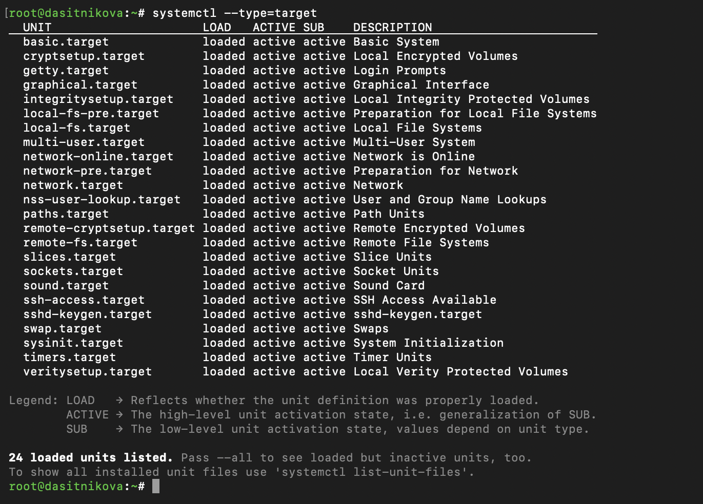{#fig-010 width=80%}

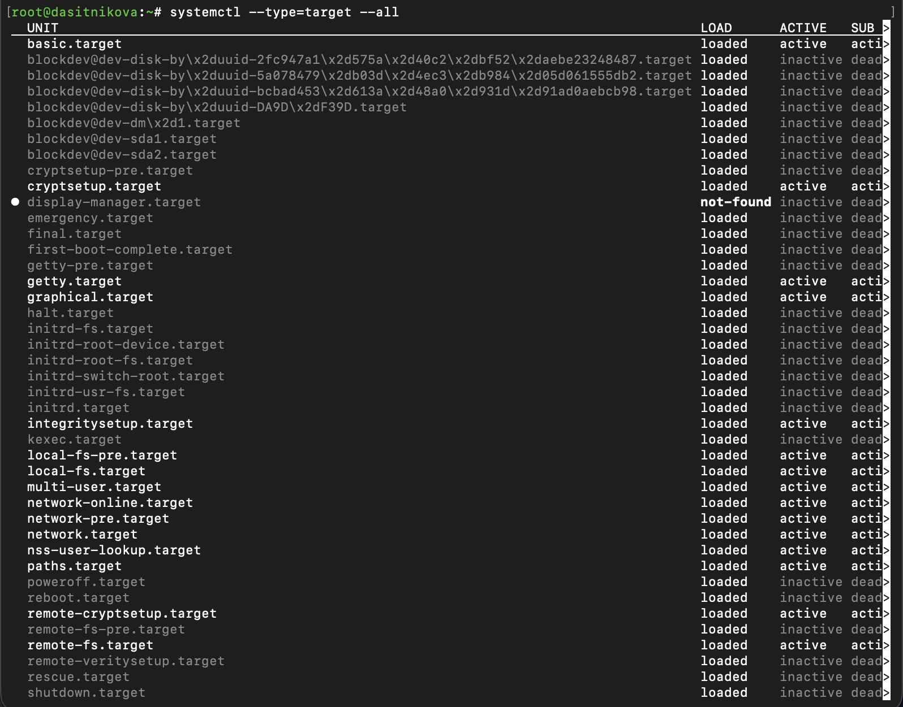{#fig-011 width=85%}

Система работает в графическом режиме, и активны 24 цели, в том числе `graphical.target`, `multi-user.target`, `basic.target`, `sysinit.target`, сетевые цели и цели точек монтирования. Столбец `LOAD` показывает, загружен ли файл юнита, `ACTIVE` и `SUB` --- его состояние. С ключом `--all` в списке появляются неактивные цели: `rescue.target`, `emergency.target`, `poweroff.target`, `reboot.target`, цели начальной загрузки `initrd` и цели блочных устройств `blockdev@…`. Цель `display-manager.target` отмечена как `not-found`: на неё ссылаются другие юниты, но файла юнита с таким именем в системе нет.

В каталоге юнитов из пакетов найдены цели, которые разрешено изолировать ([рис. @fig-012]).

~~~bash
cd /usr/lib/systemd/system
grep Isolate *.target
~~~

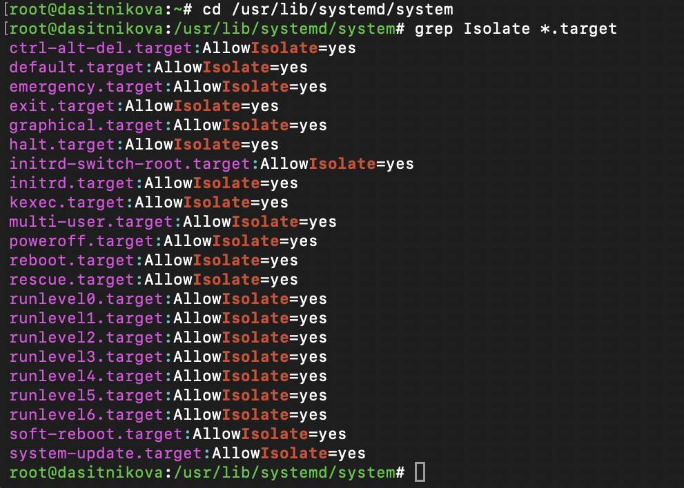{#fig-012 width=70%}

Параметр `AllowIsolate=yes` задан у 22 целей. Это цели, каждая из которых описывает законченное состояние системы: `rescue.target`, `multi-user.target`, `graphical.target`, цели выключения и перезагрузки `poweroff.target`, `halt.target`, `reboot.target`, `kexec.target`, `soft-reboot.target`, аварийный режим `emergency.target`, цели начальной загрузки `initrd.target` и `initrd-switch-root.target`, а также псевдонимы `runlevel0.target`--`runlevel6.target` и `default.target`.

В окне виртуальной машины система переведена в режим восстановления, после чего перезагружена ([рис. @fig-013]).

~~~bash
systemctl isolate rescue.target
systemctl isolate reboot.target
~~~

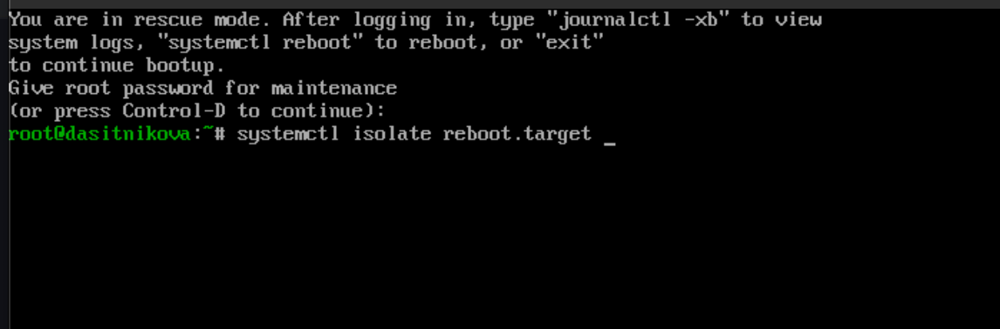{#fig-013 width=80%}

При изоляции цели `rescue.target` systemd остановил графическую среду, сетевые службы и все службы, не входящие в эту цель, и вывел на консоль приглашение для входа суперпользователя. Сообщение подсказывает, что журнал загрузки можно посмотреть командой `journalctl -xb`, перезагрузить систему --- командой `systemctl reboot`, а продолжить обычную загрузку --- командой `exit` или сочетанием клавиш Ctrl+D. После ввода пароля `root` открылась командная оболочка, и изоляция цели `reboot.target` перезагрузила систему.

## Цель по умолчанию

Выведена цель по умолчанию, в качестве неё установлен текстовый многопользовательский режим, и система перезагружена ([рис. @fig-014]).

~~~bash
systemctl get-default
systemctl set-default multi-user.target
reboot
~~~

{#fig-014 width=100%}

До изменения целью по умолчанию была `graphical.target`. Команда `set-default` удалила ссылку `/etc/systemd/system/default.target` и создала новую, указывающую на `multi-user.target`. Слева на рисунке --- окно виртуальной машины после перезагрузки: вместо графического экрана входа выведено текстовое приглашение `dasitnikova login:` со сведениями о системе, версии ядра и адресе веб-консоли. Подключение по SSH в текстовом режиме работает, поскольку служба `sshd` входит в цель `multi-user.target`.

После подключения по SSH выведена текущая цель по умолчанию, в качестве неё снова установлен графический режим, и система перезагружена ([рис. @fig-015]).

~~~bash
systemctl get-default
systemctl set-default graphical.target
reboot
~~~

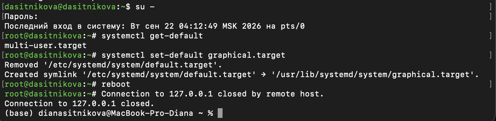{#fig-015 width=85%}

После загрузки проверены цель по умолчанию, состояние автозапуска службы `vsftpd` и список загруженных служб ([рис. @fig-016]).

~~~bash
systemctl get-default
systemctl is-enabled vsftpd
systemctl --type=service | head -20
~~~

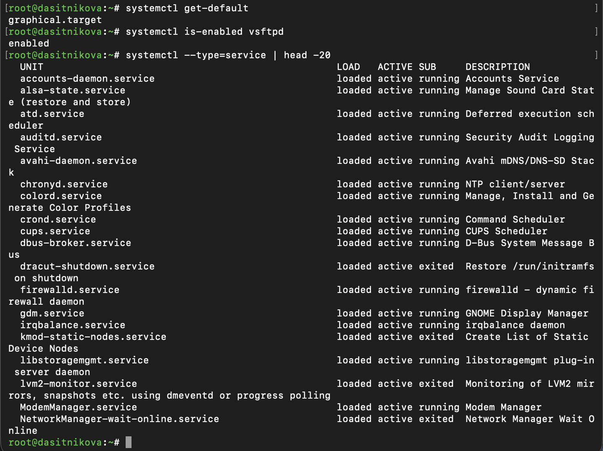{#fig-016 width=85%}

Целью по умолчанию снова является `graphical.target`, и в списке служб работает `gdm.service` --- диспетчер графического входа GNOME, который запускается только в графическом режиме. Служба `vsftpd` осталась в автозапуске: `enabled`.

# Выводы

В ходе лабораторной работы получены навыки управления системными службами Rocky Linux 10.2 посредством systemd. На примере службы Very Secure FTP выполнены установка, запуск, проверка статуса, добавление в автозапуск и удаление из него. Показано, что автозапуск реализуется символической ссылкой в каталоге `.wants` цели и не зависит от текущего состояния службы, а также изучены прямые и обратные зависимости юнита.

На примере служб `firewalld` и `iptables` показано действие зависимости `Conflicts`, которая не позволяет двум межсетевым экранам работать одновременно, и маскирование, которое полностью блокирует запуск юнита. Изучены изолируемые цели: система переведена в режим восстановления, перезагружена изоляцией цели и загружена в текстовом и графическом режимах изменением цели по умолчанию.

# Контрольные вопросы

1. **Что такое юнит (unit)? Приведите примеры.**

   Юнит --- это объект, которым управляет systemd: служба, точка монтирования, сокет, цель и т. д. Каждый юнит описывается файлом конфигурации с разделами и параметрами, а его тип определяется расширением имени. Примеры из данной работы: служба `vsftpd.service`, цели `multi-user.target` и `rescue.target`, точка монтирования `dev-mqueue.mount`, сокет `lvm2-lvmpolld.socket`, юнит пути `cups.path` ([рис. @fig-004], [рис. @fig-005]). Список всех типов юнитов выводит команда `systemctl -t help` ([рис. @fig-001]).

2. **Какая команда позволяет вам убедиться, что цель больше не входит в список автоматического запуска при загрузке системы?**

   Состояние автозапуска выводит команда `systemctl is-enabled юнит`: ответ `disabled` означает, что юнит в автозапуск не входит, а `enabled` --- что входит ([рис. @fig-016]). То же состояние показывает строка `Loaded` в выводе `systemctl status` ([рис. @fig-003]). Проверить можно и напрямую: после `disable` ссылки на юнит нет в каталоге `.wants` соответствующей цели ([рис. @fig-004]).

   ~~~bash
   systemctl is-enabled vsftpd
   ls /etc/systemd/system/multi-user.target.wants
   ~~~

3. **Какую команду вы должны использовать для отображения всех сервисных юнитов, которые в настоящее время загружены?**

   Загруженные и активные службы выводит команда `systemctl --type=service` или равносильная ей `systemctl list-units --type=service` ([рис. @fig-016]). С ключом `--all` выводятся также загруженные, но неактивные службы, а все установленные файлы служб независимо от того, загружены ли они, выводит `systemctl list-unit-files --type=service`.

   ~~~bash
   systemctl --type=service
   systemctl --type=service --all
   ~~~

4. **Как создать потребность (wants) в сервисе?**

   Обычный способ --- команда `systemctl enable служба`. Она читает параметр `WantedBy` из раздела `[Install]` и создаёт ссылку на службу в каталоге `.wants` указанной цели; так служба `vsftpd` стала желательной зависимостью цели `multi-user.target` ([рис. @fig-003], [рис. @fig-004]). Потребность в службе для произвольной цели создаёт команда `systemctl add-wants цель служба`. Можно также указать службу в параметре `Wants` раздела `[Unit]` файла другого юнита, после чего выполнить `systemctl daemon-reload`.

   ~~~bash
   systemctl enable vsftpd
   systemctl add-wants multi-user.target vsftpd.service
   ~~~

5. **Как переключить текущее состояние на цель восстановления (rescue target)?**

   Командой `systemctl isolate rescue.target` или её сокращением `systemctl rescue`. Systemd останавливает все юниты, не входящие в цель восстановления, и запрашивает пароль `root` на консоли ([рис. @fig-013]).

   ~~~bash
   systemctl isolate rescue.target
   ~~~

6. **Поясните причину получения сообщения о том, что цель не может быть изолирована.**

   Изоляция останавливает все юниты, которые не входят в изолируемую цель. Поэтому systemd разрешает изолировать только юниты, которые описывают законченное состояние системы и содержат параметр `AllowIsolate=yes` ([рис. @fig-012]). Для остальных юнитов команда `systemctl isolate` отклоняется с сообщением о том, что юнит не может быть изолирован.

   Попытка изолировать цель `network.target` ([рис. @fig-017]) была отклонена ещё раньше, чем дошло до проверки `AllowIsolate`. В файле этой цели задан параметр `RefuseManualStart=yes`, и systemd сообщил, что она может запускаться только как зависимость других юнитов. Оба параметра защищают систему от одного и того же: от перехода в состояние, в котором остались бы только сетевые юниты, а все остальные службы были бы остановлены.

   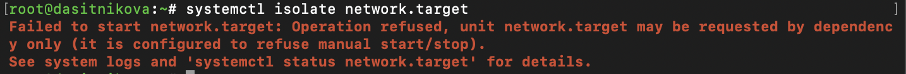{#fig-017 width=85%}

7. **Вы хотите отключить службу systemd, но, прежде чем сделать это, вы хотите узнать, какие другие юниты зависят от этой службы. Какую команду вы бы использовали?**

   Юниты, которые зависят от службы, выводит команда `systemctl list-dependencies --reverse служба`. Для `vsftpd` она показала, что службу запрашивает цель `multi-user.target`, а её требует `graphical.target` ([рис. @fig-005]).

   ~~~bash
   systemctl list-dependencies vsftpd --reverse
   ~~~

# Список литературы{.unnumbered}

::: {#refs}
:::
