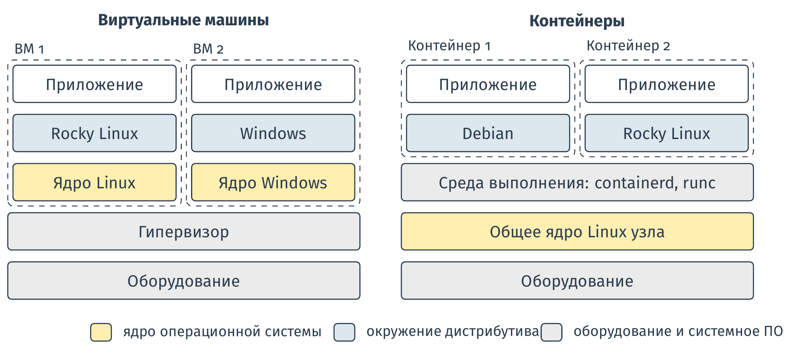
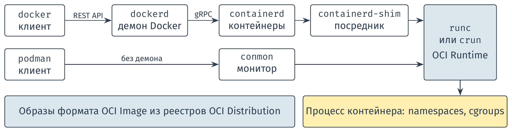
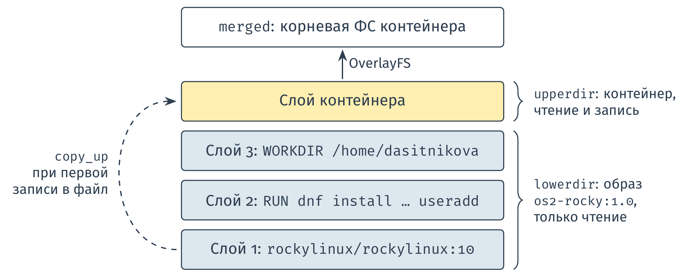
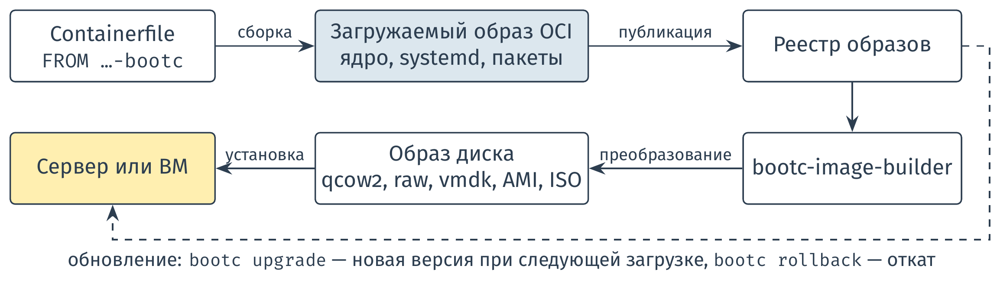

---
## Author
author:
  name: Ситникова Диана Александровна
  degrees: BSc
  email: 1032201746@rudn.ru
  affiliation:
    - name: Российский университет дружбы народов
      country: Российская Федерация
      postal-code: 117198
      city: Москва
      address: ул. Миклухо-Маклая, д. 6
## Title
title: "Развёртывание операционных систем на основе Docker"
subtitle: "Доклад по дисциплине «Основы администрирования операционных систем»"
institute:
  - "Российский университет дружбы народов им. П. Лумумбы"
  - "Преподаватель: д.ф.-м.н., профессор Кулябов Дмитрий Сергеевич"
license: CC BY
date: today
date-format: "YYYY-MM-DD"
header-includes:
  - \AtBeginDocument{\gothamset{sectionframe default=off}}
---

# Информация

## Докладчик

:::::::::::::: {.columns align=center}
::: {.column width="68%"}

- Ситникова Диана Александровна
- направление 09.03.03 «Прикладная информатика»
- Российский университет дружбы народов
- [1032201746@rudn.ru](mailto:1032201746@rudn.ru)

:::
::: {.column width="32%"}

{width=100%}

:::
::::::::::::::

# Введение

## Контейнер стал стандартной единицей поставки окружения

- 98\ % организаций внедрили облачные технологии, 82\ % пользователей контейнеров работают с Kubernetes (CNCF, 2026).
- Установка ОС на машину --- многошаговая процедура с трудно воспроизводимым результатом.
- Образ контейнера фиксирует окружение ОС в файле и разворачивается за время запуска процесса.
- С 2025 года из образов контейнеров разворачивают и загружаемые системы: image mode в RHEL.

## Объект, предмет, цель и задачи

**Объект** --- технология контейнерной виртуализации Docker.

**Предмет** --- способы развёртывания ОС на основе образов контейнеров.

**Цель** --- систематизировать способы развёртывания ОС на основе Docker и определить границы их применимости.

**Задачи:** рассмотреть механизмы ядра, Docker и Podman; проверить развёртывание дистрибутивов экспериментально; сравнить контейнеры, виртуальные машины и загружаемые образы.

# Контейнерная виртуализация

## Контейнер содержит окружение ОС, но не ядро

{width=100%}

Пространства имён изолируют ресурсы, контрольные группы ограничивают их потребление.

## Docker и Podman запускают контейнеры через общую среду OCI

{width=100%}

Podman работает без демона: контейнер запускается и от обычного пользователя, и с systemd внутри.

# Развёртывание окружения

## Образ --- стек слоёв только для чтения

{width=80%}

Базовые образы дистрибутивов: от 1,9 МБ (BusyBox) до 85,9 МБ (Rocky Linux 10).

## Четыре дистрибутива работают на одном ядре

{width=100%}

## Окружение Rocky Linux 10 разворачивается из `Dockerfile`

{width=100%}

Слой `RUN` --- 17,7 МБ; `ps` видит один процесс с PID 1; лимиты --- 256 МиБ и 0,5 процессора.

# Загружаемые системы

## Образ контейнера может стать загружаемой системой

{width=100%}

Образ bootc содержит ядро и systemd; в RHEL 9.6 и 10 этот режим называется image mode.

## Способ развёртывания выбирают по требованиям к ядру и изоляции

| | Виртуальная машина | Контейнер Docker или Podman | Образ bootc |
|:---|:---|:---|:---|
| Ядро | собственное | общее с узлом | собственное |
| Разворачивается | система целиком | окружение дистрибутива | система целиком |
| Запуск | загрузка системы | создание процесса | загрузка системы |
| Обновление | внутри системы | новый контейнер | `bootc upgrade`, откат |

Общее ядро --- общий риск: уязвимости `runc` CVE-2019-5736 и CVE-2024-21626.

## Docker разворачивает окружение ОС поверх общего ядра

- Контейнер --- окружение дистрибутива без ядра: четыре дистрибутива работают на одном ядре.
- Окружение ОС описывается `Dockerfile` и воспроизводимо разворачивается в Docker или Podman с изоляцией и лимитами.
- Систему с собственным ядром из образа контейнера разворачивает bootc.
