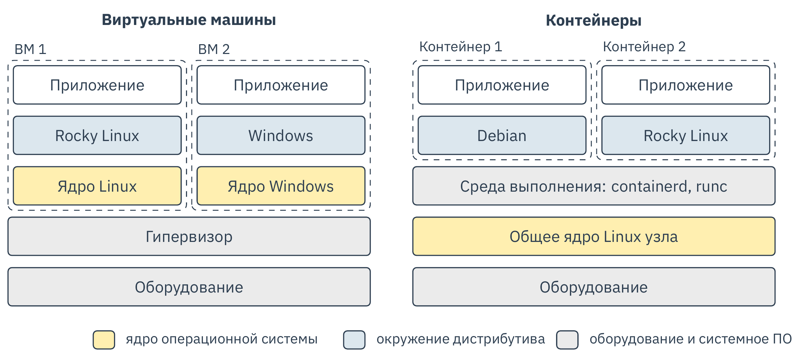
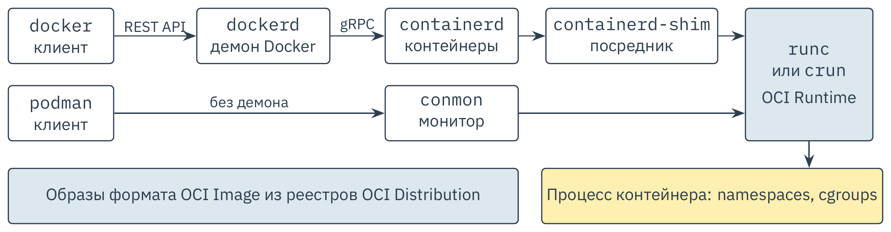
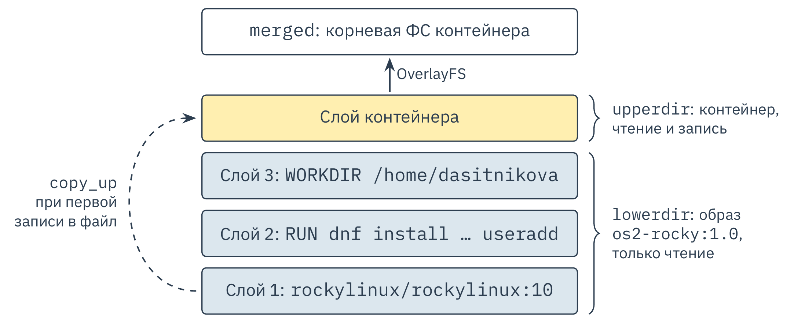
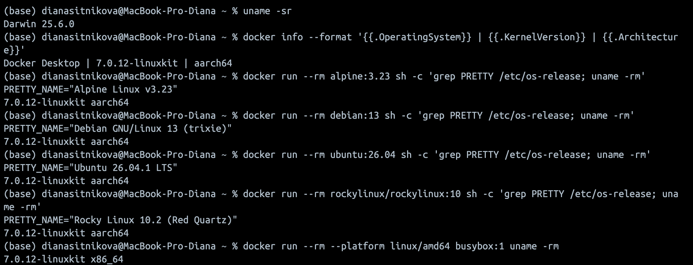
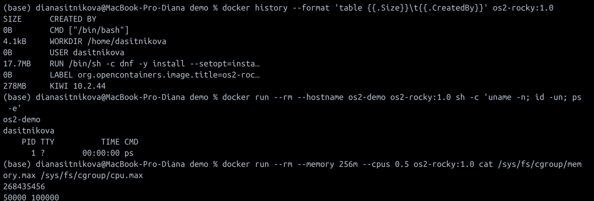
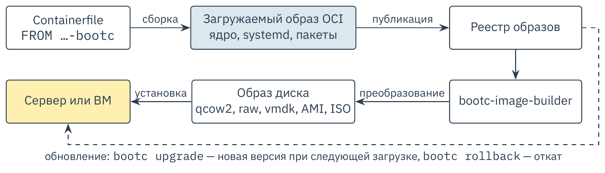

---
## Author
author:
  name: Ситникова Диана Александровна
  degrees: BSc
  email: 1032201746@rudn.ru
  affiliation:
    - name: Российский университет дружбы народов
      country: Российская Федерация
      postal-code: 117198
      city: Москва
      address: ул. Миклухо-Маклая, д. 6

## Title
title: "Развёртывание операционных систем на основе Docker"
subtitle: "Реферат по дисциплине «Основы администрирования операционных систем»"
license: "CC BY"
bibliography: bib/cite.bib
crossref:
  lof-title: "Список иллюстраций"
  lot-title: "Список таблиц"
  lol-title: "Листинги"
  lst-title: "Листинг"
---

# Введение {.unnumbered}

Развёртывание операционной системы (ОС) традиционно означает её установку и настройку на компьютере или виртуальной машине, результат которых трудно в точности воспроизвести. При контейнерной виртуализации окружение ОС описывается текстовым файлом, собирается в неизменяемый образ и разворачивается на любом совместимом узле за время запуска процесса. Наиболее распространённая реализация этого подхода --- Docker [@kane2023docker; @mouat2017docker], а совместимый с ним Podman работает без постоянного демона [@podman_docs]. Образы контейнеров используются и для доставки загружаемых систем [@bootc_docs].

Однако контейнер не содержит собственного ядра, поэтому необходимо установить, какая часть ОС в действительности разворачивается и где проходят границы применимости подхода; этим определяется актуальность работы. Её основу составляют исследования контейнерной виртуализации [@soltesz2007container; @felter2015updated; @sultan2019container] и документация проектов [@docker_docs; @podman_docs; @oci].

**Объект исследования** --- технология контейнерной виртуализации Docker и совместимые с ней средства, **предмет** --- способы развёртывания ОС на основе образов контейнеров. **Цель работы** --- систематизировать эти способы и определить границы их применимости.

**Задачи:** рассмотреть механизмы ядра Linux, архитектуру Docker и Podman; экспериментально проверить развёртывание окружений дистрибутивов; сравнить способы развёртывания, включая системные контейнеры и загружаемые образы. **Методы:** анализ публикаций и документации, сравнительный анализ, эксперимент.

# Теоретические основы контейнерной виртуализации

## Контейнер и виртуальная машина

При аппаратной виртуализации гипервизор предоставляет каждой виртуальной машине виртуальное оборудование, и в ней загружается гостевая ОС со своим ядром. При виртуализации на уровне ОС ядро одно, а изоляцию обеспечивает само ядро: каждая группа процессов, называемая контейнером, получает собственное представление системных ресурсов [@soltesz2007container]. Различие архитектур показано на [рис. @fig-arch].

{#fig-arch width=85%}

Без гостевого ядра запуск контейнера сводится к созданию процесса. В сравнении с гипервизором KVM контейнеры Docker показали равную или более высокую производительность почти во всех тестах [@felter2015updated]. Обратная сторона этих свойств --- общее для всех контейнеров ядро узла.

## Механизмы изоляции

Изоляцию в Linux обеспечивают два механизма ядра. Пространства имён ограничивают то, что процесс видит, создавая отдельные экземпляры глобальных ресурсов системы ([табл. @tbl-ns]). Контрольные группы (cgroups) ограничивают то, сколько ресурсов процесс потребляет: процессорное время, память, ввод-вывод, число процессов. Они появились в Linux 2.6.24, а их вторая версия с единой иерархией стала официальной в Linux 4.5 [@linux_manpages]. Дополнительно процессы контейнера получают урезанный набор привилегий [@docker_docs], а доступ к системным вызовам ограничивают механизм seccomp и модули безопасности Linux [@sultan2019container].

| Пространство имён | Изолируемый ресурс | Версия ядра |
|:---|:---|:---|
| `mnt` | точки монтирования | 2.4.19 |
| `uts` | имя узла и доменное имя NIS | 2.6.19 |
| `ipc` | объекты System V IPC, очереди сообщений POSIX | 2.6.19 |
| `pid` | идентификаторы процессов | 2.6.24 |
| `net` | сетевые устройства, стеки протоколов, порты | 2.6.24 |
| `user` | идентификаторы пользователей и групп | 2.6.23--3.8 |
| `cgroup` | корневой каталог контрольных групп | 4.6 |
| `time` | часы загрузки и монотонные часы | 5.6 |

: Типы пространств имён Linux [@linux_manpages] {#tbl-ns}

## Что разворачивается в контейнере {#sec-os}

ОС состоит из ядра и пользовательского пространства, а образ контейнера Debian или Rocky Linux содержит только второе: библиотеку C, командную оболочку, утилиты и пакетный менеджер. Из этого следуют три ограничения. Во-первых, команда `uname -r` в контейнере сообщает версию ядра узла. Во-вторых, контейнерам Linux нужно ядро Linux, поэтому в macOS и Windows они выполняются в служебной виртуальной машине: у Docker Desktop на компьютерах Mac ею управляет Apple Virtualization framework или Docker VMM [@docker_docs], у Podman --- команда `podman machine`, по умолчанию через libkrun [@podman_docs]. В-третьих, от узла наследуется архитектура процессора: из индекса многоплатформенного образа выбирается вариант под архитектуру узла, а образ другой архитектуры запускается только через эмуляцию, которая работает заметно медленнее [@docker_docs].

Следовательно, Docker в строгом смысле разворачивает не ОС целиком, а пользовательское окружение дистрибутива поверх общего ядра.

## Docker и Podman

Docker построен по клиент-серверной схеме: клиент `docker` через REST API обращается к демону `dockerd`, который поручает хранение образов и жизненный цикл контейнеров демону `containerd` [@docker_docs]. Тот через процесс-посредник `containerd-shim` вызывает среду выполнения `runc`, создающую пространства имён и контрольные группы процесса контейнера [@kane2023docker]. Формат образа и среда выполнения стандартизованы Open Container Initiative (OCI), которой Docker в 2015 году передал runC; спецификации версии 1.0 вышли в 2017 году [@oci].

Podman --- движок контейнеров без демона [@podman_docs]. Команда `podman` сама запускает процесс-монитор `conmon` и ту же среду выполнения OCI --- `runc` или `crun` ([рис. @fig-engine]). Поэтому образы Docker и Podman взаимозаменяемы, а команду `docker` можно заменить псевдонимом `alias docker=podman`. Контейнеры Podman запускаются как от имени root, так и от имени непривилегированного пользователя [@podman_docs].

{#fig-engine width=100%}

## Образы и базовые образы дистрибутивов

Образ --- шаблон только для чтения, по которому создаётся контейнер. Он состоит из конфигурации и упорядоченных слоёв: каждый слой хранит изменения файловой системы, внесённые инструкцией `Dockerfile`, а одинаковые слои хранятся на узле однократно [@kane2023docker]. При запуске слои объединяет файловая система OverlayFS ([рис. @fig-overlay]). Слои образа служат нижними каталогами только для чтения, над ними создаётся доступный для записи каталог контейнера, а при первом изменении файла из образа операция `copy_up` копирует файл наверх целиком [@docker_docs].

{#fig-overlay width=72%}

Базовый образ дистрибутива создаётся из корневой файловой системы в архиве `tar`, полученной, например, утилитой `debootstrap`; отправной точкой служит пустой образ `scratch` [@docker_docs]. Размеры базовых образов различаются в 45 раз ([табл. @tbl-images]): образ BusyBox построен вокруг одного исполняемого файла, а образы семейства Red Hat включают пакетный менеджер `dnf` с зависимостями.

| Образ | Менеджер пакетов | Размер arm64, МБ | Архитектур |
|:---|:---|---:|---:|
| `busybox:1` | --- | 1,9 | 7 |
| `alpine:3.23` | `apk` | 4,2 | 7 |
| `ubuntu:26.04` | `apt` | 40,7 | 6 |
| `debian:13` | `apt` | 49,7 | 7 |
| `fedora:44` | `dnf` | 65,8 | 4 |
| `almalinux:10` | `dnf` | 67,4 | 5 |
| `rockylinux/rockylinux:10` | `dnf` | 85,9 | 5 |

: Базовые образы дистрибутивов в реестре Docker Hub: сжатый размер и число архитектур на 12 сентября 2026 года {#tbl-images}

# Развёртывание окружений и загружаемых систем

## Экспериментальная проверка {#sec-experiment}

Эксперимент выполнен на компьютере Mac с процессором Apple в Docker Desktop 4.90.0 с Docker Engine 29.7.2; служебной машиной управляет Apple Virtualization framework, для эмуляции архитектуры amd64 включена Rosetta. В контейнерах Alpine, Debian, Ubuntu и Rocky Linux выведены название системы, версия ядра и архитектура; для сравнения запрошены ядро macOS и параметры служебной машины, а образ BusyBox запущен для платформы `linux/amd64` ([рис. @fig-kernels]).

Ядро macOS --- Darwin 25.6.0, ядро служебной машины --- `7.0.12-linuxkit`. Контейнеры Alpine Linux 3.23, Debian 13, Ubuntu 26.04.1 LTS и Rocky Linux 10.2 сообщают эту же версию ядра и архитектуру `aarch64`. Образ BusyBox сообщает архитектуру `x86_64` при том же ядре: эмулируется только система команд процессора, а ядро остаётся общим.

{#fig-kernels width=95%}

Затем в `Dockerfile` описано собственное окружение Rocky Linux 10 с утилитами `ps` и `ip` и непривилегированным пользователем ([листинг @lst-dockerfile]), и по нему собран образ `os2-rocky:1.0`.

```{.dockerfile #lst-dockerfile lst-cap="Инструкции Dockerfile окружения Rocky Linux 10 (метки OCI опущены)"}
FROM rockylinux/rockylinux:10

RUN dnf -y install --setopt=install_weak_deps=False \
        procps-ng iproute shadow-utils \
    && dnf clean all \
    && useradd --create-home dasitnikova

USER dasitnikova
WORKDIR /home/dasitnikova
CMD ["/bin/bash"]
```

Результат проверки показан на [рис. @fig-isolation]. К базовому слою размером 278 МБ инструкция `RUN` добавила слой 17,7 МБ, а `LABEL`, `USER` и `CMD` слоёв не создают. В контейнере, запущенном с именем узла `os2-demo`, это имя изолировано пространством имён `uts`, а процессы выполняются от имени пользователя `dasitnikova`. Команда `ps -e` видит единственный процесс --- саму себя с идентификатором 1: контейнер находится в собственном пространстве имён `pid`. При запуске с ограничениями `--memory 256m --cpus 0.5` файлы контрольных групп содержат `268435456` байт, то есть 256 МиБ памяти, и `50000 100000`, то есть половину процессорного времени одного ядра.

{#fig-isolation width=95%}

## Системные контейнеры Podman

Контейнер может содержать не только приложение, но и систему инициализации. Если командой контейнера служит `systemd` или `/sbin/init`, Podman по умолчанию включает режим systemd: монтирует `tmpfs` в `/run`, `/tmp` и `/var/lib/journal`, открывает для записи `/sys/fs/cgroup` и останавливает контейнер сигналом `SIGRTMIN+3`, которого ожидает systemd [@podman_docs]. Внутри такого контейнера работают системные службы, как в полноценной ОС, хотя ядро остаётся общим. Обратную связку обеспечивает Quadlet: генератор systemd превращает описания `.container` из каталога `/etc/containers/systemd/` в службы узла, и контейнеры запускаются вместе с системой [@podman_docs].

## Загружаемые образы bootc

Чтобы получить из образа загружаемую систему, к нему нужно добавить ядро и загрузчик. Этот путь развивает проект bootc: загружаемый образ содержит ядро в каталоге `/usr/lib/modules` и systemd, но собирается тем же способом, что и обычный, и доставляется через реестр контейнеров [@bootc_docs] ([листинг @lst-bootc]).

```{.dockerfile #lst-bootc lst-cap="Загружаемый образ на основе CentOS Stream 10 с веб-сервером"}
FROM quay.io/centos-bootc/centos-bootc:stream10
RUN dnf -y install httpd && systemctl enable httpd
```

Авторы проекта формулируют его цель так: bootc должен стать для загружаемых систем тем же, чем Podman является для контейнеров приложений. Для установки такого образа служат программа установки Anaconda и утилита bootc-image-builder ([рис. @fig-bootc]). Установленная система отслеживает образ в реестре: команда `bootc upgrade` готовит новую версию к следующей загрузке, не изменяя работающую систему, а `bootc rollback` возвращает предыдущую по схеме A/B [@bootc_docs].

{#fig-bootc width=100%}

## Сравнение и ограничения

Рассмотренные способы развёртывания сопоставлены в [табл. @tbl-compare]; выбор между ними определяется требованиями к ядру и изоляции.

| Критерий | Виртуальная машина | Контейнер | Образ bootc |
|:---|:---|:---|:---|
| Ядро | собственное | общее с узлом | из образа |
| Разворачивается | вся система | окружение ОС | вся система |
| Инициализация | своя | нет или systemd | systemd |
| Изоляция | гипервизор | механизмы ядра | отдельная машина |
| Запуск | загрузка ОС | запуск процесса | загрузка ОС |
| Обновление | внутри ОС | новый контейнер | `bootc upgrade` |

: Сравнение способов развёртывания ОС {#tbl-compare}

Главный риск контейнеров --- общее ядро. Из четырёх задач защиты, выделенных в обзоре [@sultan2019container], три решаются программно средствами ядра и потому зависят от корректности ядра и среды выполнения; это подтверждают уязвимости `runc` CVE-2019-5736 и CVE-2024-21626, открывавшие процессу контейнера доступ к узлу. Риск снижают доступ к демону Docker только для доверенных пользователей и режим rootless [@docker_docs], запуск контейнеров Podman без привилегированного демона [@podman_docs] и выполнение процессов от обычного пользователя, как в [разделе @sec-experiment].

# Заключение {.unnumbered}

1. Контейнерная виртуализация основана на пространствах имён и контрольных группах ядра Linux, поэтому Docker разворачивает не ОС целиком, а пользовательское окружение дистрибутива поверх ядра узла.
2. Docker и Podman запускают контейнеры разными цепочками компонентов, но через общую среду выполнения и формат образов OCI; образ представляет собой набор слоёв, объединяемых OverlayFS.
3. Эксперимент подтвердил, что Alpine, Debian, Ubuntu и Rocky Linux работают на одном ядре служебной виртуальной машины, а окружение Rocky Linux 10 воспроизводимо разворачивается из `Dockerfile` с изоляцией и ограничениями ресурсов.
4. Развёртывание приближается к полноценной ОС поэтапно: системные контейнеры Podman добавляют systemd, а загружаемые образы bootc --- ядро, загрузчик и транзакционное обновление.

Контейнеры предпочтительны для воспроизводимых окружений, виртуальные машины --- при необходимости собственного ядра и строгой изоляции, образы bootc --- для систем с атомарным обновлением. Цель работы достигнута, поставленные задачи решены.

# Список литературы {.unnumbered}

::: {#refs}
:::
